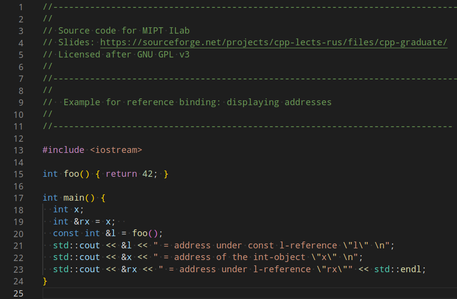
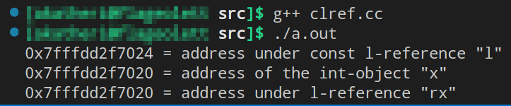
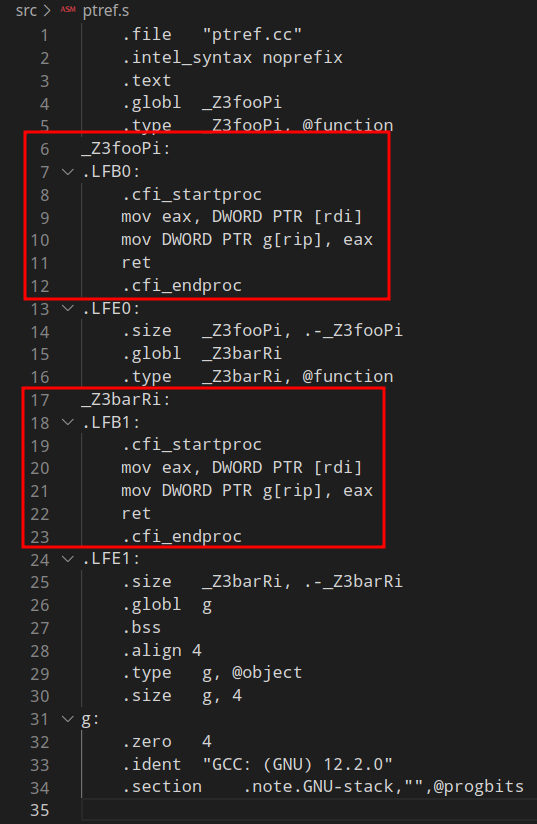
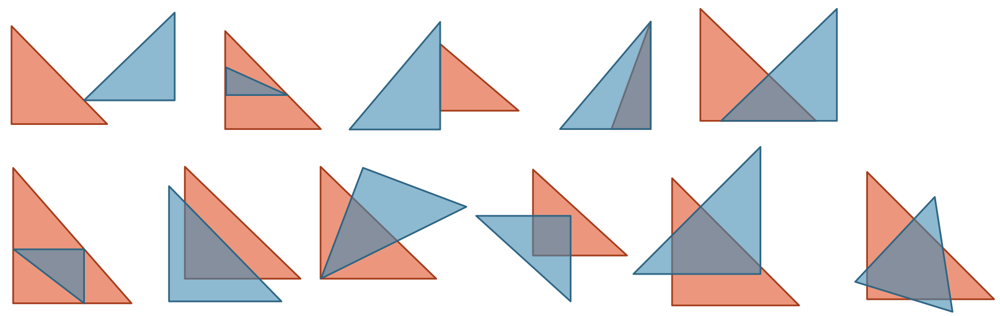

# [Лекция 2: Указатели и ссылки](https://youtu.be/e5__34DFz5Y)

## GENESIS:
Пусть в пустом пространстве появилось 4 бита памяти. Обозначим этот блок за ***a***. И пусть он был проинициализирован следующим образом:

| 0 | 1 | 0 | 0 |

> *Чем это может являться?*

>>**1. Если истрактовать это как беззнаковое целое число в диапазоне от 0 до 15, то *a* = 4** \
**2. Если истрактовать их, как код в ASCII, то a = ♦.**

Можно много как понимать и истрактовывать эти 4 бита.
Для того, чтобы они что-то там значили, им нужно сопаставить 3 основных штуки:
1. Cемантическое значение. (i.e. значение, как числа, 4)
2. Value-диапазон (i.e. от 0 до 15, или от -8 до 7)
3. Имя (i.e. ***a***)

>*Достаточно ли этого, чтобы сказать, что мы знаем тип **a**?*

>>- **Нет. для того, чтобы быть "типом", надо, чтобы на тебе были определены операции.**

Ну так вот. **Тип** составляет композиция из двух пунктов:
- value type: диапазон значения объекта (носитель алг.системы)
- object type: совокупность операций над объектом и характер замкнутости носителя относительно них (сигнатура алг.системы) (сюда так же входит краевые случаи действий операций и "UB/NaN-случаи")

&nbsp; Пусть означенный блок памяти, именуемый ***a***, имеет целочисленный арифметический тип ***i4*** (т.е. знаковый 4хбитный int со сложением, вычитанием, умножением и делением без остатка, почти как в кольце вычетов $\mathbb{Z}_{[7]}$ с оговорками).

Если бы речь шла о *Python* или *Ruby*, то на этом генезис бы закончился. Но в отличии от них, *С/C++* - это статически типизированные языки. Это означает, что тип <u>связан не с конкретной ячейкой</u>, в которой лежит объект ***a***, но <u>с самим именем</u>, которым мы обозвали объект. Если в разных точках программы имя ***a*** относится к объекту, который в разных точках исполнения программы может являеться экземпляром разных типов, то исходный язык ***динамически типизирован***. *С/С++* такой херни не позволяют. <br /> <div style="text-align: center"> **С/С++ статически типизированные языки!**.  В них **ИМЕНА НАВСЕГДА СВЯЗАНЫ С ТИПОМ**. </div> 


Если бы мы говорили о *C#* или *Java*, то на этом можно было бы закончить т.к. оба статически типизированы; описанные в них объекты живут в вакууме внутри платоновского пространства виртуальной машины. Объекты, описанные в *C++* живут не в вакууме, но в некотором пространстве, которое напоминает метрическое. Поясним:

Представим что есть RAM-модель памяти (модель памяти с произвольным доступом) в контексте целевой архитектуры, в рамках которой нам предоставили всего лишь 23 бита.

><div style="text-align: center"> 1 1 0 <u><b>0 1 0 0</b></u> 0 0 0 1 1 1 <u><b>0 0 1 1</b></u> 0 0 1 1 1 1 </div> 

Выделим в ней объекты $a = 4$ и $b = 3$. Обратим внимание, что сами $a$, $b$ объекты никак не отделены от объектов, которые лежат рядом с ними. Здесь можно начать говорить о "*расстоянии*". И самое важное расстояние, о котором стоит поговорить - это то, что между началом памяти и началом объекта. И именно оно называется ***адресом*** объекта. Унарная операция "амперсанд" (&) называется reference и в языке *С* применяется к именам слева.

- &a == 3 &nbsp;&nbsp;// (суть 3 бита от начала памяти), или = 0x3 если угодно
- &b == 0xE &nbsp;&nbsp;// (суть 14 бит от начала памяти)

И тип адреса объекта ***i4***, как целочисленного беззнакового числа, выражающего расстояние от начала объекта до начала памяти, называется ***"указателем i4"*** (обозначается ***i4****, произносится "*i4-pointer*")

Есть 2 вопроса: 
> 1. Какой размер на этой целевой архитектуре должен иметь тип указателя?
>> - 5 бит. Их достаточно, чтобы адресовать 32 ячейки, и тем более 23. Если бы он был только лишь 4 бита, то указатель бы мог адресовать лишь первые 16 бит.
> 2. О чём говорит константа **CHAR_BIT** из *<limits.h>*?
>> - Она говорит о том, сколько бит вмещает в себя байт в контексте текущей архитектуры. А точнее, сколько бит в ***char*** типе, где в идеологии языка *С* по своему определению тип ***char*** описывает минимальную адресуемую ячейку. Невозможно взять адрес/адресовать в середину char-ячейки разбиения памяти.

В данном случае **CHAR_BIT** = 1. На 64-разрядных системах ***CHAR_BIT*** = 8. <br/> При этом $sizeof(char) \equiv 1$ всегда по определению. <br/> $sizeof(int) = \text{"хрен знает чему"}$, т.к. зависит от архитектуры, но на 64-разрядных скорее всего <br/> $sizeof(int) = sizeof(long) = 4$. И это значит, дословно, "он занимает 4 чара". Это значит, что внутри объекта типа ***int*** можно 4мя разными способами впихнуть указатель. 

Определение адреса позволяет ввести адресную арифметику, в смысле которой:

>`&a - &b` = "кол-во чаров, которое вмещается между началом объекта a и началом b"

>`&a + 4` = `4 + &a` = "адрес в памяти, который находится на $4 \cdot sizeof(a)$ байта(чара) дальше от начала памяти, чем &a"

Такова линейная модель адресного пространства объектов в языке *С*.

Ok. Если говорится о расстоянии, то частный случай ситуации расстояния между объектами - расстояние равно нулю.

> Что лежит вначале памяти, или что есть суть нулевого расстояния?

>> - В начале памяти лежит "ничего". Специальный маркер этого ничего в *C* принято считать интовый *0*, или макрос **NULL**, который на самом деле суть: <br/> 
```c
#define NULL (void*)0x0  // тобишь 0 приведённый к типу void*
```
В *С++* мы забываем про 0 и **NULL**, и вводим объект `nullptr` типа ***nullptr_t***. Это один из фундаментальных для *С++* типов у которого есть только одно значение. Полезно относиться к `nullptr`, не как к константному объекту типа **nullptr_t**, а как к ключевому слову языка *С++*. И фокус теории обращен не на сам объект, а на тип, который завязан вокруг этого объекта.

> Почему он был введён? <br/>

>> Мы узнаем, когда будем разбираться с перегрузками функций.

**Spoiler**:
>! Потому что ноль очень легко выигрывает неправильные перегрузки.<br/> В языке *С* нет механизмов манглирования => нет перегрузок, и поэтому в нём ни о чём таком беспокоиться не приходится.

В языке *С* нет массивов. В нём есть линейная модель адресного пространства, в контексте которой элементы одного типа можно разложить по очереди запомнить где находится первый, через сколько будет последний, что в конечном итоге даст нам "массив". Привычный инструмент добычи элементов массива that is `имя[индекс]` в *С* на самом деле является конструкцией, которая перегружает оператор *dereference* (префиксная звездочка) над продуктом адресной арифметики.

```C
Пусть есть int p[20]; и мы хотим обратиться к 10му элементу.
p[10] эквивалентно *(p+10).
А ещё это эквивалентно *(int*)(((char*)p + 10 * sizeof(*p))),
где p имеет тип const-указателя на неконстантные данные первого элемента массива.

Забавно, что по причине коммутативности сложения и приоритетности указателя, как операнда, 10[p] эквивалентно *(10+p), а значит тоже работает.
```

Если бы речь шла только лишь о языке *С*, то и на этом можно было бы остановиться.

---
---
---
## ***Ссылки***:

&nbsp; После *C*, в *С++* появляется 2 уникальных инструмента: 
- l-value-reference (ссылки левосторонних выражений)
- r-value-reference (ссылки правосторонних выражений)

---
---

### ***l-value references***

Начнём с первого. В *C++* мы можем повесить на один и тот же объект 2 разных имени.<br/> Чего в *С* было сделать нельзя.<br/> Синтаксис для этого следующий:<br/> `[тип] [амперсанд] [имя_ссылки] = [имя существующего объекта];`

```c++
int x;
int &y;  /** ошибка: 
      *! как и const-указатель, ссылку невозможно перевязать, a значит
      *! при объявлении она должна быть обязательно чем-то определена. */
int &y = x;  // теперь у - это просто ещё одно имя для x
```
Итак здесь *y* - это ссылка на l-value, коим является объект с именем *x*.

> Что есть **l-value**?

>> **l-value**, или **левосторонним выражением** называют объекты, имеющие место в памяти (статической, автоматической или динамической). Удобно думать об этом в духе: объект был выделен => проименован => он является l-value. Как правило это то, что может стоять слева от знака "=", ведь если есть место в памяти, то туда можно присвоить какие-то данные.

Внесём контраста и уточним на примерах, почему левая ссылка - это не указатель.

---

```cpp
int x[2] = {10, 20};  // объявим и определим статический массив
int &xref = x[0];  // создадим ссылку на первый элемент массива x
int *xptr = &x[0];  // созданим указатель с адресом на первый элемент массива x

xref += 1;  /**
  * здесь произойдёт переопределение первого элемента x[0] += 1 */

xptr += 1;  /**
  * здесь произойдёт адресная арифметика по результату которой указатель xptr 
  * будет хранить адрес не на первый элемент, а на второй элемент массива x */

assert(xref == 11);
assert(*xptr == 20);
// оба ассерта сработают
```

> **Вывод 1**:<br/> *Арифметические операции c числами на левых ссылках и на указателях работают по разному.*

---

Как мы и сказали выше, левая ссылка чем-то похожа на *const*-указатель. Синтаксис *C++* и природа *левых ссылок* в нём такова, что их нельзя перевязать с одного элемента на другой, прямо как и *const*-указатели. В то время как обычный указатель перевязать можно.
```cpp
int x,y;  // пусть есть два инта
int xref = x;  // теперь к х можно обращаться по xref;
// И больше нет возможности связать xref с каким-то другим объектом (например с y)
int *xptr = &x;  // определяем указатель xptr адресом x
int * const xcptr = x  // определяем const-указатель и определяем его адресом x 


xref = y;  // здесь происходит присваивание, а не перевязка.
// Эта инструкция эквивалентна x = y (присваивание x значения y)
xref = &y;  // здесь x присвоится значение расстояния расположения объекта y до начала памяти (т.е. какое-то целое число). Так никто не делает.

xcptr = &y;  // ошибка: const-указатель нельзя переопределить. Даже не скомпилируется.

xptr = &y;  // обычный указатель перевязать можно.
xptr = y;  // здесь указателю xptr присвоится значение y и хрен его знает, в какую область памяти значение xptr будет указывать. Скорее всего в невалидную; в ту которая не принадлежит текущей программе. Так никто не делает. 
```

> **Вывод 2**: <br/> *Левые ссылки куда более ограничены на этапе инициализации и с точки зрения переопределения по сравнению с указателями.*

---

Левых ссылок не существует, как объектов, которые лежат в памяти. Или, что то же самое, ***левые ссылки сами по себе не являются l-value объектами***.

```cpp
int x;  // пусть есть инт
int &xref = x;  // свяжем ссылку xref с объектом x

int *xptr = &xref;  // в xptr попадёт адрес x, а не адрес xref. У xref нет места в памяти, а значит у него не может быть адреса. xref - это просто другое название для x. Связанная ссылка прозрачна для операции взятия адреса.

int &* xrefptr = &xref;  // ошибка. Нельзя взять указатель на ссылку, потому что ссылка не l-value
int *& xptrref = xptr;  // ok. Cсылку на указатель можно создать, потому что указатель xptr имеет место в памяти, а значит является l-value;
```
На самом деле компилятор никогда не позволит объявить ссылку не связав её с чем-нибудь. Поэтому на практике таких ситуаций, когда "ссылка существует сама по себе без связки с чем-то" не бывает. Однако полезно отделять l-value сущности от инструментов над ними.

> **Вывод 3**: <br/> При объявлении левую ссылку можно и обязательно нужно связать с чем-то, что есть в памяти. Указатель же может быть инициализирован неоглашенным мусором. А потому, пусть и ограниченнее, но ссылки безопаснее указателей.

---

```cpp
char chr = 'a';

// west&east const нотации описания указателя на неконстантные данные
const char *ptr1 <=> char const *ptr1  // оба валидны, взаимное расположение ключевого слова const ни на что не влияет.

char * const ptr2 = &chr;  // const-указатель на неконстантные данные.
// При обращении к данным по адресу через этот указатель данные можно изменить, в то время как сам указатель перевязать невозможно.

char const * const ptr3 = &chr;  // const-указатель на константные данные.
// При обращении к данным по адресу через этот указатель данные изменить нельзя, как и нельзя изменить значение адреса, присвоенное этому указателю.

char &ref1 = chr;  // неконстантная левая ссылка. Через неё данные в chr изменять можно.
char const &ref2 = chr // константная левая ссылка. Через неё данные в chr изменять нельзя.
```

> **Вывод 4**: <br/> У указателя может быть 3 состояния константности. У левой ссылки только 2.

---

Дальше пример для компиляции:

 <br/>

> **Вопрос:** что происходит в 20й строке и выведется в 21й?

То значение типа int, которое возвращает отработка `foo()` является временным объектом, который "живёт только одну строчку" (это r-value, но о них позже). И если на 20й строчке мы это значение никуда не присвоим, на 21й оно благополучно дискарднется и более не будет доступно. На 20й строчке результат отработки `foo()` не является l-value.

Так вот оказывается, что:
>> - левые константные ссылки умеют продлевать жизнь временным объектам и давать им первые в их жизни имена. После 20й строчки объект, который вернула ф-ция `foo` обретает первое имя `l` и принадлежит автоматической памяти на стеке фрейма ф-ции main.

Более того, `l` ляжет рядом с `x` на стеке. Это легко увидеть, если запустить:

 <br/>

>>> **Важно:** <br/> Константность ссылки в этом примере очень по существу! <br/> Случай неконстантности ссылки `l` - выброс ошибки компиляции, и слава Богу, ведь тогда ссылка не "провиснет". О том, что это означает, мы поговорим позже.

---
---

### ***Использование ссылок***

Представим некую ф-цию, которой нужно читать 2 тяжёлых объекта:


```cpp
int foo (Heavy fst, Heavier snd) {
  // ... fst.x
}  // этот вариант нас не устраивает т.к. при передаче аргумента по значению происходит излишнее копирование объектов, которые, например, мы исходно и не собирались изменять.

int foo (const Heavy *fst, const Heavier *snd) {
  // ... fst->x
}  // этот вариант нас устраивает больше, т.к. проблемы, что была выше, больше нет, но возможно придётся разыменовывать указатели. Последнее не то что бы "проблема", но это лишняя деталь, о которой придётся помнить при описании реализации

// Почему необходимость разыменовки - это проблема?
// - потому что указатель может быть nullptr, а его разыменовка = segmentation fault.

int foo (const Heavy &fst, const Heavier &snd) {
  // ... fst.x
  // этот вариант не имеет никаких из выше перечисленных возможныъ проблем и устраивает нас полностью.
}
```
>  **Вопрос**: Отличается ли второй и третий варианты сигнатуры ф-ции foo друг от друга?

>> - Оказывается, что нет. На уровне ассемблера аргумент-ссылка в ф-ции кода *C++* интерпретируется компилятором в точности, как указатель.

Продемонстрируем это на простеньком примере. Вот пример кода, в котором две ф-ции `foo` и `bar` делают одно и тоже, но описаны в разных сигнатурах.

 <br/>

Поглядим на их ассемблер:

 <br/>

> **Вывод**:
То есть, компилятор, когда ему нужно как-то передать информацию о втором имени куда-то, делает ровно то, что умеет - передаёт указатель.

В частности, всё то же самое происходит, когда мы пишем ссылку, как поле структуры/класса.

> **ВЫВОД-ВЫВОД**:
Левые ссылки - на низком уровне временами являются в точности указателями, но чаще просто вторыми именами для объектов. А на уровне кода *C++* в отличие указателей они имеют ряд ограничений упомянутых выше:
> 1. как имена, они надёжно приклеены к одному объекту и их нельзя перевязать, или подвинуть с помощью адресной арифметики.
> 2. они не могут быть `nullptr`, и это, временами, замечательно.

 **О втором:**<br/>
 Чтобы ссылка была `nullptr`, как указатель, она должна указывать на некий мифический объект "`nul`", который был бы gl-value, которого, к счастью, в стандарте просто не существует. <br/> <br/>


**O первом:**<br/>
> **Вопрос**: почему надёжная привязка к одному объекту - это хорошо?

Вот есть ситуация:
```cpp
void mytype::change_internal (some_big_obj & obj) {
  int &ref_intrl; = obj.somewhere[5].guts.internal;
  // ... какой-то код, активно изменяющий объект под ref_intrl
}

// если бы вместо ref_intrl было 
int *ptr_intrl; = &obj.somewhere[5].guts.internal;
// то инструкция 
ptr_intrl += 5;
// не имела бы никакого смысла, но, была бы валидна, ведь ptr_intrl - это указатель. 
```

<div style="text-align: right"><b>Ссылка лишает нас незаконных операций над интерфейсом, которые могут быть позволительны ввиду интерфейса указателей.</b></div> <br/>

И забавно то, что при всём при этом `this` -- это указатель, хотя было бы очень неплохо навесить на него ограничения ссылки. Но Stroustrup придумал `this` раньше, чем ссылки, поэтому вот.

---

О r-value и о ссылках на них будет говориться в следующих лекциях.

Сейчас происходит резкая смена темы на пример задачи вычислительной геометрии для мотивации темы инкапсуляции в *C++*.

---
---

## ***Задача из вычислительной геометрии***

> **Условие**:<br/>
В `stdin` поступает последовательность чисел, суть - координаты точек в двухмерном пространстве в кол-ве 6 (12 чисел). Точки образуют треугольники в $\mathbb{R}^2$. Первые 3 пары чисел образуют один треугольник, вторые 3 пары чисел - другой.
>> **Надо**: <br/>
Вывести в `stdout` площадь пересечения означенных треугольников.

> **Пример ввода/вывода**: <br/>
Ввод: &nbsp; **0 0 0 1 1 0 0 0 1 1 1 0**;<br/>
Вывод: &nbsp; **0.25**

Первое, что надо сделать - это представить, как может выглядеть пересечение таких треугольников:

 <br/>

> **Вопрос:**<br/>
C чего надо надо начать написание кода для решения?

>> - С описания структур данных. Берём все существительные нашей предметной области, и назначаем им типы.

Имеющиеся существительные:
- точка $\approx$ {две координаты}
- прямая $\approx$ {три координаты}
- отрезок $\approx$ {две точки}
- треугольник $\approx$ {три точки}
- полигон $\approx$ {массив из точек}

Выделили типы. Теперь нужны операции над ними. Методы для классов:
- нахождение точки пересечения прямых/отрезков
- нахождение расстояния точки и прямой
- построение выпуклой оболочки множества точек
...

Описание означенного - это этап проектирования. На это этапе сам алгоритм не так важен. В хорошо спроектированная программа называется "*хорошо спроектированной*", т.к. умеет безболезненно переживать смену алгоритмов. То есть при смене алгоритма, должен измениться только алгоритм, а интерфейс типов - разве что по-минимуму. 

Изящный алгоритм по выявлению полигона, площадь которого надо вычислить, выглядит так:
1. В классе треугольника ориентируем список точек, его составляющих, например, по часовой стрелке.
2. Фиксируемся на каком-нибудь из треугольников $T_1$.
3. И берём сторону $T_1$, составленную из его первой и второй точки, рисуем через неё прямую $a$. Обращаем внимание только на полупространство, в которой находится третья точка $T_1$.
4. Отсекаем ту часть треугольника $T_2$, которая не попала в это полупространство.
    
    * Если все 3 точки треугольника $T_2$ находятся в нужном полупространстве, то ничего делать не надо, переходим к следующей стороне треугольника $T_1$ и пункту 3.
    * Если по обе стороны от $a$ нашлись точки составляющие $T_2$, то находим точки пересечения $a$ со сторонами $T_2$. Теперь эти 2 точки пересечения и 3я, попавшая в нужное полупространство, составляют $T_2$ переходим к следующей стороне треугольника $T_1$ и пункту 3.
    * Если все точки $T_2$ находятся не по ту же сторону прямой $a$, что и третья точка $T_1$, то пересечения у треугольников нет => площадь = 0.

5. Как только пробежались по всем сторонам $T_1$ и проделали с ними пункты 3,4, выявленные точки пересечения и составляют интересующий нас полигон, площадь которого надо вычислить.

> **Вопрос**: Зачем нам первый пункт?
>> Затем, что ориентирование гарантирует нам, что третья точка треугольника всегда будет находиться в правом полупространстве:
>> - Точка $C$ будет находиться в правом полупространстве относительно $\overrightarrow{(B-A)}$ 
>> - Точка $A$ будет находиться в правом полупространстве относительно $\overrightarrow{(C-B)}$ 
>> - Точка $B$ будет находиться в правом полупространстве относительно $\overrightarrow{(A-C)}$

Это позволяет не заниматься лишними вычислениями расположения интересующего полупространства относительно прямой $a$.

> **Вопрос**: Что будет, если убрать пункт 1 и не проверять полупространство?
>> Подпункты пункта 4 алгоритма будут работать неправильно и выделить нужный полигон не получится.

> **Вопрос**: Как гарантировать то, что в метод `get_poly_intersection`, выявляющий целевой полигон, будет работать именно с правильно ориентированными треугольниками?
>> Можно сортировать каждый раз на месте, что дорого и черевато излишней работой по проверке наличия ориентированности. А можно гарантировать это **по построению**.

<div style="text-align: right"><b>Хорошо было бы, если алгоритм построения треугольников ориентировал точки некоторым фиксированным образом заранее, и не было возможности эту ориентированность случайно испортить.</b></div> <br/>

---

Другой пример

## Список

Другой пример. Пусть структура для двусвязного списка написана следующим образом.
```cpp
template<typename T> struct list_t {,
  struct node_t {
    node_t *next_, *prev;
    T data;
  };
  node_t *top_, *back_
};
```

> **Вопрос**: можно ли для этой структуры написать метод `length` возвращающая число узлов?

Ну, как бы да, но стоит ли? В том смысле что, мол а всегда ли этот метод отработает корректно? Например, а вдруг внутри списка оказалась петля? Вдруг какой-нибудь несведущий человек в своём методе переместит back_ в центр списка?  Если так, то метод `length` шагающий по адресам никогда не уткнётся в узел c `.next = nullptr`.

>> **Ответ**: пока нет гарантии отсутствия петли в списке, метод `lenght` будет небезопасен. Так что да можно, но не стоит.

> **Вопрос**: однако, если очень сильно хотим, то как сделать его безопасным?

Для начала есть способ проверить, список на наличие петли. **Алгоритм Флойда**.

1. Создаём два указателя условно "*зайца*" и "*черепаху*".
2. Запускаем цикл сдвига *зайца* на 2 адреса, *черепахи* на 1 адрес по списку за итерацию.
3. Если цикл закончился тем, что заяц уткнулся в узел, prev-указатель которого = `nullptr`, то петли нет и всё хорошо. Если же на какой-то из итераций *заяц* и *черепаха* встретились, то петля есть, увы и ах. 

И так придётся делать для каждого вызова `length`.
Та же проблема возникнет, если мы вдруг захотим написать метод `reverse`.

<div style="text-align: right"><b>Нам опять нехватает гарантий на особенность устройства типа/класса, которую можно было бы обеспечить по построению, а так же гарантий по защите основных компонет определяющих классов. </b></div> <br/>

---

Оба примера задач и выявленные проблемы вдохновляют нас на введение следующего определения.

Предусловием корректных и эффективных методов над полигонами/списками является корректность/консистентность состояний этих полигонов/списков на всё время их существования. Утверждения, тождественное `true` на которых гарантирует эту консистентность, мы будем называть ***инвариантами класса***.

><div style="text-align: left"><b>УТВ: Точки ориентированы по часовой стрелки для любого полигона текущего класса.</b></div>
><div style="text-align: right">Этот инвариант класса <i>polygon_t</i> гарантирует выпуклость любого полигона и избавляет алгоритм выявления пересечения от лишних операций.</div>

<br/>

><div style="text-align: left"><b>УТВ: Список не содержит петли, нуль-терминирован по краям.</b></div>
><div style="text-align: right">Эти инварианты классов <i> list_t, node_t </i> гарантируют отсутствие петли(WoW) в списке, и избавляет от лишних проверочных операций реализацию ф-ций полезных для списка. </div>

<br/>

Введённое определение мотивирует введение понятия инкапсуляции. Этакой изоляции средств интерфейса от небезопасных действий над типом.

> **Вопрос**: Как можно обеспечить инкапсуляцию на языке *С*? Как мы можем скрыть ключевые поля структуры у текущего списка и спрятать прочие возможности его испортить, чтобы какой-нибудь плохой программист имея на руках условно определение нашей структуры случайно не выстрелил себе ей в ногу (случайно сделал петлю, или нарушил какие-другие инварианты)?

>> - В *С* мы используем механизмы области видимости, и непрозрачность типа, которую они обеспечивают, когда мы пишем все объявления типа и ф-ций для него в заголовочный файл, а их определение/реализации - в дополнительную компиляционную единицу (в ту, что без `main`-точки входа).

```c
// listlib.h:

struct list_t;
struct list_t *create_list();
int get_list_length(struct list_t *list);
...
```

```c
// listdefs.c: (доп. модуль)

#include "listlib.h"

struct list_t{
  struct node_t {
      struct node_t *next_, *prev;
      data_t data;
  } *top, *back;
};

struct list_t *create_list() {
  struct list_t *top;
  // some realisation via malloc
  return top;
}

int get_list_length(struct list_t *list) {
  int len{};
  // node_by_node enumiration
  return len;
}
...
```

```c
// main.c: (точка входа)

#include "listlib.h"
#include "stdio.h"

int main () {
  struct list_t my_list = create_list();
  // ... some manipulations with mylist
  printf("%d", get_list_length(&mylist));
  return 0;
}
```

```bash
# компилируем из консоли инструкцией:
gcc main.c list_defs.c -o bin.out
```

Ну и вуаля. Основной код реализации списка и ф-ций для него лежат вне точки входа. Тип с `list_t` непрозрачен (в `main.c` вообще неизвестно, какие там поля у этой структуры, и даже если мы угадаем точное имя поля объекта `my_list`, компилятор скажет: "поле? какое поле"). И покуда не существует метода "сделать петлю", при таком подходе у нас не будет возможности сделать петлю. Для дальнейшего программиста, использующего нашу реализацию списка, можно упаковать `list_defs.c` в библиотеку (например статическую), а сам `list_defs.c` никому не давать. 

> **Вопрос**: Что плохо с этим подходом?

>> - Все списки на таком типе могут быть созданы только в динамической памяти. Нет возможности выделить такой список на стеке, и не получится эффективно инлайнить ф-ции (хрен его знает, что последнее означает именно в этом контексте).<br/> $\Longrightarrow$ алгоритмы на таких списках будут медленные и уродливые.

<div style="text-align: right">Это очень высокая цена за инкапсуляцию.</div> <br/>

И в *C++* у нас появляется специальные средства для инкапсуляции, а именно: 
- у полей структур появляются модификаторы доступа. Тобишь ключевые слова `private`, `protected`, `public`.
- более полный контроль над инициализацией и удалением объектов (освобождением их ресурсов). Тобишь конструкторы и деструкторы.

О последних будет говориться на следующих лекциях. А пока опишем, как будет выглядеть структура с защищенными полями.

```cpp
template <typename T> struct list_t {

   private:
    struct node_t {
      node_t *next, *prev;
      T data; 
    }
    node_t *top, *back;

   public:
    list_t(/*...*/) {/*...*/};  // конструктор
    ~list_t() {/*...*/};  // деструктор
    int get_list_length() const;
}
```
ну или так
```cpp
template <typename T> class list_t {

  struct node_t {
    node_t *next, *prev;
    T data; 
  }
  node_t *top, *back;

   public:
    list_t(/*...*/) {/*...*/};  // конструктор
    ~list_t() {/*...*/};  // деструктор
    int get_list_length() const;
}
```
Разницы никакой нет. Между пользовательскими типами определёнными через ключевые слова `struct` и `class` есть только 2 отличия.
- Поля в `class` по умолчанию `private`. Поля в `struct` по умолчанию `public`.
- Аналогичная история с модификацией доступа полей при наследовании. (об этом тоже в следующих лекциях)  

>**Вопрос**: что означает модификатор доступа `private` навешенный на поле?

>> - Означает, что данное поле будет доступно для использования ТОЛЬКО только для методов текущего класса. Это касается и `private`-методов класса, и `private`-переменных его составляющих.

То есть теперь `back`,`top` указатели можно испортить ТОЛЬКО через методы этого класса/структуры. А поскольку класс/структуру (в дальнейшем в контексте *C++* буду говорить только класс, имея ввиду или класс, или структуру, если это не важно в текущем контексте) нельзя переоткрыть, то мы можем быть спокойны, ведь после нас никакие неумелые руки не смогут засунут в него методы, могущие нарушить инварианты. Только лишь мы, как авторы этого класса, можем совершить эту ошибку.

> **Вопрос**: Что означает "*доступно для использования ТОЛЬКО методами текущего класса*"? Разве мы можем запретить программисту в *С/С++* доступ к каким-то ячейкам памяти в контексте стекового фрейма его программы??

Ну и правда. Что мешает этому программисту взять переменную-указатель на объект этого класса, скастовать его в `char*`, адресной арифметикой прошагать почарово по этому объекту и насильственно изменить состояние его `private`-полей???

>> - короткий ответ: программисту помешает совесть.

Дело в том, что модификаторы доступа внутри класса не имеют никакого отношения к сокрытию данных. Они имеют отношение к сокрытию доступа по именам. Во внешних ф-циях мы не можем получить доступ к "`prop`" `private`-полю объекта через `obj.prop` или через `ptr->prop`. Если попытаемся, то компилятор нас остановит.

Но `char`-указатель и адресная арифметика может провести нас куда угодно, до тех пор, пока мы знаем, куда идти и что искать. И мы точно знаем куда идти, если наш класс является `standart-layout`, или `trivially-copiable` (т.е. являются Си-шными структурами, или близкие к ним), т.е. если данные в объекте предсказуемо располагаются по порядку в линейной памяти. Если же оно ни то, ни другое, то на выходе после этих насильственных изменений нас ждёт `UB`.

>> - более длинный ответ: нет, ничего этого запретить мы не можем. Но программист и не захочет всего этого делать, потому что приличная исходная библиотека на *C++* написана, или должна быть написана, со всеми этими разумными защитами инвариантов в уме. И разве что специфичные зловредные диррективы тз могут заставить его писать эксплойты для доступа к памяти под приватными полями и иметь шанс привести объект к неконсистентному состоянию (к состоянию с нарушенными инвариантами).

---

И в этом контексте мы можем закрыть дискурс про ссылки.
Дело в том, что на ограничивающие механизмы ссылок, о которых выше шла речь, можно смотреть как на разновидность инкапсуляции указателей.

В *C++* появляется метод открытого интерфейса над указателями - оператор `delete`. И если в функцию пришёл указатель на какой-то объект, то внутри ф-ции у нас всегда есть возможность отпустить его ресурс, вызвав `delete`.

```cpp
int foo(const int *p) { int v = *p; delete p; return v; }
int bar(const int &r) { return r; }
...

int main () {
  foo(nullptr);  // можно
  bar(nullptr);  // низя
  // об этом мы уже говорили

  int a = 5;
  foo(&a);  // небезопасно
  bar(a);  // безопасно

}
```
Речь о том, что инвариантом ссылки является утверждение:

> **Под ссылкой валидное значение.**

Это значит, что инициализировать ссылку можно только валидным значением, и в дальнейшем интерфейс ссылки не даёт возможности испортить состояние под ней. В то время, как интерфейс указателя вполне способен отпустить данные, расположенные по нему.

---

### Важное замечание про инкапсуляцию

Инкапсуляция не является свойством объектов типа.<br/> Инкапсуляция - это свойство типа.

Пусть есть класс для списка, который имеет метод `concat_with`, могущий конец списка `this` склеить c началом списка `other`. Посмотрим на две реализации.

```cpp
template<typename T> class list_t {
    node_t<T> *top_, *back_;
  
   public:
    void concat_with(list_t<T> other) {
      for (auto cur = other.top_;  // здесь всё будет хорошо
            cur != other.back_;  // скомпилируется
            cur = cur.next_)  
          push(cur->data_);
    }   // методы от объекта this могут работать не только с приватными полями объекта this, но и с приватными полями других объектов типа list_t<T>
};
```
И следующая отличается от первой только тем, что метод `concat_with` параметризован не только тем шаблонным параметром *T*, что и класс, но и лично своим параметром *U*.

```cpp
template<typename T> class list_t {
    node_t<T> *top_, *back_;
  
   public:
    template<typename U>
    void concat_with(list_t<U> other) {
       for (auto cur = other.top_;  // здесь нарушение инкапсуляции
            cur != other.back_;  // не скомпилируется  
            cur = cur.next_) push(cur->data_)
    }  // other имеет тип list_t<U> параметризованный через U, который может не совпасть с T. list_t<T> и list_t<U> это разные типы.
};  
```
Метод класса `list_t<T>` не может иметь доступа к приватным полям объекта класса `list_t<U>`, ведь это два разных класса. И неважно, что они одинаково называются.

> <div style="text-align: right"><b> Инкапсуляция имеет отношение только к двум вещам. К типам и к именам. Больше ни к чему.</b></div>
---

Ну и поскольку из вне нет доступа к приватным полям класса их определением при объявлении занимаются конструкторы, а их освобождением - деструкторы. По умолчанию они суть ф-ции аннотированные public. Одна вызывается в начале жизни объекта и по умолчанию определяет его состояние мусором, второй - по её окончанию (по достижению или `return` ключевого слова, или конца области видимости, в котором она была инициализирована, или если принудительно вызвана). Подробнее о них в следующей лекции.

---

## HW
В `stdin` приходит число $0 < N < 10^6$, а потом $N$-штук наборов точек по 3, представляющих из себя координаты плоских треугольников в $\mathbb{R}^3$.

> **Надо**: вывести имена всех треугольников, которые пересекаются с каким либо другим.

Протестировать это всё GTest-ами.
