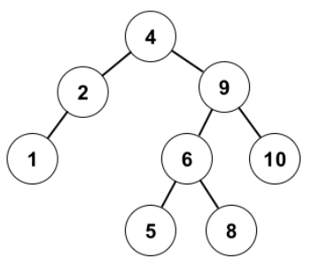
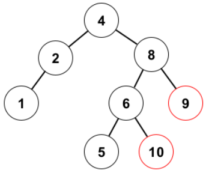
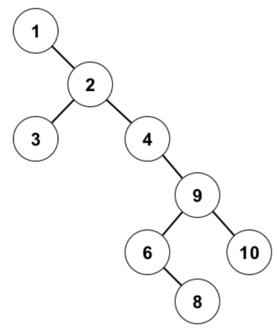
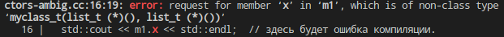
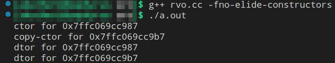
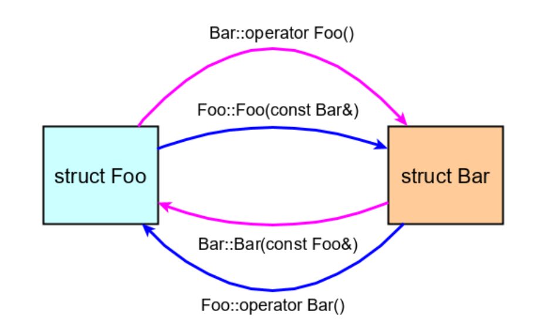
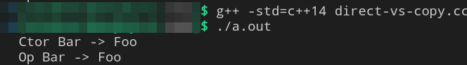
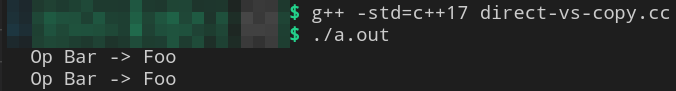
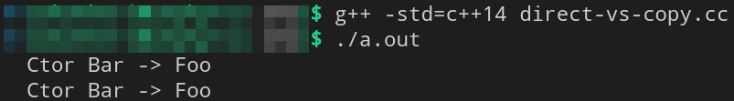
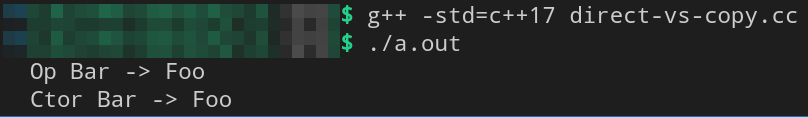

<!--- Данный документ-->

# [Лекция 4: Инициализация и копирование](https://youtu.be/duDyVgMFyug)
Эта лекция в основном про конструкторы. И чтобы смотивировать теорию про них, мы для начала поговорим о ***сбалансированных поисковых деревьях***.

## [Поисковые деревья](https://youtu.be/duDyVgMFyug?t=33)
Напомним. Это структура данных, представляющая из себя граф, в которой объекты связаны между собой через отношения "*родитель/больше/меньше*". Из объектов выделяется *корень* тем, что он без родителя, и *листья* тем, что они без правых и левых предков. Отношение "больше/меньше" может быть задано в каком угодно фиксированном смысле (числовом, лексико-графическом и др..). Эта структура данных характеризуется свойством *поисковости*. И инвариант, который гарантирует это свойство, следующий:

>*Инвариант поисковости*: <div style="text-align: center"><b><i>Любой потомок левого потомка меньше любого потомка правого потомка.</i></b></div>


Поисковое дерево          |  Не поисковое дерево
:------------------------:|:-------------------------:
  | 


У этой структуры данных есть параметр "*высота*" -- наибольшее кол-во узлов от корня до листа. <br/> В примере выше высота = 4.

Любой ключ может быть найден начиная от верхушки дерева за время пропорциональное его высоте. И в самом лучшем случае дерево имеет высоту $\approx log_2(\text{кол-во элементов дерева = N})$. И это делает поисковое дерево лучше, чем список/массив, в которых искать элементы придётся за $O(N)$ время.

> **Важное наблюдение**: <br/> Над одним и тем же множеством элементов все возможные поисковые деревья сохраняют его *inorder*-обход сортированным.

Это означает, что осуществив обход поискового дерева слева направо через корень, а из правого листа на корень корня и т.д., элементы будут попадаться в сортированном по возрастанию порядке. В частности *inorder*-обход может использоваться для тестирование бинарного дерева на инвариант поисковости.

К поисковым деревьям очень легко делать *range-based-queries*, т.е. запросы на диапазон в линейном порядке (например запрос "*посчитать сколько элементов между значением A и значением B*", где A и B могут и не являться элементами дерева). Что очень выгодно отличает их от *хэш-таблиц* например, ведь в последних никакой информации о соотношениях между элементами нет, а в поисковых деревьях - есть, и вполне себе конкретная.

Допустим надо построить минимальную реализацию дерева с возможностью добавления узла из `stdin`. Например по сигналу *`k`* принимается элемент с `double`-значением и записывается в дерево. По сигналу *`q`* - принимаются `double`-границы (первая меньше второй), по которым осуществляется *range-query*.

> **Ввод**: `k`10 &nbsp; `k` 20 &nbsp; `q` 8 31 &nbsp; `q` 6 9 &nbsp; `k` 30 &nbsp; `k` 40 &nbsp; `q` 15 40<br/>
> **Вывод**: 2 0 3

> **Вопрос**: Как написать алгоритм для подобного *range-query*?

> - Можно всякий раз осуществлять полный *inorder*-обход, что дорого. Можно не полный, а в определённом диапазоне. 

Оказывается, что в стандарте есть контейнер `std::set`, который организован как поисковое дерево. И в интерфейсе этого контейнера присутствуют нужные нам методы `upper_bound` и `lower_bound`.

```c++
template <typename C, typename T>
  int range_query(const C& s, T fst, T snd) {
  using itt = typename C::iterator;
  itt start = s.lower_bound(fst);   /* first not less then fst
    * возвращает "ссылку" на первый объект из дерева,
    * значение которого больше или равно fst -type C */

  itt fin = s.upper_bound(snd);     /* first greater then snd 
   * возвращает "ссылку" на первый объект из дерева,
   * значение которого строго больше snd -type C */

  return mydistance(s, start, fin); /* std::distance для set
   * возвращает кол-во объектов между start и fin. */
  
  /* Мы можем вызвать сам std::distance, но для этого
   * у нас должен быть перегружен operator<, а про 
   * перегрузку операторов мы ещё не говорили. 
   * Но мы можем без проблем определить глобальный метод,
   * считающий нужный нам distance.*/ 
}
```
---
### [Проектирование поискового дерева](https://youtu.be/duDyVgMFyug?t=374)

Спроектируем же наше поисковое дерево, которое решит нам эту задачу не хужее `std::set`.

```c++
namespace Trees {
  template <typename KeyT, typename Comp>
  class SearchTree {

    // тип внутреннего узла, определение которого пока не важно
    struct Node;

    using iterator = Node *;  // итератор положение внутри дерева
    Node *top_;  // указатель на вершину

   public: // селекторы
    iterator lower_bound(KeyT key) const;
    iterator upper_bound(KeyT key) const;
    int distance(iterator fst, iterator snd) const;
    
   public: // модификаторы
    void insert(KeyT key);
    ...
  };
  ...
}
```
Можно заметить, как красиво модификаторы доступа отделяют ф-ции по характеру. Да, поля доступа внутри определения класса можно переоткрывать сколько угодно раз. 

Подумаем об инвариантах хорошего поискового дерева. Можно сразу смекнуть, что условие поисковости - это не единственный инвариант, который нам хотелось бы организовать при проектировании для "хорошести". Ведь вот такое дерево:
 &nbsp;| &nbsp;
:-:|:-:
 | оно конечно поисковое, но в худшем случае отсортированный по возрастанию список тоже является поисковым деревом. Искать в нём элементы не эффективно. И делать в них ranged-queries - тоже.

Нам нужна балансировка, чтобы при заполнении дерева его ветви росли $\pm$-равномерно. 

Популярны два варианта балансировки. Через "*красно-чёрный*" инвариант. И через "*AVL*" инвариант.

> ***Красно-чёрный*** *инвариант бинарного дерева* - это совокупность из 4х утверждений, подразумевающих наличие поля в типе узла, отвечающего за идентификацию его цвета(красного или чёрного) (`bool`-переменной для этой цели хватит). И утверждения эти следующие:
> 1. Корень чёрный.
> 2. `nil`-узлы (aka листья, aka узлы без ключей) чёрные.
> 3. Любой красный узел имеет 2 черных отпрыска.
> 4. Для любого узла, кол-во чёрных узлов между ним и любым из его (опосредованных) листьев одинакова. Если кратко, то :"*чёрная высота каждого узла одинакова*".

Выполнение *красно-черного* инварианта в контексте любой операции, подразумевающей изменение состояния дерева, гарантирует, что его высота $h$, относительно мощности дерева $N$, будет удовлетворять неравенству $h \leq 2 \cdot log_2(N)$. Да, на реализацию операций удаления и добавления узлов начинают накладываться интересные нетривиальные сложности (о которых мы говорить здесь не будем), но зато процессы поиска элементов в таком дереве (и обработки запросов на диапазон) на выходе будут происходить очень быстро. Выполнение *красно-черного* инварианта у данного дерева нарекает его титулом "***красно-чёрное дерево***".

> Инвариант ***Адельсона-Вельского и Ландиса*** (aka *AVL*) - это совокупность из двух утверждений (технически - одного), подразумевающих наличие поля в типе узла, отвечающего за наличие разности высот между двумя путями до наиболее отдалённых листев. И утверждения следующие:
> 1. Высота пустого узла нулевая (скорее уточняющее)
> 2. Для каждой вершины высота обоих поддеревьев различается не более чем на единицу.

Выполнение *AVL*-инварианта у данного дерева влечёт примерно те же ништяки и нарекает его титулом "***AVL-дерево***".

---
### [Проектирование узла, начала инициализаций](https://youtu.be/duDyVgMFyug?t=766)
Подумаем об устройстве узла. Как можно написать его структуру?

В *С* это можно сделать например так:

```c
struct Node {
  Key_t key_;
  Node *parent_, *left_, *right_;
  int height_;  // для контроля AVL-инварианта.
};
```
Такая структура простенькая сишная структура в связи со своим устройством обзывается [агрегатом](https://en.cppreference.com/w/cpp/language/aggregate_initialization) (скипнуть до начала раздела "Definitions"). 

> **Вопрос**: Чем плох такой подход проектирования узла с точки зрения инициализации объектов этого типа?

В *С* инициализация объекта типа `struct Node` может произойти на стеке и на куче.

```c
// варианты агрегатной инициализации объекта на стеке в Си
struct Node stack_node = {key, NULL, NULL, NULL, 0};
struct Node stack_node = {key};  // то же самое, что и выше;
// остальные поля default нули согласно типам полей соответственно
---
// default-инициализация на Си объекта в куче.
struct Node *heap_node = malloc(sizeof(struct Node));
heap_node = {key, NULL, NULL, NULL, 0};
```
И в языке *C* агрегатная инициализация - это всё, что у нас есть.

---
#### [Об инициализациях в С++](https://youtu.be/duDyVgMFyug?t=1677)

В *C++* их, если перечислять, то:
- default
- zero
- direct
- value
- copy
- list
- copy-list
- агрегатная
- ... и ещё немного

И все они очень похожи друг на друга, и перетекают друг-в-друга как в крайние случаи. И мы будем вводить их постепенно под соусом из контекста.

---

В *C++* агрегат - это приятная редкость, ибо появляются конструкторы. Но допустим, что конструкторов пока нет. Тогда:
```c++
// варианты агрегатной инициализации объекта на стеке в С++
Node stack_node = {key, NULL, NULL, NULL, 0};
Node stack_node = {key};  // то же самое, что и выше;
Node stack_node {key};  // новшество в С++11

// агрегатная инициализация на С++ объекта в куче 
Node *heap_node_ptr = new Node{key, NULL, NULL, NULL, 0};
...
```
>> - плохо в таком подходе следующее:
>>  1. У нас остаётся возможность инициализировать значение узла мусором, что не безопасно.
>>  2. в нём единственная худо-бедно конкретная инициализация, которая нам доступна - это агрегатная. К сожалению она легко ломается.

Стоит добавить в структуру что-нибудь невозможное для языка *C*, e.g. добавить одно `private/protected`-поле в целях, например, защитить AVL-инвариант, так сразу присваивание фигурными скобочками перестаёт работать.

Отойдём от агрегатной инициализации и по уму напишем конструктор.

```c++
template <typename KeyT>
struct Node {
  KeyT key_;
  Node *parent = nullptr,  // default
    *left_ = nullptr,  // member
    *right_ = nullptr;  // initialisation
  int height_ = 0;  // почленная инициализация по умолчанию

  Node(KeyT key) {key_ = key;} // конструктор
};
```
> **Вопрос**: хорош ли такой конструктор?

Перед ответом на него хотелось бы знать критерии этой "хорошести". Мы подумаем о них в следующем подразделе. А пока обратим внимание на то, как мы можем таким конструктором пользоваться.

```c++
Node sn(key);  // "direct-инициализация", old syntax
Node sn{key};  // "direct-инициализация", new syntax
Node sn = key;  /* "copy-инициализация"
  * последнее - это в частности так выглядит синтаксис вызова
  * опреденённого выше конструктора. */
```
> **Вопрос**: Чем отличаются вызовы конструктора через фигурные скобки от того,  что через обычные скобки?
> 
Ну, поскольку появился конструктор, агрегатная инициализация более невозможна. А потому вторая direct-инициализация - не агрегатная, а вызов всё того же, определённого в теле структуры, конструктора. 

> - Так что в текущей постановке отличий на самом деле нет, но позже они обещают быть.

И первое не очень тривиальное отличие фигурных скобок от нормальных в этом контекте можно показать на отвлечённом примере.
Допустим есть некоторый `myclass_t`, который суть - объединение двух списков:
```c++
// ctor-ambig.cc

#include <iostream>

struct list_t {};  // пустая структура
struct myclass_t {
  int 42;
  
  /* да, имена аргументов ф-ций, оказывается, можно опускать,
   * и это работает до тех пор, пока мы не хотим к этим аргументам
   * по имени обратиться, но всё же работает, что для меня шок. */
  myclass_t(list_t, list_t) {}
};

int main () {
  myclass_t m1( list_t(), list_t() );  // здесь нас ждёт сюрприз
  myclass_t m2{ list_t(), list_t() };  // здесь всё ок, вызов конструктора

  std::cout << m1.x << std::endl;  // здесь будет ошибка компиляции
  std::cout << m2.x << std::endl;
}

g++ ctor-ambig.cc без изысков
```
Выстрелит следующая ошибка компиляции:



Читается она так: 
> запрашивается член "`x`" из "`m1`", где последний суть - не объект пользовательского типа. Вместо того, чтобы быть объектом, он является вот этим: '`myclass_t m1 (list_t (*)(), list(*)())`'

И если прочитать этот *cdecl* (а как это делать, мы учили в [предыдущей лекции](../../03_lect/abstract/doc.md)), то станет понятно, что `m1` - это объявление ф-ции, которая принимает 2 указателя на ф-цию, суть которых `list_t(*)()`, и возвращают временный объект типа `myclass_t`.

> **Вопрос**: а какого, извините, хрена так происходит?<br/>
> 1. Почему вдруг кто-нибудь будет объявлять одну ф-цию внутри другой ф-ции ( `m1` внутри `main` ) ?!
> 2. Почему вызов конструктора `list_t()` превратился в аргумент типа указателя на ф-цию `list_t(*)()`?!
> 3. Почему `m1` вместо объекта типа `myclass_t` является ф-цией?
>> - опустим первый вопрос. Да, практика вообще странная: "объявлять ф-ции внутри других ф-ций". Когда-нибудь потом (в [7й лекции](../../07_lect/abstract/README.md)) мы об этом поговорим
>>
>> В парсере *C++* есть два важных правила:
>> - Всё что можно засчитать за объявление ф-ции, первостепенно засчитывается за объявление ф-ции. $\leftarrow$ ответ на последний вопрос закопан здесь.
>> - И второстепенно: всё что можно засчитать за доступ к полю, засчитывается за доступ к полю. (посмотреть пример в первой лекции при проектировании КЭШей)

Исправляется это дело следующим образом. Надо сломать *function declaration* дополнительными скобками вокруг аргументов, ведь дополнительные скобки вокруг аргументов не могут в нём встретиться. И да;

```c++
меняем 
myclass_t m1( list_t(), list_t() );
на
myclass_t m1( (list_t()), (list_t()) );
```
и теперь парсер нас понимает. Теперь `m1` будет объектом типа `myclass_t`. Решение такое себе, и с *C++11* появилась возможность вызывать конструктор не агрегата через фигурные скобки:
```c++
myclass_t m2{ list_t(), list_t() };
```
А до 2011го года, да, люди страдали.

Этот пример вдохновляет нас на следующее.
> Предпочитать пользоваться конструктором через фигурные скобки.

 За одним исключением. Если есть конструктор из *initialiser list-а*, то предпочитать с опаской.

Про списки инициализации мы сейчас поговорим.

---
### [Двойная инициализация, и как правильно от неё уйти](https://youtu.be/duDyVgMFyug?t=1536)
Вернёмся к нашим претензиям на "хорошесть" конструктора. Для этого рассмотрим похожий на то, что было выше пример.

```c++
struct S {
  S() { std::cout << "default" << std::endl; }
  S(KeyT key) { std::cout << "direct" << std::endl; }
};  /** структура для доп. шаблонного ключа, объект которого будет 
  * использоваться в узле. */

struct Node {
  S key_; int val_
  Node(KeyT key, int val) { key_ = key; val_ = val }
  ...
}
```
> И вот **вопрос**: что будет на экране при создании объекта `Node` через его конструктор?
>> - Будет "*default \n direct*". А почему?
>>> - Потому что правильно думать о конструкторах можно так: как только мы зашли в тело конструктора (внутрь `{...}`) поля УЖЕ объявлены и УЖЕ чем-то проинициализированы. До инструкций внутри тела конструктора поля у объекта уже были созданы и проинициализированы конструктором класса `S` по умолчанию.

И последний отвечает в частности на вопрос, почему компилятор ругается, если поля нашего класса имеют члена ссылку, или член const-указатель, ведь эти поля не могут быть проинициализированы по умолчанию, т.к. перевязать их нельзя.

Короче, чтобы уйти от повторной инициализации, а так же определить состояние для членов-ссылок класса и const-указателей в объекте (если они есть), надо проинициализировать наши поля где-нибудь
```c++
Node (KeyT key, int val) >вот_здесь< {...} 
```
Т.е. где-то до начала тела конструктора, но после его вызова.
И правильный способ это сделать - написать ***список инициализации***.

```c++
struct S {/* всё то же самое */};

struct Node {
  S key_; int val_
  Node(KeyT key, int val): key_(key), val_(val) {}
  ...
};
```
Теперь при вызове конструктора в `stdout` выстрелит только "*direct*". 

И здесь есть **два правила**:
- *порядок инициализации полей определяется НЕ порядком перечисленных инициализаций в списке, а порядком расположения полей в классе.*
```c++
struct Node {

  int val_; S key_;  // сначала идёт val_, потом идёт key

  Node(S key, int val): key_(key), val_(val) {} /* val_ будет
   * проинициализирован первым, key_ вторым, и да,
   * если инициализация key_ требует определённость val_,
   * то требование будет выполнено */
  ...
};
```
- дефолтные инициализации полей по умолчанию неявно затаскиваются в список инициализации каждого конструктора
```c++
struct S {/* всё то же самое */};

struct Node {
  int val_ = 1;
  S key_; 
  Node(S key):/* здесь незримо val_(1), */ key_(key) {}
  ...
};
```
И да. Явный список инициализации приоритетнее неявного.

```c++
struct Node {
  int val_ = 1; 
  Node() {}  // val_1(1)
  Node(int val_): val_(val) {}  /* здесь о значении
   * по умолчанию никто даже и не вспомнит. */
  ...
};

такую структуру лучше переписать так:

struct Node {
  int val_; 
  Node(int val_ = 1): val_(val) {}  // val_1(1)
  /* Кратко и просто. Более того этот конструктор можно использовать,
   * как конструктор по умолчанию, в котором дефолтно val_ будет
   * проинициализирован единицей. */
  // Это пример смежности default и direct инициализаций
  ...
};
```
---
### [Делегация конструкторов](https://youtu.be/duDyVgMFyug?t=2017)

Начиная с *C++11* появилась возможность делегировать конструкторы. Если первый конструктор делает что-то нетривиальное, и мы не хотим городить много кода, а хотим переиспользовать уже написанное в другом конструкторе, то достаточно указать его первым в списке инициализации:

```c++
struct myclass_t {
  int max = 0, min = 0;
  // нетривиальность - инициализация поля через тернарную конструкцию
  myclass_t(int my_max) : max(my_max > 0 ? my_max : DEFAULT_MAX) {}

  myclass_t(int my_max, int my_min) : myclass_t(my_max),
    my_min(my_min > 0 && my_min < max ? my_min : DEFAULT_MIN) {}
  ...
  /* дальше можно написать третий конструктор, который будет делать что-то ещё,
   * и в нём делегировать первичную инициализацию полей второму конструктору */
};
```

---

Ок. Довели до ума конструктор в узле дерева. Доведём до ума и деструктор.

### [Деструкторы](https://youtu.be/duDyVgMFyug?t=2079)
```c++
template<typename KeyT>
struct Node {
  KeyT key_;
  Node *parent_ = nullptr,  // default
    *left_ = nullptr,       // member
    *right_ = nullptr;      // initialisation
  int height_ = 0;
  
  Node(KeyT key) : key_(key) {}  // конструктор
  ~Node() {delete left_; delete right_;}  // вот такой вариант деструктора
  ...
};
```
То есть удаление узла влечёт удаление всего поддерева, для которого этот узел является корнем. Ведь `delete` вызовет деструкторы потомков, а их деструкторы вызовут `delete` для их потомков.
Покритируем это.
> **Вопрос**: почему такой деструктор плох?
>> 1. Возможно мы не хотим удалять всё поддерево, фактом удаления его узла-корня. Возможно мы хотим удалить только узел и перестроить дерево с учётом элементов в его поддереве. 
>> 2. `delete` вызовет деструктор для `left_` и для `right_`, а последние вызовут деструкторы для своих потомков - это рекурсия. Рекурсия черевата переполнением стека.
>> 3. `delete` удалит `left_` и `right_`, если они были созданы на куче через `new`. Но последнего никто не гарантировал. Узел не знает, как и где он был создан. Об этом знает тот, кто его создавал. Например методы класса `SearchTree`. Разве что конструктор, или методы класса `Node` выделяли память на потомков текущего узла через `new`, тогда деструктор `Node` должен будет эту память освободить. Но в данном случае это не так. Да и не должно быть так.

> **Вопрос**: Надо ли проверять на `nullptr` перед `delete`?
>> - НЕТ. Внутри `delete` проверка на `nullptr` уже предусмотрена. `delete nullptr;` - это безопасно. Даже в языке *C*, `free(NULL);` - это безопасно.

2й пункт ответа на первый вопрос самый сильный. Потому что мы очень боимся переполнения стека, ведь переполнение стека - это ситуация, которую мы не способны обработать. И напротив мы совершенно не боимся переполнения кучи, ведь если `malloc` / `new` больше не способны выделить память, то их вызовы вернут `NULL` / `nullptr`, или прозвенят в `errno` / бросят `std::bad_alloc` соответственно.

> **Вопрос**: как избежать рекурсии при очистки дерева?

---
### [Value-initialisation](https://youtu.be/duDyVgMFyug?t=2569)
*Value*-инициализация смежна с *direct* и *default* инициализацией. И мы коснёмся её лишь слегка.

Для класса с конструктором без аргументов между перечисленными инициализациями нет разницы:
```c++
SearchTree s;  // default-init, SearchTree();
SearchTree t{};  // default-init, SearchTree()
// здесь неизбежно вызывается некоторый конструктор.
```
А вот для примитивных типов и агрегатов разница есть и не маленькая:
```c++
int n;  // default-init, сдвиг stack-pointer, n := garbage happen to be there
int m{};  // value-init, сдвиг stack-pointer, m := 0
int *p1 = new int[5];  // default-init мусором. malloc.
int *p2 = new int[5]{};  // value-init нулями. Аналог calloc.
// к слову, массив - это разновидность агрегата
```
___

Ну ладно. Мы поговорили о конструкторах, немножко о деструкторах, о вариантах инициализации. Поговорим о неявностях, которыми *C++* заполняет наши классы по умолчанию

## [Интерфейс класса по умолчанию](https://youtu.be/duDyVgMFyug?t=2747)

Напишем пустой класс:
```c++
class Empty {


};
```
> **Вопросы**:
> 1. Сколько места занимает один объект этого класса? и почему не 0 байт?
>> - Да, в классе ничего не лежит, а значит даже если мы создадим объект от него, он не будет иметь никаких интерпретаций под собой. И казалось бы, раз у него нет полей, значит он должен весить 0 байт. На самом деле нет. Поскольку мы можем создать объект этой структуры и на стеке, и на куче, в последнем случае если нам вдруг захочется создать массив таких объектов, то минимальное необходимое условие на этот массив: элементы не должны схлопнуться в один адрес, чтобы можно было итерировать по этому массиву указатель, чтобы как минимум `delete` на нём корректно отработал. А значит 0 байт объект типа `Empty` весить не может, ведь единица адресации в *C/C++* - 1 байт, или 1 чар (см. [lect_02](../../02_lect/abstract/doc.md)). `sizeof(Empty);` вернёт 1.

Тему о кол-ве пространства, занимаемого объектом пустого класса, мы ещё вспомним, когда появится наследование, и будем говорить про *EBCO* (that is *empty base optimisation*). Там "пустой" базовый класс будет вносить 0 байт в класс наследник.

> 2. Сколько будет весить этот класс, если в него добавить какие-нибудь методы?
>> - Разве что эти методы будут виртуальные, тогда в структуре будут храниться указатели на виртуальные таблицы, по одному на виртуальный метод. Не виртуальные методы ничего не весят.

> 3. Помимо дефолтных конструкторов и деструкторов, чем ещё компилятор заполнит эту структуру в тайне от нас?
>> - Зависит от того, как мы будем его использовать. Будем ли его вообще создавать и уничтожать, передавать его объекты в функции по значению(копировать)? Будем ли использовать приведение его в другой тип, или другой тип к нему, присваивать значение одного объекта к другому?...

Один из ответов на 3й вопрос - конструктор копирования. 

### [Копирование/присваивание](https://youtu.be/duDyVgMFyug?t=2925)

Конструктор копирования - это такой конструктор, который создаёт новый объект текущего класса по подобию уже существующего объекта этого класса.

Варианты вызвать конструктор копирования следующие:
```c++
// пусть есть класс Copyable

Copyable a;  // default-init - оригинальный объект

Copyable b(a), c{a};  // direct-init via copy ctor
Copyable d = a;  // copy-init via copy ctor
```
Не следует путать его с операцией присваивания. В присваивании есть 2 стороны, и по обе стороны объекты УЖЕ существуют.
```c++
a = b;  // присваивание
d = c = b = a;  // присваивание цепочкой
 // оно правоассоциативно, т.е. порядок исполнения справа-налево.

// левая сторона присваивания - это this, а правая - это, возможно, значение, ссылка, или указатель на "референс".
```
И вот здесь можно почувствовать, что присваивание - это не конструктор, ведь оба объекта уже существуют. И сущность, которой является присваивание - это "*оператор*". Знак "`=`" - это "*оператор*". И объявление/перегрузка этой сущности, как функции, подразумевает конкретный синтаксис.

Ответим на 3й вопрос конкретно:
>> - как только в нашем коде появились инструкции `Empty x; Empty y(x); x = y;` компилятор заполнит класс следующим образом, и оптимизирует/уберёт лишнее, если оно не используется.
```c++
class Empty {
 public:
  Empty();  // ctor
  Empty(const &Empty);  // copy ctor
  Empty& operator=(const &Empty);  // assignment
  ~Empty();  // dtor
};
```
Здравый смысл подсказывает, что правая часть присваивания, равно, как и "референс" для копирования, не должны измениться при осуществлении операций. А потому их аргументы аннотированы `const`. Оператор`=` возвращает ref, чтобы было возможно присваивание цепочкой. Можно догадаться, что под этим ref спрятан `return *this`.

Посмотрим на простом, показательном примере, как именно он сгенерирует эти методы.

```c++
template <typename T> struct Point2D {
  T x_ y_;
  /** то, что написано ниже - этого в коде нет, но компилятор добавит

    Point2D(): default_init x_, default_init y_ {} 
    ~Point2D() {}
    Point2D(const &Point2D rhs): x_(rhs.x_), y(rhs.y_) {}
    Point2D& operator=(const &Point2D rhs) {
       x_ = rhs.x_; y_ = rhs.y_; return *this;
    } 
   
  */
};
```
> **Замечания**:<br/>
> Для случаев `T` встроенных типов и агрегатов: 
> 1. Конструктор по умолчанию сделает то, чего мы сами сделать своими руками не можем - проинициализирует поля мусором на месте сдвига stack-pointer-а (в *C++* нет синтаксиса для этого).
> 2. Конструктор копирования осуществит побитовое копирование значений полей объекта `rhs` в поля `*this`.
> 3. Оператор присваиваиня осуществит побитовое присваивание значений полей объекта `rhs` в поля `*this`.
> 
> Для случаев `T` пользовательских типов: 
> 1. Конструктор по умолчанию вызовет конструктор по умолчанию класса `T`.
> 2. Конструктор копирования вызовет конструктор копирования класса `T`.
> 3. Оператор присваивания вызовет оператор присваивания класса `T`.
> 4. Деструктор вызовет деструктор класса `T`.

И в связи с этим становится понятно, что написание своего конструктора копирования и оператора присваивания в некоторых контекстах скорее не обязательно, и даже вредно. Например, вот есть класс КЭШа:

```c++
template <typename T, typename KeyT> class Cache {
  std::list<T> cache_;
  std::unordered_map<KeyT, T> locations_;
  ...
};
...
Cache<smth> c1;
Cache<smth> c2 = c1 
```
Здесь сгенеренный компилятором конструктор копирования сделает всё за нас, ведь в нём у `std::list` и у `std::unordered_map` вызовутся свои конструкторы копирования. Ничего своего писать здесь не надо. В это случае всеми ресурсами управляет код стандартной библиотеки. И разве что в полях нашего класса мы имеем ресурс, который мы сами выделили на куче, и кроме нас управлять / отпускать его некому, мы должны призадуматься о написании своего конструктора копирования. И `SearchTree` - это пример того самого случая.

> **Вопрос**: что будет, если мы не напишем конструктор копирования для `SearchTree`?
>> - при любом инстансе копирования дерева будут происходить плохие вещи; указатель на *top_, будет скопирован побитово из одного объекта типа `SearchTree` в другой объект типа `SearchTree`(ИМЕННО ЧТО УКАЗАТЕЛЬ, а не данные, на которые он ссылается), ведь тип указателя в *C/C++* - это, как ни крути, встроенный тип, не важно, во что он там разыменуется. А значит, по окончанию scope копии вызовется деструктор, и у оригинального дерева всё содержимое провиснет.

> <div style="text-align: center"><i>Если наш класс управляет тем ресурсом, которым никто кроме нас не управляет, надо серьёзно призадуматься о написании своего конструктора копирования</i></div>
<div style="text-align: right"><br/>О перегрузке оператора= надо призадуматься в той же самой степени и по той же самой причине. И есть ещё один метод, нуждающийся в перегрузке в этой связи, но о нем в следующей лекции.</div> <br/>
 

> Ок. Призадумались, но пока ничего не придумали, а писать дальше надо. Что делать?
>> Самое простое, что можно сделать - удалить (запретить).

Синтаксис для "удаления/запрещения" cуществующих методов класса (конструкторов/операторов...), для копирования в частности, следующий:
```c++
type_t (const &type_t) = delete;
```
Любая попытка вызвать удалённый метод интерфейса класса (конструктор, оператор...) приведёт к ошибке компиляции. Надёжно. Безопасно. Лениво.

```c++
template <typename KeyT, typename Comp>
  class SearchTree {
    struct Node {...};
    using iterator = Node *;  // итератор положение внутри дерева
    Node *top_;  // указатель на вершину

   public:  // база
    SearchTree(KeyT val) { top_ = new Node{val}; }
    ~SearchTree() { delete top_; }
    SearchTree(const &SearchTree rhs) = delete;  // удаленный copy ctor
    SearchTree& operator=
      (const &SearchTree rhs) = delete;  // удаленный оператор=

   public: // селекторы
    ...
   public: // модификаторы
    ...
  };
```

Ещё есть `... = default`, который суть - явное уточнение для метода иметь поведение по умолчанию. Но это редко, когда бывает полезно; cкорее всего вообще не нужно ничего писать.

Помимо невозможности присваивания значения одного существующего объекта другому рождающимуся, запрещение копирования в классе влечёт невозможность передать / вернуть объект этого класса по значению в / из функции, что, казалось бы, что-то само собой разумеющееся для любых объектов. Вообще говоря в стандарте, конечно, есть классы, для которых запрещено копирование (i.e. мьютекс). Но если здравый смысл вам подсказывает, что для текущего класса копирование в принципе должно быть возможно, пожалуйста, не злоупотребляйте `= delete;`

И если мы не хотим злоупотреблять, давайте его напишем.

Отвлечемся от дерева к чему-нибудь более приземлённому. Пусть есть класс `Buffer`:

```c++
class Buffer {
  int n_; int *p_;
   
   public:
    Buffer(int n) : n_(n), p(new int[n]) {}
    ~Buffer() { delete [] p_; }

    Buffer(const Buffer& rhs);  // их можно определить 
    Buffer& operator= (const Buffer& rhs);  // вне тела класса
};
```
Опишем конструктор копирования:
```c++
Buffer::Buffer(const Buffer& rhs) 
  : n_(rhs.n_),  // здесь время жизни для n_ началось 
    p_(new int[n_])  // можем сэкономить на rhs.n_
{
  std::copy(p_, p_ + n_, rhs.p_);  // безопасный memcpy
}
```
и оператор присваивания:
```c++
// оба объекта rhs и this уже существуют.
// Надо отпустить предыдущее состояние this, если this != rhs.
Buffer& Buffer::operator= (const Buffer& rhs) {
  if (this == &rhs) return *this;
  n_ = rhs.n_;
  delete [] p_;
  p_ = new int[n_];
  std::copy(p_, p_ + n_, rhs.p_);
  return *this;
}
```
В этой реализации присваивания есть проблема, связанная с переполнением стека, о которой мы поговорим когда-нибудь [потом](когда-нибудь).

Поговорим о спецсемантике всего этого.

---
### [Специальная семантика](https://youtu.be/duDyVgMFyug?t=3768)

Итак, спецсемантика. Насколько я понял, под ней имеются ввиду: "*неявные смысловые / механические особенности при использовании*". Одна такая механическая особенность, или, скорее, явление, зовётся *copy elision*, или *RVO* (that is *Return-Value-Optimisation*).

---
#### **Пример RVO / Copy elision. Спецсемантика копирования**

Рассмотрим следующий [код](https://github.com/tilir/cpp-graduate/blob/master/03-concrete/rvo.cc):

```c++
// rvo.cc

#include <iostream>

using std::cout;
using std::endl;

struct foo {
  foo() { cout << "foo::foo()" << endl; }
  foo(const foo &) { cout << "foo::foo(const foo&)" << endl; }
  ~foo() { cout << "foo::~foo()" << endl; }
};

foo bar() { foo local_foo; return local_foo; }

int main() { foo f = bar(); }
```

Автором наказано покомпилировать это двумя разными инструкциями
```console
g++ rvo.cc
g++ -fno-elide-constructors rvo.cc
```
и посмотреть, что будет в результате.

> **Вопрос**: что будем иметь в `stdout` при исполнении `a.out` при компиляции `rvo.cc` первой инструкцией?

Давайте проследим:
1. `main` вызовет `bar`
2. `bar` вызовет default-конструктор для `local_foo` $\leftarrow$ *`foo::foo()`*
3. по выходу из `bar`, `f` будет проинициализированно временным объектом, который вернула `bar` через copy-конструктор $\leftarrow$ *`foo::foo(const foo&)`*
4. временный объект из `local_foo` умирает на этой строке $\leftarrow$ *`foo::~foo()`*
5. `f` умрёт при выходе из `main` $\leftarrow$ *`foo::~foo()`*

Итого, вывод:
```bash
foo::foo()            # конструктор для local_foo
foo::foo(const foo&)  # copy-конструктор для f
foo::~foo()           # деструктор для local_foo
foo::~foo()           # деструктор для f
```
>> - увы, увы. Даже если мы попросим `g++` на `-O0` (без оптимизаций)
 <br/>

> Что? Был какой-то конструктор копирования?
>> - нет. Произошел [***mandatory elision of copy operation***](https://en.cppreference.com/w/cpp/language/copy_elision).

Надо понимать про конструкторы копирования очень важную вещь:
<div style="text-align: center"><b><i>Объект <u>this</u> после копирования эквивалентен ВО ВСЕХ отношениях тому объекту <u>rhs</u>, с которого копировали.</b></i></div></br>

И это всегда так. В данном случае это означает, что `f` полностью взаимозаменяем с `local_foo`. Компилятор протянул `local_foo` в вот-вот только рождающийся `f` целиком и полностью. Другими словами, произошло *return-value-optimisation*. И нет, слово optimisation - это не потому что компилятор "оптимизировал код" и убрал *copy*-конструктор из `main`. Мы знаем это потому, что:
1. RVO происходит даже в случае компиляции на -O0.
2. В конструкторе копирования есть явный побочный эффект - push сообщения в `stdout`. С тем же успехом там мог стоять вызов ф-ции, которая форматирует жесткий диск.

И никакой компилятор в своём уме не нарушит [*as-if-rule*](https://en.cppreference.com/w/cpp/language/as_if) при оптимизации, то есть не выдаст в результате программу с нарушением последовательностей побочных эффектов, продиктованных в исходном коде (отличное [видео про as-if-rule](https://www.youtube.com/watch?v=8yUSMJWlEsk)). Но в данном случае означенное нарушение происходит **в связи со спецсемантикой конструктора копирования**. И при определённых условиях, о которых можно прочитать [тут](https://en.cppreference.com/w/cpp/language/copy_elision) *copy*-конструктор может быть выброшен на уровне *front-end*-а языка, а может и не быть выброшен. Но в данном случае он выбрасывается на уровне *front-end*-a языка (что бы это не значило). Чтобы вырубить RVO, можно компилить с флагом `-fno-elide-constructors`. Чуть подправим код для наглядности и поглядим на результат:
```c++
// rvo.cc

#include <iostream>

using std::cout;
using std::endl;

struct foo {
  foo() { cout << "ctor for " << this << endl; }
  foo(const foo &) { cout << "copy-ctor for " << this << endl; }
  ~foo() { cout << "dtor for " << this << endl; }
};

foo bar() { foo local_foo; return local_foo; }

int main() { foo f = bar(); }
```


Заметим, что все конструкторы вызвались. А объекты, для которых они вызвались, имеют разные адреса.

Поскольку *copy*-конструктор подвержен *RVO*, компилятор должен иметь возможность его узнавать. А потому у него есть набор из строго допустимых форм, предусмотренных стандартом.

---
#### [**Допустимые формы copy-конструктора**](https://youtu.be/duDyVgMFyug?t=4077)
Перечислим все эти формы. Они могут отличаться только конкретным диапазоном аннотаций к `foo&`-типу принимаемого аргумента `rhs`. То есть, аргумент `rhs` может быть как угодно *cv-квалифицированной* ссылкой на `foo`. Имеется ввиду следующее.
```c++
struct Copyable {
  ...
  Copyable(Copyable &rhs);  
  Copyable(const Copyable &rhs);  // эта форма по умолчанию
  Copyable(volatile Copyable &rhs);
  Copyable(const volatile Copyable &rhs);
  ...
};
```
Может быть не объявлена ни одна форма, тогда по умолчанию компилятор напишет за нас вторую. А могут быть объявлены хоть все 4, тогда вызов каждой будет матчится через *name-resolution* (т.е. вызов конструктора копирования, в который передали неконстантный `rhs` сматчится с первой формой).

>**Вопрос**: что такое cv-квалификация?

---
##### [**cv-квалификация**](https://youtu.be/duDyVgMFyug?t=4146)
Есть ключевое слово `const`, есть ключевое слово `volatile`. "*cv-квалификация*" - это свойство объектов в *C/C++* которое обретается ими через навешивание совокупности этих ключевых слов перед уточнением типа.
```c
const int c = 34;  /** означает, что обращаясь по идентификатору "с"
 * внутри нашего кода, мы не можем изменить состояние ячейки памяти,
 * на которое это "c" ссылается. */

volatile int v;  /** означает, что в двух последовательных обращениях к "v"
 * её значение может непредсказуемо измениться не зависимо от нашего кода,
 * в котором данное "v" аннотированно volatile.*/

const volatile int cv = 42;  /** означает, что обращаясь по идентификатору "cv"
 * внутри нашего кода мы не можем изменить состояние ячейки памяти, на которое
 * это "cv" ссылается, но оно само может непредсказуемо измениться независимо
 * от нашего кода.
```
В *C++* cv-квалификация предусмотрена не только для переменных, но так же для методов членов класса. Пусть есть структура `S` с методами `kek`, `foo`, `bar` и `buz`, которые имеют разную cv-квалификацию.

```c++
int S::kek() { return 42; }  /** означает, что данный метод может изменить
 * поля объекта типа S, от которого он был вызван, а вызван он может быть 
 * только объектами, которые не являются ни const, ни volatile. */

int S::foo() const { return 42; }  /** означает, во-первых, что данный метод
 * гарантированно не изменит поля объекта типа S, от которого он был вызван,
 * а во-вторых - он может быть вызван не только обычными объектами типа S,
 * но так же и const-объектами типа S. */

int S::bar() volatile { return 42; }  /** означает, во-первых, что данный метод
 * может изменить поля объекта типа S, от которого он был вызван,
 * а во-вторых - он может быть вызван не только обычными объектами типа S,
 * но так же и volatile-объектами типа S. */

int S::buz() const volatile { return 42; }  /** означает, во-первых,
 * что данный метод гарантированно не изменит поля объекта типа S,
 * от которого он был вызван,
 * а во-вторых - он может быть вызван от объектов типа S,
 * имеющих какую угодно cv-квалификацию. */
```

> **Вопрос**: много ли в стандартной библиотеке `volatile`-методов?
>> - Ноль.

По этой теме есть исторический анекдот:
> Создайте переменную `std::vector` предворённую `volatile`, и попробуйте с ней сделать хоть что-нибудь так, чтобы не вызвать ошибку компиляции.

---

##### [**Допустимость формы (продолжение)**](https://youtu.be/duDyVgMFyug?t=4400)
Надо понимать следующее; **в шаблонном классе шаблонный конструктор копирования - это не конструктор копирования**.

```c++
template <typename T> struct Copyable {
  Copyable() = default;  /* если не указать явно в шабл. структуре, то
    * то при инициализации будет ругаться. */
  Copyable(const Copyable &c) {
    std::cout << "Hello!" << std::endl;
  }  /* по левую и по правую сторону этого copy-конструктора
   * ожидаются типы Copyable, параметризованные одинаковым параметром T. */
};

Copyable<void> a;
Copyable<void> b{a}; // на экране Hello (rvo не произойдёт)
```
В примере выше всё нормально. Конструктор копирования структуры `Copyable`, принимает параметр, который ничем не параметризован $\Rightarrow$ для каждого параметра/типа эта ф-ция будет делать одно и тоже.

> **Вопрос**: А если вдруг нам захотелось, чтобы *copy*-конструктор делал разные вещи, в зависимости от параметризации объекта, который создаётся, или в зависимости от параметризации объекта-референса, по которому новый объект создаётся?
>> - Насчёт первого или - хз. А насчёт второго наш ответ - ***coercion*-конструктор**:

```c++
template <typename T> struct Coercible {
  Coercible() = default; /* если не указать явно в шабл. структуре, то
    * то при инициализации будет ругаться. */
  template <typename U> Coercible(const Coercible<U> &c) {
    std::cout << "Hello!" << std::endl;
  }  /* в данном случае тип U - это не тип T в частности.
   * coercion-конструктор ожидает от U любой другой параметр, кроме T */
};

Coercible<void> a;

Coercible<void> b{a}; /* на экране ничего. 
 * Вызов copy-конструктора, который был сгенерирован компилятором.
 * coercion-конструктор - это не copy-конструктор! */

Coercible<int> c{a};  // на экране hello. Вызов coercion-конструктора.
```
---
#### [**Спецсемантика инициализации. Ключевое слово `explicit`. Конструкторы, как пользовательские преобразования**](https://youtu.be/duDyVgMFyug?t=4483)
Оказывается, что обычный конструктор при *direct*-инициализации объекта класса может определять неявное преобразование типа. Это можно проследить на следующем примере

```c++
struct MyString {
  char *buf_; size_t len_;
  MyString(size_t len) : buf_{new char[len]{}}, len_{len} {}
};

void foo(MyString) {/* как то определена */}

int main () {
  
  foo(42);  // чего? foo же принимает объект MyString по значению !!
  /* Да всё так. Но конструктор структуры MyString принимает size_t.
   * Можно написать явный вызов конструктора foo(MyString(42)),
   * и это сработает.
   * Но оказывается можно опустить явную диррективу вызова конструктора
   * внутри аргумента ф-ции foo, и просто написать 42. Тогда,
   * учитывая сигнатуру foo и, существующий в MyString, конструктор,
   * последний вызовется неявно. А выглядеть это будет, как неявное
   * приведение числа в MyString-аргумент ф-ции foo. Круто же? Круто. */
  ...
}
```
И механизм неявного преобразования через конструкторы почти всегда полезен. В примере выше, он не полезен, ведь этот *implicit cast* подразумевает выделение динамической памяти на массив. Ну и читается это весьма сомнительно, мол, "*что значит, число было скастовано в строку?, ау!*"

Таков пример **неявных пользовательских преобразований**. В прошлой лекции в разделе про *name resolution process* мы упомянули, что в иерархии множества перегрузок **они**, помимо прочих, стоят ниже неявных стандартных преобразований, но выше переменного числа аргументов (пункт 5 в списке).

Для того, чтобы заблокировать такое поведение (т.е. заблокировать неявное преобразование аргумента конструктора в тип), конструктор можно аннотировать ключевым словом `explicit`.

```c++
struct MyString {
  char *buf_; size_t len_;
  explicit MyString(size_t len) : buf_{new char[len]{}}, len_{len} {}
};

void foo(MyString) {/* как то определена */}

int main () {
  
  foo(42);  // error: could not convert '42' from 'int' to 'MyString'
  foo(MyString(42));  // ok
  ...
}
```
Но повторимся, в большей части случаев такие неявные приведения полезны. Поэтому вешать `explicit` на конструктор - это экстрим, и должно быть хорошо обоснованно.

Помимо того, что `explicit` блокирует неявные приведения, он так же блокирует *copy*-инициализацию. И здесь выявляется различие между *copy*-инициализацией и *direct*-инициализацией. Пару разделов выше эти различия обещали быть; вот они.

```c++
struct Foo {
  explicit Foo(int x) {}
};

int main () {
  Foo f{2};  // direct-инициализация, ok
  Foo f = 2;  // copy-инициализация, FAIL
  ...
}
```
В общем-то справедливо. *Copy*-инициализация некоторым образом похожа на неявное преобразование. В данном случае `int` в `Foo`.

Ладно. В одну сторону (т.е. из `int` в "нас") пользовательские преобразования реализуются через конструкторы с одним аргументом соответствующего типа.
> **Вопрос**: как реализовать пользовательское преобразование из "нас" в `int`? Ведь интерфейсы примитивных типов нам не доступны. Мы не можем описать свой конструктор класса `int`
>> - для пользовательского преобразования из "нас" в другую сторону, в частности в `int`, мы можем внутри "нас" написать `operator int() {...}`. Аналогично можно описать оператор приведения из "нас" в другой пользовательский тип. 
```c++
struct MyString {
  char *buf_; size_t len_;
  operator const char*() { return buf_; }
  ...
};

void foo(const char*) {...}

int main() {
  MyString str;
  foo(str);  // ok
}
```
В отличие от `operator=`, синтаксис описания сигрантуры операторов приведения в другую сторону начинается не с типа, который они возвращают, а сразу со слова `operator`, ведь возвращать он обязан объект того типа, к которому описывается приведение. Ну и операторы приведения не принимают никаких аргументов. Такова допустимая форма.

`explicit` на операторы приведения из "нас" в другую сторону имеют тот же смысл - блокировка неявного приведения.

Как можно заметить следующее. У "нас" можно описать конструктор и оператор приведения из другого пользовательского типа в "нас", и из "нас" в другой пользовательски тип соответственно. Но и у другого пользовательского типа можно сделать всё то же самое по отношению к "нам". На лицо избыточность в способах каста из одного пользовательского типа в другой пользовательский тип.

 <br/>

> **Закономерный вопрос**: Что будет при конфликте? Какой путь implicit-каста компилятор посчитает оптимальным и когда?

В контексте ответа на этот вопрос очень удобно рассматривать отличие *copy*-инициализации от *direct*-инициализации

#### [**Разница между инициализациями direct и сopy**](https://youtu.be/duDyVgMFyug?t=4754) 

И здесь затык, поскольку начиная с 17-го стандарта (т.е. в 17, 20, 23) правила изменились по сравнению с 14-м и 11-м.

К примеру вот есть код:
```c++
// direct-vs-copy.cc

#include <iostream>

struct Foo;
struct Bar;

struct Foo {
  Foo() {}
  Foo(const Bar &) { // <- это первый способ инициализировать объект Foo
    std::cout << "Ctor Bar -> Foo" << std::endl;
  }
};

struct Bar {
  Bar() {}
  operator Foo() {  // <- это второй способ инициализировать объект Foo
    std::cout << "Op Bar -> Foo" << std::endl;
    return Foo{};
  }
};

int main() {
  Bar b;  // это наш основной референс для создания Foo-объекта

  // есть 2 варианта инициализации объекта Foo. 
  // Direct и copy инициализация.
  Foo f1(b);  // direct-init
  Foo f2 = b; // copy-init
}
```
**!!! Мы будем рассматривать его работу только в контексте компиляции на GCC !!!** 

Отличие *direct*-инициализации от *copy*-инициализации, помимо того, что синтаксис *direct* подразумевает скобочки(фигурные или круглые) конструктора, а синтаксис *copy* подразумевает `= объект_типа_аргумента_конструктора`; другое отличие состоит в их *overload-set*-ах (списках перегрузок): 
- при *direct*-инициализации рассматриваются все-все конструкторы и только они.
- при *copy*-инициализации рассматриваются конструкторы и операторы приведения НЕ аннотированные `explicit`.

Первый пункт верен лишь в контексте до 17-го стандарта. Раньше было так. Сейчас уже нет.

Соответственно в `main`:
- объект `f1` может быть создан через конструктор `Foo(const Bar &)`
- объект `f2` может быть создан через `Foo(const Bar &)` а может и через `operator Foo()` в `struct Bar` до тех пор, пока они не аннотированы `explicit`.

И до 17-го стандарта, и после, в этом коде при *copy*-инициализации `f2`, оператор приведения выигрывает.

 <br/>

Но начиная с 17-го стандарта имеем:

 <br/>
Т.е. начиная с *C++17*, в *overload-set* *direct*-инициализации объекта типа "нас" попадают операторы приведения снаружи в "нас". Как явные, так и неявные. И в данном случае для 17-го стандарта они (эти операторы приведения) выигрывают при *direct*-инициализации.

Если мы навесим на `operator Foo()` модификатор `explicit`, то для разных стандартов имеем следующее.

 <br/>

 <br/>

Т.е. модификатор `explicit` на операторе приведения из `Bar` в `Foo` понижает его приоритет в списке перегрузок *copy*-инициализации, как до 17-го стандарта, так и после.

В списке перегрузок *direct*-инициализации же, начиная с 17-го стандарта, во-первых, оператор приведения снаружи (из `Bar` в `Foo`) начинает иметь место, а во-вторых модификатор `explicit` на операторе никак не влияет на его приоритет (в списке перегрузок *direct*-инициализации).

---
### [***Standart_implicit_cast* vs *User_implicit_cast***](https://youtu.be/duDyVgMFyug?t=5042)
В прошлой лекции мы говорили про [*name resolution process*](https://youtu.be/TQ5VPnKWqoY?t=2990) при разрешении конфликта между перегрузками ф-ций, где внутри списка этих перегрузок матчинг типов аргументов и, соответственно, выбор реализации, подчинялись конкретной [иерархии](https://youtu.be/TQ5VPnKWqoY?t=3187). И в ней:
- пунктом 4 выступал матчинг с учётом в одно неявное **стандартное** преобразование;
- пунктом 5 выступал матчинг с учётом в одно неявное **пользовательское** преобразование. 
- пунктом 6 выступал матчинг с учётом **вараргов** (эллипсис *a.k.a.* многоточие).

Приоритет растёт в сторону уменьшения индекса пункта, т.е. перегрузка с неявным стандартным преобразованием более предпочтительна перегрузке с неявным пользовательским, и тем более перегрузке с многоточиями (*standart implicit cast* "короче/выгоднее" чем *user implicit cast*). 

Продемонстрируем, что имеелось ввиду на примере.

```c++
struct Foo { Foo(long x = 0) {} };

void foo(int x);  // перегрузка foo с int
void foo(Foo x);  // перегрузка foo c Foo

void bar(Foo x);  // перегрузка bar c Foo
void bar(...);  // перегрузка foo c чем угодно

int main () {
  long l; 
  
  foo(l); /* что здесь произойдёт? 
   * - foo перегружается с аргументом int и с аргументом Foo, 
   *  где в последнем случае у нас есть конструктор, 
   *  позволяющий скастовать long в Foo. 
   * 
   *  И поскольку в означенной иерархии пользовательское 
   *  преобразование менее приоритетно, чем стандартное,
   *  long приведётся в int, и вызовется foo(int). */


  bar(1); /* что здесь произойдёт?
   * - bar перегружается с аргументом Foo и 
   *  с произвольным числом аргументов.
   * 
   *  И поскольку в означенной иерархии матчинг с учётом
   *  пользовательского преобразования более приоритетен,
   *  чем матчинг с многоточиями, то интовая единица
   *  сначала неявно приведётся в long,
   *  потом этот long неявно приведётся в Foo
   *  и вызовется bar(Foo). */
}
```

> **Вывод**: какой бы длинной не была цепочка неявных стандартных/пользовательских преобразований, перегрузка с эллипсисом всегда хуже неё.

Оказывается любая корректная цепочка преобразований может состоять из скольки угодно стандартных преобразований вначале и одного пользовательского преобразования в конце, или же одного пользовательского вначале и сколь угодно стандартных в конце.
> **Вопрос**: а что, если вдруг, для матчинга понадобится цепочка, подразумевающая больше одного пользовательского преобразования, то многоточия победят? И данная цепочка более не будет корректной; выбросится ошибка компиляции?

---
Закончим пугалкой, забегая вперёд.

Мы уже заметили, что синтаксис описания перегрузок операторов для каждого случая может отличаться. И \*здесь держитесь\*, если у конструкторов спецсемантика возможна только для конструкторов копирования, у инициализаций - только лишь относительно слова `explicit` и наличия пользовательских операторов приведения, то у самих операторов спецсемантика при перегрузке **возможна ВЕЗДЕ**. *Неявные особенности отношений компилятора к перегрузкам операторов класса* - это одна из самых сложных тем в *C++*. Целый отдельный разговор об этих спецсемантиках у нас будет позже в следующих лекциях.

---
## [HW-T](https://youtu.be/duDyVgMFyug?t=5257)
В `stdin` приходят запросы трёх видов:
- `k` - запрос на добавление ключа в базу данных. Повторения ключей в контейнере недопустимы.
- `m` - запрос на поиск j-го наименьшего элемента (j-тая порядковая статистика),
- `n` - запрос на поиск кол-ва элементов, которые будут меньше, чем тот, что задан,

и ключи (целые числа).
> **Вход**: `k` 8 &nbsp; `k` 2 &nbsp; `k` -1 &nbsp; `m` 1 &nbsp; `m` 2 &nbsp; `n` 3 

> **Результат**: -1 2 2

> **Надо**: описать контейнер, который способен обработать эти запросы за $O(log_2(N))$. Описать для него конструктор копирования (без `=delete`), деструктор без рекурсий.

> **Подсказка**: это должно быть поисковое дерево с хитрой балансировкой. И нет. `std::set` для этих целей "до слёз не предусмотрен". Надо написать своё дерево.

Протестировать это всё *GTest*-ами на крупных списках запросов с дополнением данных в контейнер в особо больших количествах
