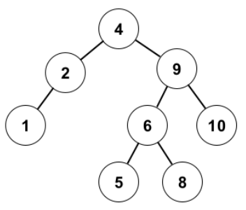
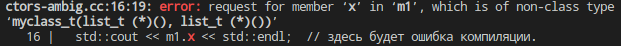

# [Лекция 4 (Инициализация и копирование)](https://youtu.be/duDyVgMFyug)
Эта лекция в основном про конструкторы. И чтобы смотивировать теорию про них, мы для начала поговорим о ***сбалансированных поисковых деревьях***.

## [Поисковые деревья](https://youtu.be/duDyVgMFyug?t=33)
Напомним. Это структура данных, представляющая из себя граф, в которой объекты связаны между собой через отношения "*родитель/больше/меньше*". Из объектов выделяется *корень* тем, что он без родителя, и *листья* тем, что они без правых и левых предков. Отношение "больше/меньше" может быть задано в каком угодно фиксированном смысле (числовом, лексико-графическом и др..). Эта структура данных характеризуется свойством *поисковости*. И инвариант, который гарантирует это свойство, следующий:

>*Инвариант поисковости*: <div style="text-align: center"><b><i>Любой потомок левого потомка меньше любого потомка правого потомка.</i></b></div>


Поисковое дерево          |  Не поисковое дерево
:------------------------:|:-------------------------:
  | 


У этой структуры данных есть параметр "*высота*" -- наибольшее кол-во узлов от корня до листа. <br/> В примере выше высота = 4.

Любой ключ может быть найден начиная от верхушки дерева за время пропорциональное его высоте. И в самом лучшем случае дерево имеет высоту $\approx log_2(\text{кол-во элементов дерева = N})$. И это делает поисковое дерево лучше, чем список/массив, в которых искать элементы придётся за $O(N)$ время.

> **Важное наблюдение**: <br/> Над одним и тем же множеством элементов все возможные поисковые деревья сохраняют его *inorder*-обход сортированным.

Это означает, что осуществив обход поискового дерева слева направо через корень, а из правого листа на корень корня и т.д., элементы будут попадаться в сортированном по возрастанию порядке. В частности *inorder*-обход может использоваться для тестирование бинарного дерева на инвариант поисковости.

К поисковым деревьям очень легко делать *range-based-queries*, т.е. запросы на диапазон в линейном порядке (например запрос "*посчитать сколько элементов между значением A и значением B*", где A и B могут и не являться элементами дерева). Что очень выгодно отличает их от *хэш-таблиц* например, ведь в последних никакой информации о соотношениях между элементами нет, а в поисковых деревьях - есть, и вполне себе конкретная.

Допустим надо построить минимальную реализацию дерева с возможностью добавления узла из `stdin`. Например по сигналу *`k`* принимается элемент с `double`-значением и записывается в дерево. По сигналу *`q`* - принимаются `double`-границы (первая меньше второй), по которым осуществляется *range-query*.

> **Ввод**: `k`10 &nbsp; `k` 20 &nbsp; `q` 8 31 &nbsp; `q` 6 9 &nbsp; `k` 30 &nbsp; `k` 40 &nbsp; `q` 15 40<br/>
> **Вывод**: 2 0 3

> **Вопрос**: Как написать алгоритм для подобного *range-query*?

> - Можно всякий раз осуществлять полный *inorder*-обход, что дорого. Можно не полный, а в определённом диапазоне. 

Оказывается, что в стандарте есть контейнер `std::set`, который организован как поисковое дерево. И в интерфейсе этого контейнера присутствуют нужные нам методы `upper_bound` и `lower_bound`.

```cpp
template <typename C, typename T>
  int range_query(const C& s, T fst, T snd) {
  using itt = typename C::iterator;
  itt start = s.lower_bound(fst);   /* first not less then fst
    * возвращает "ссылку" на первый объект из дерева,
    * значение которого больше или равно fst -type C */

  itt fin = s.upper_bound(snd);     /* first greater then snd 
   * возвращает "ссылку" на первый объект из дерева,
   * значение которого строго больше snd -type C */

  return mydistance(s, start, fin); /* std::distance для set
   * возвращает кол-во объектов между start и fin. */
  
  /* Мы можем вызвать сам std::distance, но для этого
   * у нас должен быть перегружен operator<, а про 
   * перегрузку операторов мы ещё не говорили. 
   * Но мы можем без проблем определить глобальный метод,
   * считающий нужный нам distance.*/ 
}
```

[Проектирование поискового дерева](https://youtu.be/duDyVgMFyug?t=374)

Спроектируем же наше поисковое дерево, которое решит нам эту задачу не хужее `std::set`.

```cpp
namespace Trees {
  template <typename KeyT, typename Comp>
  class SearchTree {

    // тип внутреннего узла, определение которого пока не важно
    struct Node;

    using iterator = Node *;  // итератор положение внутри дерева
    Node *top_;  // указатель на вершину

   public: // селекторы
    iterator lower_bound(KeyT key) const;
    iterator upper_bound(KeyT key) const;
    int distance(iterator fst, iterator snd) const;
    
   public: // модификаторы
    void insert(KeyT key);
    ...
  }
  ...
}
```
Можно заметить, как красиво модификаторы доступа отделяют ф-ции по характеру. Да, поля доступа внутри определения класса можно переоткрывать сколько угодно раз. 

Подумаем об инвариантах хорошего поискового дерева. Можно сразу смекнуть, что условие поисковости - это не единственный инвариант, который нам хотелось бы организовать при проектировании для "хорошести". Ведь вот такое дерево:
 &nbsp;| &nbsp;
:-:|:-:
 | оно конечно поисковое, но в худшем случае отсортированный по возрастанию список тоже является поисковым деревом. Искать в нём элементы не эффективно. И делать в них ranged-queries - тоже.

Нам нужна балансировка, чтобы при заполнении дерева его ветви росли $\pm$-равномерно. 

Популярны два варианта балансировки. Через "*красно-чёрный*" инвариант. И через "*AVL*" инвариант.

> ***Красно-чёрный*** *инвариант бинарного дерева* - это совокупность из 4х утверждений, подразумевающих наличие поля в типе узла, отвечающего за идентификацию его цвета(красного или чёрного) (`bool`-переменной для этой цели хватит). И утверждения эти следующие:
> 1. Корень чёрный.
> 2. `nil`-узлы (aka листья, aka узлы без ключей) чёрные.
> 3. Любой красный узел имеет 2 черных отпрыска.
> 4. Для любого узла, кол-во чёрных узлов между ним и любым из его (опосредованных) листьев одинакова. Если кратко, то :"*чёрная высота каждого узла одинакова*".

Выполнение *красно-черного* инварианта в контексте любой операции, подразумевающей изменение состояния дерева, гарантирует, что его высота $h$, относительно мощности дерева $N$, будет удовлетворять неравенству $h \leq 2 \cdot log_2(N)$. Да, на реализацию операций удаления и добавления узлов начинают накладываться интересные нетривиальные сложности (о которых мы говорить здесь не будем), но зато процессы поиска элементов в таком дереве (и обработки запросов на диапазон) на выходе будут происходить очень быстро. Выполнение *красно-черного* инварианта у данного дерева нарекает его титулом "***красно-чёрное дерево***".

> Инвариант ***Адельсон-Вельского и Ландиса*** (aka AVL) - это совокупность из двух утверждений (технически - одного), подразумевающих наличие поля в типе узла, отвечающего за наличие разности высот между двумя путями до наиболее отдалённых листев. И утверждения следующие:
> 1. Высота пустого узла нулевая (скорее уточняющее)
> 2. Для каждой вершины высота обоих поддеревьев различается не более чем на единицу.

Выполнение *AVL*-инварианта у данного дерева влечёт примерно те же ништяки и нарекает его титулом "***AVL-дерево***".

### [Проектирование узла, начала инициализаций](https://youtu.be/duDyVgMFyug?t=766)
Подумаем об устройстве узла. Как можно написать его структуру?

В *С* это можно сделать например так:

```c
struct Node {
  Key_t key_;
  Node *parent_, *left_, *right_;
  int height_;  // для контроля AVL-инварианта.
};
```
Такая структура простенькая сишная структура в связи со своим устройством обзывается [агрегатом](https://en.cppreference.com/w/cpp/language/aggregate_initialization) (скипнуть до начала раздела "Definitions"). 

> **Вопрос**: Чем плох такой подход проектирования узла с точки зрения инициализации объектов этого типа?

В *С* инициализация объекта типа `struct Node` может произойти на стеке и на куче.

```c
// варианты агрегатной инициализации объекта на стеке в Си
struct Node stack_node = {key, NULL, NULL, NULL, 0};
struct Node stack_node = {key};  // то же самое, что и выше;
// остальные поля default нули согласно типам полей соответственно
---
// агрегатная инициализация на Си объекта в куче.
struct Node *heap_node = malloc(sizeof(struct Node));
heap_node = {key, NULL, NULL, NULL, 0};
```
И в языке *C* агрегатная инициализация - это всё, что у нас есть.

#### [Об инициализациях в С++](https://youtu.be/duDyVgMFyug?t=1677)

В *C++* их, если перечислять, то:
- default
- zero
- direct
- value
- copy
- list
- copy-list
- агрегатная
- ... и ещё немного

И все они очень похожи друг на друга, и перетекают друг-в-друга как в крайние случаи. И мы будем вводить их постепенно под соусом из крепкого контекста.

В *C++* агрегат - это приятная редкость, ибо появляются конструкторы. Но допустим, что конструкторов пока нет. Тогда:
```cpp
// варианты агрегатной инициализации объекта на стеке в С++
Node stack_node = {key, NULL, NULL, NULL, 0};
Node stack_node = {key};  // то же самое, что и выше;
Node stack_node {key};  // новшество в С++11

// агрегатная инициализация на С++ объекта в куче 
Node *heap_node_ptr = new Node{key, NULL, NULL, NULL, 0};
...
```
>> - плохо в таком подходе следующее:
>>  1. У нас остаётся возможность инициализировать значение узла мусором, что не безопасно.
>>  2. в нём единственная худо-бедно конкретная инициализация, которая нам доступна - это агрегатная. К сожалению она легко ломается.

Стоит добавить в структуру что-нибудь невозможное для языка *C*, ie добавить одно `private/protected`-поле в целях, чтобы, например, защитить AVL-инвариант, так сразу присваивание фигурными скобочками перестаёт работать.

Отойдём от агрегатной инициализации и по уму напишем конструктор.

```cpp
template <typename KeyT>
struct Node {
  KeyT key_;
  Node *parent = nullptr,  // default
    *left_ = nullptr,  // member
    *right_ = nullptr;  // initialisation
  int height_ = 0;  // почленная инициализация по умолчанию

  Node(KeyT key) {key_ = key;} // конструктор
};
```
> **Вопрос**: хорош ли такой конструктор?

Перед ответом на него хотелось бы знать критерии этой "хорошести". Мы подумаем о них в следующем подразделе. А пока обратим внимание на то, как мы можем таким конструктором пользоваться.

```cpp
Node sn(key);  // "direct-инициализация", old syntax
Node sn{key};  // "direct-инициализация", new syntax
Node sn = key;  /* "copy-инициализация"
  * последнее - это в частности так выглядит синтаксис вызова
  * опреденённого выше конструктора. */
```
> **Вопрос**: Чем отличаются вызовы конструктора через фигурные скобки от того,  что через обычные скобки?
> 
Ну, поскольку появился конструктор, агрегатная инициализация более невозможна. А потому вторая direct-инициализация не агрегатная, а вызов всё того же, определённого в теле структуры, конструктора. 

> - Так что в текущей постановке отличий на самом деле нет, но позже они обещают быть.

И первое не очень тривиальное отличие фигурных скобок от нормальных в этом контекте можно показать на отвлечённом примере.
Допустим есть некоторый `myclass_t`, который суть объединение двух списков:
```cpp
// ctor-ambig.cc

#include <iostream>

struct list_t {};  // пустая структура
struct myclass_t {
  int 42;
  
  /* да, имена аргументов ф-ций, оказывается, можно опускать,
   * и это работает до тех пор, пока мы не хотим к этим аргументам
   * по имени обратиться, но всё же работает, что для меня шок. */
  myclass_t(list_t, list_t) {}
};

int main () {
  myclass_t m1( list_t(), list_t() );  // здесь нас ждёт сюрприз
  myclass_t m2{ list_t(), list_t() };  // здесь всё ок, вызов конструктора

  std::cout << m1.x << std::endl;  // здесь будет ошибка компиляции
  std::cout << m2.x << std::endl;
}

g++ ctor-ambig.cc без изысков
```
Выстрелит следующая ошибка компиляции:



Читается она так: 
> запрашивается член "`x`" из "`m1`", где последний - суть не объект пользовательского типа. Вместо того, чтобы быть объектом, он является вот этим: '`myclass_t m1 (list_t (*)(), list(*)())`'

И если прочитать этот *cdecl* (а как это делать, мы учили в [предыдущей лекции](../../03_lect/abstract/doc.md)), то станет понятно, что `m1` - это объявление ф-ции, которая принимает 2 указателя на ф-цию, суть которых `list_t(*)()`, и возвращают временный объект типа `myclass_t`.

> **Вопрос**: а какого, извините, хрена так происходит?<br/>
> 1. Почему вдруг кто-нибудь будет объявлять одну ф-цию внутри другой ф-ции ( `m1` внутри `main` ) ?!
> 2. Почему вызов конструктора `list_t()` аргумент превратился в тип указателя на ф-цию `list_t(*)()`?!
> 3. Почему `m1` вместо объекта типа `myclass_t` является ф-цией?
>> - опустим первый вопрос. Да, практика вообще не популярная - объявлять ф-ции внутри ф-ций. Но возможно где-то это надо.
>>
>> В парсере *C++* есть два важных правила:
>> - всё что можно засчитать за объявление ф-ции, первостепенно засчитывается за объявление ф-ции. $\leftarrow$ ответ на последний вопрос закопан здесь.
>> - И второстепенно - всё что можно засчитать за доступ к полю, засчитывается за доступ к полю. (посмотреть пример в первой лекции при проектировании КЭШей)

Исправляется это дело следующим образом. Надо сломать function declaration двойными скобками вокруг аргументов, ведь двойные скобки вокруг аргументов не могут в нём встретиться. И да;

```cpp
меняем 
myclass_t m1( list_t(), list_t() );
на
myclass_t m1( (list_t()), (list_t()) );
```
и теперь парсер нас понимает. Теперь `m1` будет объектом типа `myclass_t`. Решение такое себе, и с *C++11* появилась возможность вызывать конструктор не агрегата через фигурные скобки:
```cpp
myclass_t m2{ list_t(), list_t() };
```
А до 2011го года, да, люди страдали.

Этот пример вдохновляет нас на следующее.
> Предпочитать пользоваться конструктором через фигурные скобки.

 За одним исключением. Если есть конструктор из *initialiser list-а*, то предпочитать с опаской.

Про списки инициализации мы сейчас поговорим.

### [Двойная инициализация](https://youtu.be/duDyVgMFyug?t=1536)
Вернёмся к нашим претензиям на "хорошесть" конструктора. Для этого рассмотрим похожий на то, что было выше пример.

```cpp
struct S {
  S() { std::cout << "default" << std::endl; }
  S(KeyT key) { std::cout << "direct" << std::endl; }
};  /** структура для доп. шаблонного ключа, объект которого будет 
  * использоваться в узле. */

struct Node {
  S key_; int val_
  Node(KeyT key, int val) { key_ = key; val_ = val }
  ...
}
```
> И вот **вопрос**: что будет на экране при создании объекта `Node` через его конструктор?
>> - Будет "*default \n direct*". А почему?
>>> - Потому что правильно думать о конструкторах можно так: как только мы зашли в тело конструктора (внутрь `{...}`) поля УЖЕ объявлены и УЖЕ чем-то проинициализированы.

И последний отвечает в частности на вопрос, почему компилятор ругается, если поля нашего класса имеют члена ссылку, или член const-указатель, ведь эти поля не могут быть проинициализированы по умолчанию, т.к. перевязать их нельзя.

Короче, надо инициализировать наши поля где-нибудь
```cpp
Node (KeyT key, int val) >вот_здесь< {...} 
```
Т.е. где-то до начала тела конструктора, но после его вызова.
И правильный способ это сделать - написать ***список инициализации***.

```cpp
struct S {/* всё то же самое */};

struct Node {
  S key_; int val_
  Node(KeyT key, int val): key_(key), val_(val) {}
  ...
}
```
Теперь при вызове конструктора в `stdout` выстрелит только "*direct*".