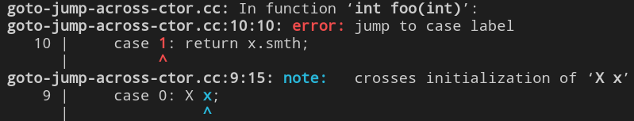
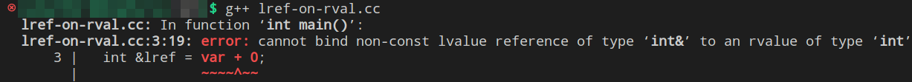
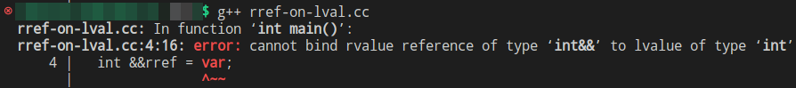
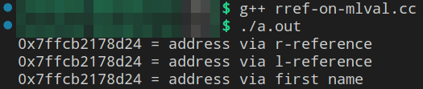

# [Лекция 5: RAII и перемещение](https://youtu.be/_mLDaU4wSOo)

Эта лекция посвящена классам, которые владеют своими ресурсами; так называемым *RAII-классам*. А так же мы начнём говорить о семантике перемещения.

## [Владение ресурсом и извороты в Си в попытках удалить его безопасно](https://youtu.be/_mLDaU4wSOo?t=113)

> **Вопрос**: Что значит владеть ресурсом?

Вопрос философский. И может показаться, что ответ на него мол: "*владеть = иметь к ним доступ, подступаться к методам для работы с ним*". К такому описанию владения есть 2 претензии:
- в контексте *C/C++* если очень сильно захотеть, можно получить доступ к чему угодно, было бы желание;
- чтобы ресурс был, его нужно создать

А потому полезно думать следующим образом. 
>> - **владеть** ресурсом = **уметь его выделять, освобождать и, возможно, предоставлять безопасный доступ**.

> **Вопрос**: какие существуют ценные ресурсы в контексте инструментов программирования?
>> - файловые хэндлы
>> - сетевые соединения
>> - память

Последний является наиболее важным и наиболее простым.

Владение ресурсом - это то, за чем мы должны следить, ведь если этого не делать, то этот ресурс может утечь, как например здесь

```c++
int main() { ...
  S *p = new S;
  foo(p);  // ресурс утёк в foo, и может быть там непредвиденно освобождён
  delete p;  // возможно двойное удаление
}
```
И если освобождение ресурса не локализовано в ответственности некоторого механизма этого самого ресурса (например засчёт деструктора), в языке *C* нам приходится этим освобождением заниматься непосредственно по месту событий руками. И, к сожалению, в языке *C* этим заниматься крайне неудобно.

Рассмотрим популярный пример кода на *C*, который приходится писать, если ответственность за динамическую память вешается на реализацию ф-ции.

<div style="text-align: right">...пример ниже никак не связан с функцией <code>foo</code> в коде выше!</div> <br/>

```c
int foo(int n) {
  struct S *p = malloc (sizeof(struct S)); 
  // .... some code ....
  if (condition) {
    free(p);
    return FAILURE;
  }  
  // .... some code ....
  free(p);
  return SUCCESS;
}
```

Здесь две точки освобождения. Хотелось бы иметь одну.
И частично вопреки правилам структурного программирования это можно осуществить, используя оператор `goto`.

```c
int foo(int n) {
  struct S *p = malloc (sizeof(struct S));
  int result = SUCCESS; 
  // .... some code ....
  if (condition) {
    result = FAILURE;
    goto cleanup;
  }
  // .... some code ....
  cleanup:
  free(p);
  return result;
}
```
Но `goto` - это, как бы, плохо. Тем не менее, у нас есть [Linux kerner coding style](https://www.kernel.org/doc/html/v4.10/process/coding-style.html), где в пункте 7, именуемом [centralized exiting of functions](https://www.kernel.org/doc/html/v4.10/process/coding-style.html#centralized-exiting-of-functions), умные люди, которые проектировали *Linux kernel* на *C*, советуют писать именно так.

Ну и давайте раз и навсегда разберёмся, **почему `goto` - это плохо**.
> - Эдгар Дейкстра в 1968 написал письмо в журнал с темой [Go To Statement Considered Harmful](Dijkstra68.pdf). И речь шла о том, что злоупотребление `goto` плохо не для компилятора, а именно для программиста. Анализировать код, в котором использование `goto`-оператора - обычное дело, очень сложно. **Почему сложно?**
> 
>> Если структура нашей программы суть - вложенные блоки циклов и условных конструкций, то в ней нет непредсказуемых нелокальных выходных дуг. Мы точно можем быть уверены, что выходы производятся из шапок `for`, `if`, по достижению `return`; вся блочная структура программы представляет из себя вложенное дерево из блоков.
`goto` делает из дерева произвольный граф, цепочку исполнения которого анализировать намного труднее.

В своё время, означенная статья Дейкстры произвела на всех такое впечатление, что люди начали `goto` стесняться. А когда люди стесняются `goto`, люди `goto` начинают маскировать. В связи с этим появились такие ключевые слова, как `break`, `continue`, `switch-case`. Вариант реализации кода выше от стеснительного программиста выглядит, например, так:

```c
int foo(int n) {
  struct S *p = malloc (sizeof(struct S));
  int result = SUCCESS; 
  do {
    // .... some code ....
    if (condition) {
      result = FAILURE;
      break;  // что вы?!, какой goto? неее 
    }
    // .... some code ....
  } while(0);
  free(p);
  return result;
}
```
Цикл из одной итерации, из которой делается условный и вполне законный `break`. Выглядит по-ублюдски, но зато социально-приемлемо.

Другая проблема с `goto`, которая стала заметна в 90х, состоит в следующем.
Если у объектов есть состояние, и инициализация этого состояния происходит через вызов конструктора, то дуга `goto` может пересекать точки начала жизни объектов и точки их смерти по отдельности. Например вот функция со `switch-case`:

```c++
int foo(int cond) {
  switch(cond) {
    case 0: X x;
    case 1: return x.smth;
  }
}
```
> "***Дуги control flow не должны пересекать точки создания объектов и их уничтожения.***". 

Ведь если метка для `goto` находится внутри блока после начала *scope* некоторой переменной, но до его окончания, то точка исполнения, пройдя по этой метке, рискует наткнуться на диррективу в связи с объектом, который не был даже *default*-сконструирован. Обращение к объекту, который ещё не родился - это UB.
> 
И слава Богу, в *C++* это ошибка компиляции, причём формулируется она ожидаемым образом:
 
 <br/>

 Поэтому если в коде на *C* довольно легко прыгнуть из тела одного цикла-`for` внутрь тела другого цикла-`for` выше, то на *C++* это сложно, ведь в последнем появляется инициализация объектов вызовом конструктора.

 В связи с этим безопасно в коде на *C++* не забывать о явных блоках при описании `case`-ов
 ```c++
int foo(int cond) {
  switch(cond) {
    case 0: {X x}; 
    case 1: return x.smth;  // очевидная ошибка; x не виден
  }
}
```

Чтобы не заниматься всем этим контролем над освобождением ресурсов в *C++* руками, выше мы уже упомянули: надо использовать **механизмы деструкторов**.

---
## [RAII (Resource acquisition is initialisation)](https://youtu.be/_mLDaU4wSOo?t=627)

Овладение ресурсом есть инициализация.
> ***RAII-классы*** - *это классы, которые владеют своими ресурсами*.

Владеют в том смысле, что и обсуждалось в разделе выше.
Вспомним самый первый пример, только перепишем его на *C++*:
```c++
template <typename S> int foo(int n) {
  S *p = new S{n}; 
  // .... some code ....
  if (condition) {
    delete p;
    return FAILURE;
  }  
  // .... some code ....
  delete p;
  return SUCCESS;
}
```
В этом примере мы хотели бы автоматизировать выделение и освобождение ресурса в `p` так, чтобы к `p` можно было относиться проще, как к статической переменной, безопасной в отношении утечки. Чтобы:

- выделение происходило по объявлению (возможно в некоторой степени конкретезированному);
- освобождение происходило по достижению `return`;

В этом нам помогут конструкторы и деструкторы класса `S`. С ними, выше означенный шаблон реализации `foo` на *C++* будет выглядеть чище и проще. Вот так, например:
```c++
template <typename S> int foo (int n) {
  ScopedPointer<S> p{new S(n)}; // ownership passed
  // .... some code ....
  if (condition) return FAILURE; // dtor called: delete
  // .... some code ....
  return SUCCESS; // dtor called: delete
}
```
Теперь реализация `foo` не в ответе за освобождение памяти по указателю `p`. Эта ответственность переложена на реализацию шаблонного класса `ScopedPointer`.

> **Вопрос**: Как может выглядеть реализация этого `ScopedPointer`?
>> - например вот так
>> ```c++
>> template <typename T> class ScopedPointer {
>>   T *ptr_;
>>    public:
>>      ScopedPointer(T *ptr = nullptr) : ptr_(ptr) {}
>>      ~ScopedPointer() { delete ptr_; }
>> };
>>```
>> Более того, ни `foo`, ни какая другая ф-ция, на стеке которой будут объявляться указатели `ScopedPointer<type>`, не смогут легально перехватить ответственность за **выделенный** на этот указатель **ресурс**, потому что указатель с этим адресом заинкапсулирован в `private` части реализации `ScopedPointer`.

> Инвариант класса `ScopedPointer`:
> <div style="text-align: center"><i><b>Никто кроме меня не имеет доступа к указателю, который я храню внутри себя.</i></b></div>
В связи с этим класс `ScopedPointer` ещё можно называть *<u>RAII-обёрткой вокруг сырых указателей</u>*

С учётом сказанного в конце предыдущей лекции можно уследить одно замечательное качество конструктора описанной *RAII*-обертки:

> Шаблонность конструктора `ScopedPointer(T *ptr = nullptr)` относительно параметра `T` допускает неявное преобразование сырого указателя на **любой тип** в объект `ScopedPointer`, параметризованный **этим самым любым типом**.

И замечательно это потому, что `ScopedPointer` гарантирует обратную совместимость с любым *legacy*-кодом, который оперировал сырыми указателями. Т.е. например в целях безопасности, мы можем тупо заменить все вхождения аргументов-указателей на аргументы-значения типа `ScopedPointer` в *legacy*-коде, убрать из него ненужные `free/delete`, и его логика сохранится.

> **Вопрос**: ага, сохранится, лол. 
> - А разве `ScopedPointer` поддерживает оператор `->` нужным нам образом?!
> - Разве копирование при передаче `ScopedPointer` в функцию по значению - это хорошая идея в текущем состоянии реализации?!
> - Разве в текущей реализации `ScopedPointer` можно вообще как-то докопаться до данных, выделенных по адресу в инкапсулированном указателе?
>>
>> Нет, нет, и ещё раз нет. Но к счастью в *C++*:
>> - унарный `operator*` (*dereference*) можно перегрузить 
>> - `operator->` тоже можно перегрузить
>> - копирование по умолчанию в случае `ScopedPointer` скопирует указатель на фрейме вызывающей ф-ции, и вызовет деструктор по достижению её `return` $\Rightarrow$ удалит данные, а внешний указатель провиснет. Но и конструктор копирования можно перегрузить.

### [**Копирование `ScopedPointer`**](https://youtu.be/_mLDaU4wSOo?t=790)
&nbsp; Если бы нам хотелось копировать `ScopedPointer`-объекты без копирования всей той памяти, которая повязана на инкапсулированный в объекте указатель, то нам надо было бы придумать способ изолировать владение ресурсом от копии объекта `ScopedPointer`, чтобы деструктор копии не имел возможности удалить ресурс, на который эта копия ссылается. Это можно сделать через введение счётчика, который считает кол-во существующих копий, повязанных на данный ресурс, и через перегрузку деструктора в зависимости от значения в этом счётчике. 

Счётчик должен обладать свойствами:
- `private`, чтобы его нельзя было снаружи изменить;
- "`static`", чтобы каждый объект знал, сколько объектов `ScopedPointer`, повязанных на данный ресурс на текущий момент существует и не удалено.

Проблема в том, что ресурсов, которые мы хотим защитить нашей *RAII*-оберткой может быть очень много, а `static`-член класса существует один для всех объектов одновременно, а значит уже для 2х ресурсов его может нехватить. Делать массив?...

Пока не будем греть голову и решим эту проблему в лоб. Забудем про единственность существования ресурса. Смело допустим, что он является копируемым, и осуществим глубокое копирование.

```c++
class ScopedPointer {
  // ... -//-
  ScopedPointer(const ScopedPointer& rhs) :
    ptr_(new T{*rhs.ptr_}) {}
  // ... -//-
};
```

Таким образом 
- *копия "взаимозаменяема" с оригиналом в момент копирования* => семантика копирования почти удовлетворена;
- *владение оригинальным ресурсом не утекает при копировании* $\leftarrow$ это тоже правда.

Да, тип нашего "скопед-указателя" понимает операцию копирования чересчур буквально, но пока оставим это.

Присваивание реализуется тривиально без неожиданностей.
1. Проверяем, не все себя ли присваиваемся
2. `delete` того, что слева
3. Переопределение на содержимое `rhs`

### [**Доступ к состоянию `ScopedPointer`**](https://youtu.be/_mLDaU4wSOo?t=878)
Надо подступиться к содержимому `T* ptr_`. 
> **Вопрос**: Какие есть варианты методов для доступа?
>
> Их несколько.
>> 1. Метод член класса `access`:
>>```c++
>> template <typename T> class ScopedPointer {
>>   T *ptr_;
>>    public:
>>     // ctor(){}, dtor(){}
>>     T& access() { return *ptr_; }
>>     const T& access() const { return *ptr_; }
>> }; 
>> ```
>> И в этом случае мы пишем 2 метода.
>> - для объектов `ScopedPointer`, аннотированных `const`, возвращающих `const` ссылку на ресурс
>> - для объектов `ScopedPointer` не аннотированных ничем, возвращающих модифицируемую ссылку

Данный способ доступа ещё не так сильно нарушает инвариант нашей *RAII*-обёртки. Указатель не утёк, да, но ссылка утекла. К ссылке, конечно, `delete` применить нельзя, но т.к. она прозрачна, то <kbd>&ссылка</kbd> не защищена от `delete`.

Другая проблема метода `access`: доступ к ресурсу через метод получается весьма многословным:
```c++
ScopedPointer<S> p{new S(n)};
// Допустим x - это int поле в структуре S нашего ресурса 
int x = p.access().x;  // слишком длинно
```
Если же мы хотим, чтобы наш класс, который призван маскировать поведение указателей был не менее удобен, чем обычный указатель, то следующий вариант
>> 2. Перегрузка оператора *dereference*. Или `operator*` не принимающий аргументов:
>> ```c++
>> template <typename T> class ScopedPointer {
>>   T *ptr_;
>>    public:
>>     ...
>>     T& operator*() { return *ptr_; }
>>     const T& operator*() const { return *ptr_; }
>>     ...
>> };
>> ```

Здесь проблема утечки ссылки всё та же, но доступ к полю уже значительно компактнее.

```c++
ScopedPointer<S> p{new S(n)};
// x - это int поле в структуре S нашего ресурса 
int x = (*p).x;  // уже лучше
```

Всё же не очень удобно. Нам очень бы хотелось стрелочку!
>> 3. Перегрузка оператора "стрелочка".
>>```c++
>> template <typename T> class ScopedPointer {
>>   T *ptr_;
>>    public:
>>     ...
>>     ??? operator->() { return ???; } // например p->x, для T::x
>>     ...
>> };
>>```
> **И вот вопрос**: Что эта стрелочка берёт, а что возвращает?

Интуитивно кажется, что поскольку она возвращает поле, какого бы типа оно не было, то возвращаемый тип метода `operator->` - не тип, а имя поля, что, увы, в *C++* невозможно.
Ответ малость неожиданный и связан со **спецсемантикой оператора "->"**.

>> компилятор относится к пользовательской перегрузке `operator->` с особенностью:<br> **он ожидает, что у возвращаемого типа уже перегружен `operator->`, и в вызывает стрелочку от объекта, который попал в return текущей перегрузки.**

В *C/C++* у типа "*указатель на структуру*" `operator->` - это метод открытого интерфейса. Он существует и понятным образом работает. А потому, то что мы хотим выглядит так:
```c++
template <typename T> class ScopedPointer {
   T *ptr_;
    public:
     ...
     T* operator->() { return ptr_; }
     const T* operator->() const { return ptr_; }
     ...
};
```
Означенную спецсемантику ещё называют ***Drill-Down-Behaviour***. Зарывающееся вниз поведение, дословно. Стрелочка, вызывает стрелочку от возвращаемого типа, который вызывает стрелочку от своего возвращаемого типа и т.д. пока не упрёмся в указатель на структуру с открытыми полями и без перегруженного `operator->`.
```c++
ScopedPointer<S> p{new S(n)};
// x - это int поле в структуре S нашего ресурса 
int x = p->x;
/* Можно думать, что вместо "p->" 
 * на самом деле стоит "(p.ptr_)->",
 * держа в голове, что само p.ptr_ недоступно, но вызов -> от неё доступен. */

/* Если думать об этом, как о методе класса, 
 * то то, что выше, эквивалентно */
int x = (p.operator())->x;
```
Ну и да, можно заметить, что инструкция `p.operator->()` в сухую сдаёт нам заинкапсулированный указатель, и это прокол. Но надо понимать, что программист и не захочет вызывать `operator->`, как метод класса, при использовании интерфейса `ScopedPointer`, т.к. это **пример ненормативного использования** операторов. А язык не обязан защищать от **целенаправленного некорректного использования** предоставляемых им инструментов.

Из локаничной стрелочки самой по себе ничего не утекает, и тем она замечательна.

> **Итак**:
>```c++
> template <typename T>
> class ScopedPointer {
>  T* ptr_;
>
>  public:
>   ScopedPointer(T* ptr = nullptr) : ptr_(ptr) {}
>   ScopedPointer(const ScopedPointer& rhs) :
>     ptr_(new T{*rhs.ptr_}) {}
>   ~ScopedPointer() { delete ptr_; }
>
>  public:
>   T& operator*() { return *ptr_; };
>   const T& operator*() const { return *ptr_; };
>   T* operator->() { return ptr_; };
>   const T* operator->() const { return ptr_; };
>   ScopedPointer& operator=(const ScopedPointer& rhs) {
>     if (&rhs != this) {
>       return *this;
>     }
>     delete ptr_;
>     ptr_ = new T(*(rhs.ptr_));
>     return *this;
>   }
> };
>```
> <div style="text-align: center"><b>Хороша ли получившаяся RAII-обёртка? </b></div>

---

## [`std::swap` и подводка к *move*-семантике]()

В инструментарии стандартной библиотеки есть шаблонная функция [`std::swap`](https://en.cppreference.com/w/cpp/algorithm/swap), которая принимает в себя 2 аргумента по левой ссылке и меняет местами их значения.

Можно думать, что до *C++11* её реализация выглядела примерно так:
```c++
template <typename T>
void swap (T& x, T& y) {
  T tmp = x;
  x = y;
  y = tmp;
}
```

> Проанализируем её. Что нужно от типа `T`, чтобы `swap` сделал своё дело?
>> 1-я строка - вызов *copy*-конструктора; </br>
>> 2,3 строки - вызов оператора присваивания;</br>
>> Тобишь `T` должно быть *copyable* и *assignable*.<br>
>> То есть *copy*-конструктор и присваивание у типа `T` не должны быть удалены.

Рассмотрим простую ситуацию использования функции `swap`:

```c++
Захватили владение в сырые указатели, 
и решили поменять их местами под

struct S { /*какое-то определение*/ };

int main() {
  ...
  S *a = new S(1), *b = new S(2);
  std::swap(a, b);
  ...
}

Компилим на -std=c++98
```

В ней всё произойдёт ровно так, как и ожидается. Произойдёт обмен указателями, ресурсы останутся на месте. Просто. Быстро.

А теперь сделаем всё то же самое для ресурсов, захваченных в наш `ScopedPointer`:

```c++
ScopedPointer<S> x{new S(1)}, y{new S(2)};
std::swap(x, y);

Компилим на -std=c++98
```

И внутри `swap` всё опять произойдёт ровно так, как и ожидается:
```c++
  T tmp = x;  // глубокое копирование x в tmp
  x = y;      // delete x.ptr_, x.ptr_ = new T(*(y.ptr_))
  y = tmp;    // delete y.ptr, y.ptr_ = new T(*(tmp.ptr_))
  return;     // tmp.~T()
```
Нам это не нравится по очень понятным причинам, и на вопрос в конце предыдущего раздела мы отвечаем:
>> - нет. Получившаяся *RAII*-обёртка пока что недостаточно хороша.

Очень бы хотелось, чтобы `swap` просто поменял местами значения полей-указателей внутри `x` и `y`.
> **Вопрос**: Ну и что теперь делать? Писать свой `swap` в контексте `ScopedPointer`?
>> - Нет. Ведь начиная с *C++11* в интерфейсах классов появился механизм, который решает означенную проблему для *RAII*-классов и умных указателей.

И этот механизм называется ***семантика перемещения***.

И здесь я на момент отклонюсь от конспектирования Владимирова и попытаюсь разъяснить релевантную содержательную часть [доклада Криса Ван-Рена](https://www.youtube.com/live/km3Urog_wzk?feature=share) про категории выражений.

---

## Value-caterories in C++11
В 3-й лекции мы обещали вернуться к уточнениям категорий выражений, когда доберёмся до *r-value*. 

<div style="text-align: center"><b>Here we go.</b></div>

В [означенном выступлении](https://www.youtube.com/live/km3Urog_wzk?feature=share) от ноября 2020-го года французским акцентом выразительно и доходчиво Kris Rens пояснил о том, что есть из себя *value-categories*, и где их можно встретить. Я опишу лишь частично первый блок выступления.

Как и было сказано ранее (в 3й лекции),
> ***value-category*** = характеристика выражения.

Она не относится к типам, переменным или их значениям. Только к выражениям самим по себе.

> **Выражение** суть - синтаксически корректно построенная последовательность названий методов со скобочками, операторов и операндов, которая задаёт вычисление. Процесс этого вычисления может повлечь побочные эффекты (вывода в <kbd>stdout</kbd>, изменение значения переменной, форматирование жёсткого диска и др.). Финал вычисления может вернуться в виде результата конкретного типа.

При достижении выражения в коде, точка исполнения может как запустить, так и не запустить его вычисление. Произойдёт вычисление или нет зависит от наличия в нём побочных эффектов и наличия необходимости вернуть его результат. 

У выражений есть:
- возвращаемый тип
- категория

Категорий бывает 5 вариантов: 3-шт основных, 2-шт обобщающих. 

Качественно отличных друг от друга вариантов категорий всего 3, и они основные:

- ***l-value*** = **l**ocation value = "значение-с-местом-в-памяти"
- ***pr-value*** = **P**ure **r**-value = "чистое-значение"
- ***x-value*** = e**X**piring value = "значение-чей-срок-жизни-истекает"


Удобно мыслить их в отношении двух свойств
1. *The expression evaluates to an identity*. Дословно: "*вычисляемое значение выражения совпадает с объектом, лежащим под идентификатором*". На самом деле это следует понимать, как ***результат выражения имеет имя, или место в памяти***;

Перечислим варианты выражений, варьирующихся на этом свойстве:
```c++
int a = 21;
struct S {
  int i = 84
  int foo() {return i;}
  int& access_to_i() {return i;}
};
S obj;

следующие выражения имеют либо имя, либо место в памяти
  a          // имеет и имя, и место в памяти
  ++a        // вычислится и в памяти будет лежать модиф. значение
  std::cout  // поток. Он суть - static объект, при подключении iostream
  "Hi"       // строковый литерал
  S().i      // временно вычисленное значение с именем i
  obj        // имеет и имя, и место в памяти
  obj.i      // имеет и имя, и место в памяти
  S.access_to_i()  // имеет место в памяти; 


следующие выражения не имеют ни имени, ни места в памяти
  42   // не имеет имени и вычислится, когда чему-нибудь присвоим здесь же

  a++  /* пост-инкремент int-а в C++ увеличивает значение переменной
        * на единичку, и возвращает предыдущее значение, которое 
        * больше нигде не лежит. */

  nullptr  // зарезервированное состояние типа nullptr_t
  false    // 0, как бы

  []{return 42;}  /* анонимная ф-ция, которая не исполнится, если к 
                   * чему-нибудь её не присвоить здесь же */
  
  a + 0   /* арифметическое выражение которое не вычислится,
           * если никуда его не присвоить, и неважно,
           * что результат вычисления равен исходному значению a */

  a || true /* логическое выражение которое не вычислится,
             * если никуда его не присвоить*/

  static_cast<double>(a)  /* объект, типа double, который не вычислится 
                           * если его никуда не присвоить. */

  S()  /* временный объект типа S без имени, инициализируемый
        * вызовом конструктора, который вычислится если только в 
        * конструкторе есть побочный эффект, но умрёт на этой же строчке,
        * ведь имени у него нет, и это не copy-инициализация. */
  
  S().foo() // примерно всё то же самое, что и для S().
```
Строковый литерал `"Hi"` имеет *static-storage-duration*, т.е. существует до конца работы программы. А потому в любой момент можно к этой строке подступиться (как-то), и в этом отношении он *location-value*.


2. "***результат вычисления может быть безопасно украден***" дословно. А в терминах Владимирова это звучит куда внятнее: "***ответственность за ресурс может быть безопасно перехвачена***". Это возможно в двух случаях:
    *  либо время жизни объекта, который составляет это выражение, на исходе (ещё один шаг точки исполнения, и он умрёт), 
    *  либо его вычисление в текущей позиции точки исполнения порождает безымянный временный объект, чей *lifetime* ограничен концом полного выражения.
```c++
результат вычисления может быть безопасно украден:
  S()
  S().foo()
  S().i
  42
  nullptr
  a + 0;

передача ответственности за ресурс опасна
  a
  obj
  obj.i
```


Отличие первого "либо" от второго заключается в том, что:
- в первом случае самого вычисления может и не происходить, но объект ПОКА ЧТО имеет место в памяти (где-то в ОЗУ)
- во втором - места в памяти у вычисления не было и не будет, пока мы не вздумаем его куда-нибудь присвоить, и вычисление произойдёт, если будет куда, или если в нём предусмотрен побочный эффект.

Второе свойство стало главной причиной внедрения *move*-семантики в стандарт C++11.

В контексте этих двух свойств можно построить табличку 2х2 и разместить означенные варианты категорий:

| Свойства                                    | <u>имеет</u> имя или<br>место в памяти | <u>не имеет</u> ни имени, <br> ни места в памяти |
| ------------------------------------------- | -------------------------------------- | ------------------------------------------------ |
| перехват владения<br><u>**безопасен**</u>   | ***x-value***                          | ***pr-value***                                   |
| перехват владения<br><u>**небезопасен**</u> | ***l-value***                          | n/a                                              |


Последние два обобщающих варианта категорий:
- ***r-value*** = *errrrRrrr-value* = совокупность *x-value* и *pr_value*. 
- ***gl-value*** = *generalized-l-value* = cовокупность *x-value* и *l-value*

> **Вопрос**: почему перехват владения у *l-value*-выражений небезопасен?
>> - потому что если вдруг на один и тот же ресурс из памяти ссылаются 2 имени из разных стековых фреймов, и через второе был произведён `delete`, то в результате, или что-то провиснет, или произойдёт двойное удаление, или и то, и другое.

> **Вопрос**: почему перехват владения у *r-value*-выражений безопасен?
>> - потому что выше объявленных проблем у него нет и быть не может.
---
Отступление закончилось, возвращаемся к Владимирову.  
## [*R-value*-ссылки и `std::move`](https://youtu.be/_mLDaU4wSOo?t=1397)

*r-value*-выражения можно вычислить и присвоить полученное значение в какую-нибудь существующую переменную:
```c++
int va = pow(11,2) + foo() / 3;
``` 
А можно сделать почти то же самое только с другим синтаксисом и описательной составляющей.

*r-value*-выражения можно связать с именем и в этот момент материализовать его в памяти, вычислив. Делается это с помощью правой ссылки (*r-value-reference*).

```c++
int &&rref = pow(11,2) + foo() / 3;
```
> **Вопрос**: чем отличаются между собой объекты `va` и `rref`?
>> - в данном случае вообще ни чем, разве что у них разные позиции в списках перегрузок функций, относительно аргументов `int` и `int&&`. А в остальном, `va`, и `rref` продлевают жизнь значению от некоторого вычисления в *pr-value*-выражении. А после инициализации/связывания оба сами по себе являются *l-value*-выражениями.  

Да. <u>Связанная правая ссылка, как выражение только из самой себя, является *l-value*</u>. Т.е. ресурс, на который она ссылается, лежит в памяти, и, более того, через эту ссылку этот ресурс можно модифицировать. Тем не менее <u>правая ссылка - это не переменная</u>. Глубокие отличия мы увидим позже в других примерах.

Сейчас это всё звучит странно. Как будто какое-то непонятное нагромождение синтаксисом. Но ок.

> **Вопрос**: чем отличается левая ссылка от правой?
>> - правая ссылка может связаться с временными объектами (*r-value* выражениями), левая - нет. Исключение - `const`-левая ссылка.

```c++
// lref-on-rval.cc

int main () {
  int va = 5;
  int &lref = va + 0;
  int &&rref = va + 0;
}
```
 <br/>


> И напротив
>> - левая ссылка может связаться с *l-value* выражениями, правая - нет.

```c++
// rref-on-lval.cc

int main () {
  int va = 5;
  int &lref = va;
  int &&rref = va;
}
```
 <br/>
И это самое важное в правых ссылках. Это отличие можно интерпретировать следующим образом: 

<div style="text-align: center"><b> - правые ссылки умеют отличать объекты, которые нам жалко, от объектов, которые нам не жалко. </b></div>

Нам не жалко тех объектов, которые имеют своё место в памяти. И нам жалко тех, что своего места в памяти не имеют, и живут, буквально, одну строку.<br/>

> Ладно. Но правая ссылка -- это же ссылка! В некотором смысле она - указатель!<br/>
> **Вопрос**: Должен же быть способ связать её с объектом, который уже лежит в памяти?
>> - Должен. И он есть. Нужно просто "обмануть" процесс связывания, и сказать правой ссылке, что по другую сторону от `=` стоит *r-value*.

Означенный обман происходит через функцию `std::move`.

```c++
// rref-on-mlval.cc

int main () {
  int va = 5;
  int &lref = va;
  int &&rref = std::move(va);

  std::cout << &rref << " = address via r-reference\n"
            << &lref << " = address via l-reference\n"
            << &va << " = address via first name" << std::endl;
}
```
 <br/>
Более того, можно видеть, что никакой материализации нового объекта в памяти при связывании `rref` не произошло (произошедший обман лишь частичный). И левая, и правая, и исходное имя: все ссылаются на одно и то же место в памяти. Так что если раньше были сомнения, что правая ссылка - это не переменная, то теперь понятно; она очевидно не является переменной.

> **Вопрос**: Что происходит внутри `std::move` с переменной `va`?
>> Посмотрим, как выглядит её сигнатура:
>>```c++
>>template<typename T>
>>constexpr T&& move(&T __t);  // __t is an argument of arbirtaty type
>> (пока не обращаем внимания на ключевое слово constexpr)
>>```
>> - хрен его знает, что там внутри (об этом в магистерском курсе), но полезно думать об этом так. 
>>    - `std::move` умеет **кастовать категорию** попавшего внутрь неё выражения из *l-value* в *x-value*.
>>    - `std::move` принимает аргумент по левой ссылке в себя, приводит её к правой ссылке, возвращает последнюю. Правая ссылка без имени, как выражение - это *x-value*.
>>> И нет, ни с выражением `va`, ни с ресурсом под ним, <u>ничего не происходит</u>. `va` не становится вдруг *x-value*-выражением после действия `std::move` ниже в коде. У неё сохраняется всё то же время жизни, какое и было до.
>>
>> `std::move` "обманывает" *name-resolution-process* конструктора правой ссылки `rref`, и *l-value* `va` попадает на выгодные позиции в *overload-set* конструктора под видом *x-value*, которое уже лежит в памяти, и его не нужно дополнительно материализовать.

> **Вопрос**: Почему `std::move` кастует *l-value* в *x-value*, а не в *pr-value*?
>> - Потому что ресурс под `va` лежит в памяти и связан с именем. А *pr-value* выражения существуют, как рецепты вычисления, и, пока не свяжутся с именем, не вычисляются и нигде в памяти не лежат.

> **Вопрос**: Что будет, если в `std::move` попадёт *r-value* выражение?
>> - Сюрприз: ничего.

> **Вопрос**: Почему `std::move` так называется? Ну, в смысле, почему, если *move* = перемещение, в то время как суть функции - это всего лишь приведение категории?
>> Об этом позже.

Чуть закрепим ощущения понимания простенькими примерами (тупо продублирую слайд, т.к. он показательный)


• Правая ссылка не может быть связана с *l-value*.
```c++
int x = 1;
int &&y = x + 1; // ok
int &&b = x;     // fail, x - не rvalue
```
• Неконстантная левая ссылка не может быть связана с *r-value*.
```c++
int &c = x + 1;       // fail, x+1 - не lvalue
const int &d = x + 1; // meh, ok, продляет время жизни
  // const int & отвратительное исключение из правила:
  // "левая ссылка только для lvalue"
```

• Но при этом правая ссылка сама по себе задаёт имя и адрес и является *l-value*.

```c++
int &&e = y;  // fail, y - не rvalue
int &f = y;   // ok, ведь уже связанная правая ссылка является lvalue
```
---
## [*ref*-аннотация методов класса. Релевантность *l-ref* аннотации.](https://youtu.be/_mLDaU4wSOo?t=2099)

Всегда надо помнить: <div style="text-align: center"><b> метод может быть вызван для *r-value-expression*</b></div> <br/>
Например, пусть есть вот такой класс:
```c++
class S {
  int n = 0;
  public: int& access() { return n; }
};
```
И мы вызываем метод `access` от объекта на стеке и от временного:
```c++
int main() {
  ...
  S x;
  int& lref1 = x.access(); /* здесь всё хорошо.
    * lref1 связалась с переменной x.n */
  int& lref2 = S{}.access(); /* А здесь всё плохо.
    * lref2 связалась переменной n во временном объекте типа S, который
    <- здесь уже умер. lref2 провисла. */
}
```
И эта ситуация вполне себе имеет право на жизнь. Иногда нам нужно писать аксессоры для доступа во внутреннее состояние объектов нашего заинкапсулированного объекта, которые возвращают именно <u>ссылку</u> во внутреннее состояние.
> **Вопрос**: Почему ссылку? 
>> - Аксессор - должен предоставлять доступ на <u>его изменение</u>.

 Но в данном случае, к сожалению, этот аксессор доступен для временных объектов типа `S` в том числе, состояние которых существует до конца полного выражения.

И поскольку ситуация распространённая, то начиная с *C++11*, методы могут быть *ref*-аннотированными.
> Начиная *C++11* метод-член класса может быть перегружен по факту того, вызывается он для *r-value*-`this` или для *r-value*-`this`.

```c++
struct S {
  int foo() &; // 1
  int foo() &&; // 2
};

S bar ();

int main() {
  ...
  S x {};
  x.foo(); // 1
  bar().foo(); // 2
  ...
}
```

В связи с этим мы можем предусмотреть защиту от выше означенной проблемы.
Аннотируем аксессор *l-ref* ссылкой:
```c++
class S {
  int n = 0;
  public: int& access() & { return n; }
};
```
И теперь всё будет хорошо.
```c++
int main() {
  ...
  S x;
  int& lref1 = x.access(); // здесь всё хорошо
  int& lref2 = S{}.access();  // здесь хорошая ошибка компиляции
  ...
}
```
Ведь ошибка компиляции намного лучше, чем провисшая ссылка.

Мы уже об этом говорили, но скажем ещё раз. Если убрать *ref*-анностацию из `access`, то в 80% случаев всё будет хорошо, ведь то место в памяти, откуда ресурс временного объекта был освобождён, всё ещё будет хранить нужное "0" значение. А когда-нибудь потом это выстрелит, когда мы будем меньше всего к этому готовы. Провисания `lref2` не заметит ни компилятор, ни *valgrind*, ни санитайзеры.

Таким образом, правило хорошего тона звучит:
><div style="text-align: center"><b>- Методы-члены класса, возвращающие любую ссылку на внутреннее состояние объекта, надо аннотировать <i>l-value</i> ссылкой!</b></div>

---
## [Передача/возврат правых ссылок в/из функцию(и) и их отличия от левых ссылок в этом отношении](https://youtu.be/_mLDaU4wSOo?t=2599)
Возвращать правые ссылки из функций нужно очень аккуратно, и всякий раз важно понимать, <u>зачем мы это делаем</u>. Приведём пару примеров для затравки:
```c++
int& foo(int& x) { return x; } /* ok. x - это ссылка на объект
  * из стека функции, вызывающей foo. При выходе ничего не провисает. */

const int& bar(const int& x) { return x; } /* когда как.
  * Результат провиснет, если bar был вызван от pr-value. e.g. от 42 */

int&& buz(int&& x) { return std::move(x); } /* DANGLE почти всегда!
  * результат не провиснет, только если buz был вызван
  * от std::move(<l-value>). */
```
> **Вопрос**: <u>а зачем мы это делаем</u>? В какой ситуации имеет смысл вернуть правую ссылку?
>> - вопрос риторический и ответ на него подразумевает наличие опыта. Зададим другой.
>
> **Вопрос**: куда может вернуться правая ссылка? 
>> - результат вызова метода, возвращающего `type&&`, может поместиться в переменные <u>`type&&`</u>, <u>`const type&&`</u>, <u>`const type&`</u> и в <u>`type`</u>, но не с <u>`type&`</u>.
>>> !!! при этом в примерах подобных тем, что выше, очень важно, чтобы возвращаемый объект имел *scope* или *lifetime* ВНЕ ГРАНИЦ стека функции, возвращающей `type&&`. Иначе всё, конечно, скомпилируется, но будет провисание. 

Опишем безопасные варианты `buz` и повозвращаем их результат в *r-ref*:
```c++
int&& buz_1(int& x) { return std::move(x); } 
int& buz_2(int& x) { return x; }
// оба варианта не приводят к провисанию и делают одно и то же. 

int main() {
  int va = 5;
  int&& rref_1 = buz_1(va);  /* временный int&&, коим и является
  * результат buz_1 - это *вау* предпочтительный кандидат
  * для инициализатора rref. Т.к. она всё ещё не связана с именем,
  * значит не материализовалась и не является l-value.
  * std::move при инициализации rref не нужен. */

  int&& rref_2 = std::move(buz_2(va));  /* временный int&, коим и является
  * результат buz_2 - это невалидный кандидат для инициализатора rref.
  * Cвязанная int&, пусть и безымянная - это l-value, а потому
  * для присваивания её к rref, надо пропустить её через std::move. */ 
}
```
> **Обратный вопрос**: как примерно выглядит иерархия в *overload-set* при перегрузке функций с разными ссылками?
>> - Для ответа на вопрос предлагаю покомпилировать следующий код c флагами <kbd>-DA</kbd> <kbd>-DCR</kbd> <kbd>-DCRR</kbd> <kbd>-DRR</kbd> по отдельности и в совокупности.
>> ```c++
>> #include <iostream>
>> 
>> using std::cout, std::endl;
>> 
>> #ifndef RR
>> void foo(int &&) { cout << "&&" << endl; }
>> #endif
>> 
>> #ifndef CRR
>> void foo(const int &&) { cout << "const &&" << endl; }
>> #endif
>> 
>> #ifndef CR
>> void foo(const int &) { cout << "const&" << endl; }
>> #endif
>> 
>> #ifndef R
>> void foo(int &) { cout << "&" << endl; }
>> #endif
>> 
>> #ifndef A
>> void foo(int) {cout << "arg" << endl; }
>> #endif
>> 
>> int main () {
>>   int va = 5;
>>   foo(std::move(va));
>> }
>> ```
>> **Спойлер**: результат `std::move` никогда не свяжется с *non-const* левой ссылкой, а перегрузка с аргументом-значением будет конфликтовать со всеми остальными по отдельности. Однако ж если убрать перегрузку по значению; задефайнить <kbd>А</kbd>, то вырисовывается иерархия:
>> 1. `int&&`
>> 2. `const int &&`
>> 3. `const int &`
>>
>> Да, **правые ссылки умеют пролезать в константные левые**. Ниже нам этот факт очень пригодится.
>>
>> А если задефайнить <kbd>-DCR</kbd> <kbd>-DCRR</kbd> <kbd>-DRR</kbd>, т.е. заблокировать все допустимые варианты перегрузок с аргументами-ссылками, то выиграет перегрузка с аргументом-значением.
>>
> **Упражнение**: допишите одно слово в коде выше и выясните, с чем может связаться аргумент-константная-правая-ссылка.

Ну и неважный замыкающий случай первых примеров:
```c++
int& bat(int&& x) { return x; } /* снова DANGLE. 
  * Не провиснет только если bat вызывается от std::move(<l-value>) */
```
Теперь к риторическому. В своём магистерском курсе Владимиров разбирает ещё пару функций. В контексте последних и `std::move` он формулирует правило на будущее:
> Если из вашего метода вы возвращаете правую ссылку, то это значит, что
> 1. либо вы пишете реализацию `std::move`, `std::forward`, `std::declval` функций;
> 2. либо вы пишете *r-ref* аннотированный метод-член класса, который передаёт состояние умирающего объекта.
> 3. либо вы ошибаетесь.
> 
> И в 1-м случае ничего писать не надо; они уже написаны. А второй покрывает 90% из всех, имеющих право на жизнь, ситуаций.
---
Хорошо. Мы приблизительно ответили, когда имеет смысл возвращать *r-value* ссылку из функции.
> **Закономерный вопрос**: а когда имеет смысл принимать *r-value* ссылку в качестве аргумента функции?
>> - при описании конструктора перемещения и перемещающего присваивания.
## [Перемещающие конструктор и присваивание. Релевантность *r-ref*-аннотации методов класса](https://youtu.be/_mLDaU4wSOo?t=2744)
Помимо конструкторов по умолчанию, пользовательских и копирования, существует ещё [**конструктор перемещения**](https://en.cppreference.com/w/cpp/language/move_constructor). И он принимает первым аргументом правую ссылку на объект класса.

Если у копирующего конструктора задача (семантика копирования): <div style="text-align: center"><b> скопировать правую часть в левую часть таким образом, чтобы оригинал и копия были взаимозаменяемы в момент после копирования.</b></div><br/>
То задача перемещаюшего конструктора (семантика перемещения) более скромная: <div style="text-align: center"><b>передать владение ресурсами из правой части в левую часть, и оставить правую часть в констистентном, но необязательно предсказуемом состоянии. </b></div> <br/>

Допустимые формы *move*-конструктора в принципе те же, что и у *copy*-конструктора, но с оговоркой.
> Лишь только *move*-конструкторы перегруженные с неконстантными, но, как угодно *v*-квалифицированными, правыми ссылками могут выполнить выше описанную задачу. Почему так? - будет понятно ниже в примере.
>>> *offtop*: **Константные *r-value* ссылки** - это очень редкий и на первый взгляд может показаться, что совершенно бесполезный объект. По крайней мере с точки зрения семантики перемещения. Ведь конструктор перемещения, как минимум для *RAII*-класса, **должен мочь изменить** содержание `rhs`-аргумента! Однако пара неожиданных тонкостей оперирования с методами, принимающими *const r-value-ref* есть. Одно можно посмотреть [тут](https://www.sandordargo.com/blog/2021/08/18/const-rvalue-references).

Вспомним про наш `ScopedPointer` и напишем для него *move*-конструктор, выполняющий свою задачу:
```c++
template <typename T> class ScopedPointer {
  T *ptr_;
   
   public:
    // копирующий конструктор
    ScopedPointer(const ScopedPointer& rhs) : 
      ptr_(new T{*rhs.ptr_}) {}  // глубокое копирование

    // перемещающий конструктор
    ScopedPointer(ScopedPointer&& rhs) : 
      ptr_(rhs.ptr_) {  // передаём указатель из rhs в this
      rhs.ptr_ = nullptr;  /* зануляем указатель rhs, 
       * чтобы delete объекта под rhs ничего не сделал
       * ни с чьими ресурсами */
    }
};
```
В данном случае ничего непредсказуемого c объектом под `rhs` не происходит, но в формулировке речь идёт о том, что конструктор перемещения <u>не обязан</u> делать с `rhs` <u>что-то конкретное</u>, покуда он оставляет `rhs` в консистентном состоянии.

То есть его состояние после перемещения лучше не использовать (разыменовка `rhs` опасна), но переопределение, последующее использование и удаление объекта под `rhs` должны быть возможны и безопасны.

И теперь мы можем ответить, почему `std::move` называется так, как он называется.
>> - потому что, 
>>    1. <u>если</u> мы хотим передать владение из одного объекта в другой, которого ещё не существует, нужно вызвать конструктор перемещения.
>>
>>    2. По определению конструктор перемещения имеет аргумент *r-value* ссылку. А чтобы при создании нового объекта в *name-resolution-process* выиграл конструктор перемещения, нужно передать аргумент
>>        * либо временный объект,
>>        * <u>либо</u> `std::move(`существующий объект`)`.
>>
>> И с учётом первого "<u>если</u>", мы выбираем последнее "<u>либо</u>".
>>
>> `std::move` обеспечивает победу конструктора *перемещения* в процессе разрешения имени при инициализации. Вот почему эта функция называется "*move*".

И вызывается всё это дело следующим образом.
```c++
int main () {
  ScopedPointer<int> orig {new int[5] {}};
  
  ScopedPointer<int> copy{orig};  // direct-init via copy ctor
  //ScopedPointer<int> copy = orig;  // copy-init via copy ctor

  ScopedPointer<int> reimag{std::move(orig)};  //  direct-init via move ctor
  // ScopedPointer<int> reimag = std::move(orig);  // copy-init via move ctor

  // <- здесь orig более не является чем-то предсказуемым в общем случае
}
```
И да, *move*-конструкторы подвержены *RVO*. *Move-elision* is a thing.

### [**Перемещающее присваивание**](https://youtu.be/_mLDaU4wSOo?t=2885)
Оно отличается от обычного присваивания (копирующего присваивания) тем, что, согласно семантике перемещения, правая сторона при перемещении остаётся в консистентном, но необязательно предсказуемом состоянии, и не обязана совпадать с левой частью. Более того, в *RAII*-классах совпадение правой и левой части после перемещения губительно. Опишем его для `ScopedPointer`

```c++
template <typename T> class ScopedPointer {
  T *ptr_;
   
   public: ...
    // копирующее присваивание
    ScopedPointer& operator=(const ScopedPointer& rhs) {
      if (&rhs != this) {
        return *this;
      }
      delete ptr_;
      ptr_ = new T(*(rhs.ptr_));
      return *this;
    }

    // перемещающее присваивание
    ScopedPointer& operator=(ScopedPointer&& rhs) {
      if (&rhs != this) {
        return *this;
      }
      delete ptr_;  // удаляем старый ресурс под this
      ptr_ = rhs.ptr_;  // переносим в this ресурс из rhs
      rhs.ptr_ = nullptr;  // "обезопасиваем" дальнейшее удаление rhs
      return *this;
    }
};
```
Можно сделать дешевле. Можно не заниматься освобождением ресурса, оставить это дело деструктору и просто обменять указатели. Непредсказуемость финального состояния правой части, которая диктуется семантикой перемещения, позволяет нам сэкономить на дорогой операции (`delete ptr_;`).
```c++
...
    // более дешевое перемещающее присваивание (и по коду, и по сути)
    ScopedPointer& operator=(ScopedPointer&& rhs) {
      if (&rhs != this) {
        return *this;
      }
      std::swap(ptr_, rhs.ptr);
      return *this;
    }
...
```
<div style="text-align: center"><b>Перемещающее присваивание существует не для того, чтобы делать правую и левую часть относительно знака "<code>=</code>" одинаковыми! А для того, чтобы передать ресурс <code>rhs</code> в <code>this</code>. После этого использование данных из <code>rhs</code> небезопасно, но объект всё ещё валиден и безопасен для переопределения и удаления.</b></div> <br/>

И начиная *C++11* `std::swap` реализован с учётом *move*-семантики!
```c++
template <typename T> void swap (T& x, T& y) {
  T tmp = std::move(x); // move ctor
  x = std::move(y);     // move assign
  y = std::move(tmp);   // move assign
}
```
И теперь, компилируя на <kbd>-std=c++11</kbd> и выше, при попытке обменять значения 2-х объектов типа `ScopedPointer` с перегруженными выше описанным образом *move*-конструктором и *move*-присваиванием произойдёт:
- одна передача состояния в новый объект `tmp`
- два обмена указателями
- один деструктор для `tmp`.

И это намного лучше, чем "копирующий `swap`", о котором была речь пару разделов назад.

> **Вопрос**: что произойдёт, если вызывать `std::swap` для объектов типа <u>без</u> перемещаюшего конструктора и перемещающего присваивания?
>> - вместо означенных перемещений произойдут копирования. Ведь если 
>> ```c++
>> struct S {...};  /* неперемещаемый,
>>  * но копируемый (хотя бы по умолчанию) тип */
>>
>> S obj;  // какой-то объект типа S
>> ```
>> &nbsp; &nbsp; то `std::move(obj)` - это правая ссылка, которая, \*сюрприз-сюрприз\*, может подойти к `const S&`, а значит могут вызваться конструктор копирования и копирующее присваивание.

### ***r-ref*-аннотация методов-членов класса**
Когда мы хотим использовать какой-то метод класса только от временных объектов, то мы аннотируем его `&&` в объявлении сигнатуры после аргументов. Обычно такая ситуация возникает (как я это понимаю), если в некотором классе присутствует очень нужный нам метод, но сам объект после исполнения этого метода нам не нужен, а отдельную функцию нам по каким-то причинам писать нецелесообразно, или лень. И чаще всего ставка на второе.

И в этой ситуации, если задача метода - вернуть результат, отраженный в его внутреннем состоянии, то это как раз тот самый случай, когда из метода от временного объекта надо вернуть `type&&`, чтобы забрать состояние у объекта, который вот-вот умрёт, и передать его дальше. Для этого у типа поля, которое мы возвращаем, само собой, должны быть определены *move*-конструктор и *move*-присваивание. Пример:
```c++
using std::vector;

class X {
  vector<char> data_;
   public:
    X() = default;

    /* ограниченный доступ к внутреннему состоянию 
     * по const-ссылке в объекте l-value */
    vector<char> const & data() const & { return data_; }

    /* передача ресурса временного объекта по правой ссылке */
    vector<char> && data() && { return std::move(data_); }
};

int main () {
  X obj;
  ...
  vector<char> a = obj.data(); // copy
  vector<char> b = X().data(); // move
}
```
Поскольку класс `std::vector<char>` перемещаемый и копируемый, то для `a` вызовется *copy*-конструктор от левой константной ссылки, связанной с существующим в памяти *l-val*-объекта `obj`, вектором `data_`, а для `b` вызовется *move*-конструктор от правой ссылки на, временно материализовавшийся внутри *r-val*-объекта `X()`, вектор `data_`.

И поскольку `X()` - это временный объект, то для него, без вариантов, вызовется именно *r-ref*-аннотированный метод `data()`.

---

## [Излишние телодвижения](https://youtu.be/_mLDaU4wSOo?t=3302)

Узнав о `std::move` и о его возможностях, можно словить *`std::move`-fever*; that is компульсивно пихать `std::move` туда, куда не надо в попытках быть выразительным и эффективным.

Не хочу ничего писать по этому поводу. В лекции всё достаточно прозрачно (не то что бы в остальном меня это останавливало).

---

Поговорим вот о чём. Пусть есть бестолковый *RAII*-класс `SillyPointer`:

```c++
template <typename T> class SillyPointer {
  T *ptr_;
   public:
    SillyPointer(T *ptr = nullptr) : ptr_(ptr) {}
    ~SillyPointer() { delete ptr_; }
};
```
Оказывается, что в этом случае *default*-определённые *copy*/*move* конструкторы/присваивания соответственно будут определены по умолчанию и одинаково, т.е. как побитовое копирование. И если мы попытаемся вызвать `swap` от объектов такой обёртки, то всё будет очень плохо. 
```c++
template <typename T> void swap(T& lhs, T& rhs) {
  T tmp = std::move(lhs);
  lhs = std::move(rhs); 
  rhs = std::move(tmp);
} // UB (probably segfault)
```
Здесь будет то ли двойное, то ли тройное удаление по одному и тому же адресу `ptr_`.

### [Правило пяти/нуля](https://youtu.be/_mLDaU4wSOo?t=3775)
Итак [*rule of five*](https://en.cppreference.com/w/cpp/language/rule_of_three). Это правило хорошего тона при проектировании в ООП. И оно утверждает следующее:
> *Если ваш класс требует нетривиального определения <u>хотя бы одного</u> из пяти методов:*
> - копирующего конструктора,
> - копирующего присваивания,
> - перемещающего конструктора,
> - перемещающего присваивания,
> - деструктора,
> 
> *то **лучше бы нетривиально определить все пять***.

Оно имеет место, поскольку при его нарушении включаются куда более сложные правила о том, когда они будут явно определены, когда неявно; в стандарте 2 страницы текста на этот счёт. Короче, лучше не рисковать.

*RAII*-класс требует нетривиального деструктора по своему определению, а потому, если мы его пишем, то для него НАДО определить все копирующие и перемещающие методы. В `SillyPointer` *правило пяти* нарушено, и на примере попытки вызова `std::swap` мы увидели цену за это нарушение.

И да, "удаление" - это один из вариантов нетривиального определения. Т.е. если очень лень, то их надо хотя бы `delete`-нуть.

&nbsp; *Правило пяти* очень выгодно и полезно рассматривать в совокупности с другим правилом хорошего тона из принципов *SOLID*. А именно с [*SRP* (*Single Responsibility Principle*)](https://en.wikipedia.org/wiki/Single-responsibility_principle). 

Если наш класс управляет владением ресурса, и делает что-то ещё, то у этого класса **две ответственности**. И в контексте *SRP* это нехорошо. А потому формулируется ***правило нуля*** (*rule of zero*):

> <div style="text-align: center"><i>Если ваш класс требует нетривиального определения <u>хотя бы одного</u> из тех неявных пяти методов, и,<br/> таким образом, всех пяти,<br/> то в нём <b>НЕ ДОЛЖНО быть никаких других методов</b>!</i></div> 

Принимая *правило нуля* при проектировании сущностей вещи становятся чуть проще: 
- либо наш класс управляет ресурсом,
- либо делает что-то другое и не требует нетривиальных деструктора, копирований, перемещений.

Примеры:
- класс полигона не требует нетривиального определения деструктора, если он хранит свои вершины в поле `std::vector`. Деструкторы, копирования, перемещения уже определены внутри `std::vector`. Класс `polygon_t` по требованию вызовет их все через свои копирующие, перемещающие, "разрушающие" методы, сгенерированные по умолчанию. Ничего не надо писать. `polygon_t` - это не *RAII*-класс.

- c классом КЭШа та же история; он состоит из `std::list` и `std::unordered_map`, и сам по себе тоже не *RAII*. Нет нужды писать какие-либо нетривиальности, связанные с управлением памятью, самому. Внутри `std::list` и `std::unordered_map` уже всё написано до нас.

---

# [Проектирование матриц](https://youtu.be/_mLDaU4wSOo?t=4134)
В этом разделе мы рассмотрим особенности перегрузки оператора `[]` (aka. индексатора), но уже в следующей лекции.

А пока закончим генезис и поговорим о том, как в *C/C++* можно организовать $n$-мерные массивы.

## Двумерные массивы
Вспомним нашу игрушечную RAM-модель памяти на ограниченное число бит, в контексте которой мы рассматривали объекты типа `i4`. И допустим мы выделили двумерный массив этого типа `i4 arr[2][2]`;
><div style="text-align: center">
>0 &nbsp; <u><b>1 1 0 0</b></u>
> &nbsp; <u><b>1 0 0 0</b></u>
> &nbsp; <u><b>0 0 1 1</b></u>
> &nbsp; <u><b>1 0 0 1</b></u>
> &nbsp; 1 1 0 1 0 1 1 </div>
>
> **Вопрос**: как именно расположены элементы `arr[0][0]`, `arr[1][0]`, `arr[0][1]`, `arr[1][1]`?
>> - *C/C++* читают массивы заданные таким `i4 arr[2][2];` образом, изменяя самый правый индекс первым. То есть, если `arr` - это указатель на первый элемент, то
```c++
arr[0][0] = *(arr + 2*0 + 0) == *(arr + 0) // = 0b1100 = 12
arr[0][1] = *(arr + 2*0 + 1) == *(arr + 1) // = 0b1000 = 8
arr[1][0] = *(arr + 2*1 + 0) == *(arr + 2) // = 0b0011 = 3
arr[1][1] = *(arr + 2*1 + 1) == *(arr + 3) // = 0b1001 = 9
```
Массивы $2,3,4,...n$-мерные, заданные таким образом мы будем называть *непрерывными*.
$$arr = \begin{pmatrix}
[0,0] & [0,1] \\
[1,0] & [1,1]
\end{pmatrix} = 
\begin{pmatrix}
12 & 8 \\
3 & 9
\end{pmatrix}$$
Две строки были упакованы в одномерную модель. И это *row-major order*.

В языке *Fortran* принят *column-major order*. Там в одномерную модель памяти пакуются столбцы, и, соответственно, первый индекс изменяется в первую очередь.

К элементу массива `int arr[7][9];` в позиции `[2],[3]` можно обратиться напрямую без перегруженных квадратных скобочек следующим образом
```c++ 
arr[2][3] == *(arr + 2*9 + 3) == *(arr + 21);
```

В *C/C++* так же существуют то, что называется *jagged arrays*. Массив из указателей. Он сам по себе не знает, сколько там элементов лежит под текущим указателем. И вот, например, мы ему сказали, что его указатели ссылаются на память уже существующего массива:
```c++
i4 arr[2][2];
i4 *jarr[2] = {arr, arr + 2};
```
> <div style="text-align: center">
> <u><b>0 1 0 1 0</b></u>
> &nbsp; <u><b>1 0 0 1 0</b></u>
> &nbsp; <u>1 1 0 0</u>
> &nbsp; <u>1 0 0 0</u>
> &nbsp; <u>0 0 1 1</u>
> &nbsp; <u>1 0 0 1</u> ... </div>

Да, пусть наша модель начинается "с нуля". Первые 2 объекта по 5 бит - это указатели на `i4`:
```c++
jarr == &arr;  // согласно инициализации
jarr[0] == *(jarr + 0) ==
        == адрес на объект, начинающийся с 10=(0b1010) бита == arr
jarr[0][1] == *(*(jarr + 0) + 1) == arr[0][1] = 8

jarr + 1 == &(arr + 2);  // согласно инициализации
jarr[1] == *(jarr + 1) ==
        == адрес на объект, начинающийся с 18=(0b10010) бита = arr + 2;
jarr[1][0] == *(*(jarr + 1) + 0) == arr[1][0] = 9

ну и поскольку jarr ссылается на непрерывный массив, то
jarr[0][2] == jarr[1][0] == arr[1][0] == 12;
```

Как мы видим, разница между *jagged* и непрерывными массивами состоит в адресной арифметике при доступе к элементам. И, как уже можно было заметить, перегрузка оператора `[]` контекстно-зависима:

> в случае непрерывного массива `[i][j]` означает:
>> - прибавь к адресу `i`, помноженное на мощность второго индекса, потом прибавь `j` и результат разыменуй.
>
> в случае *jagged*-массива `[i][j]` означает:
>> - прибавь к адресу `i`, разыменуй, потом прибавь `j` и опять разыменуй.

Первое соответствует тому, что называется ***массиво-подобным вычислением*** адресов.</br>
Второе соответствует тому, что называется ***указателе-подобным вычислением*** адресов.

Первое требует знание внешнего индекса (его мощности). Второе требует двух разыменований.

При передаче этих $2$-мерных массивов в функцию, типы аргументов должны выглядеть следующим образом, который отвечает массиво-подобному/указателе-подобному вычислению адресов соответственно:

```c++
// указатель на массив из 10 элементов типа int
void foo(int (*arg_arr)[10]) {  // <-> int arg_arr[][10]
  // здесь arg_arr[i][j] == *(aarr + i * 10 + j);
  ...
}

// указатель на указатель на объект типа int
void bar(int **arg_jarr) {
  // здесь arg_jarr[i][j] == *(*(jjarr + i) + j);
  ...
}
```

> **Вопрос**: сколько индексов можно опускать при агрегатной инициализации многомерного массива?</br>
> ```c++
> float flarr[2][3] = {{1.0, 2.0, 3.0},{4.0, 5.0}}  // понятно:
> // о третьем нуле во втором кортеже компилятор догадается
>
> float flarr[][3] = {{1.0, 2.0, 3.0},{4.0, 5.0}}  // тоже понятно:
> // о третьем нуле во втором кортеже компилятор догадается,
> // и о том, что первая размерность = 2 - тоже
>
> float flarr[][] = {{1.0, 2.0, 3.0},{4.0, 5.0}}  // увы, не понятно:
> // компилятор не догадается что именно мы имеем ввиду.
> ```
>> - самый первый вложенный индекс разрешается опускать, но только его.
>> ```c++
>> void func(float flarr[][3][6]);  // ok, float *flarr[3][6]
>> ```

Обычно `a[]` означает `*a` в точности почти всегда. Случай, когда это не так, следующий. По большей части связан с ассемблером, который генерируется в связи с тем, что было написано.
```c++
extern int *a;  // где-то есть настоящая ячейка а
extern int b[];  // где-то есть массив b какой-то длины. 

i = a[5];  // i = *(a + 5)
i = b[5];  // i = *(b + 5)
эти две строчки сгенерируют разный ассемблер,
о тонкостях которого я пояснять не возьмусь
даже на уровне повторения слово-в-слово...
```
но скажу, что второй вариант быстрее, т.к. там меньше операций.

## [HW-MX](https://youtu.be/_mLDaU4wSOo?t=4791)
Выбрать представление двумерных массивов, нетривиально использующее либо массиво-подобное вычисление, либо указателе-подобное вычисление, и написать вокруг него шаблонный класс для матриц. Чтобы в его контексте, в случае совпадения кол-ва строк и столбцов, можно было бы вычислить определитель. По меньшей мере для случаев `typename T = double, int`. 

> **Вход в stdin**: 2 1 0 0 1
>
> **Выход в stdout**: 1

Поиграться с лин. алгеброй, свойствами определителя (конкретно с теми, что связаны с влиянием элементарных преобразований на его значение) и написать тесты для матриц 100x100 с любым предворительно заданным определителем.
> **Ограничение в инструментарии для реализации**: правило нуля в данном случае отменяется. `std::vector` в реализации использовать низя. 
