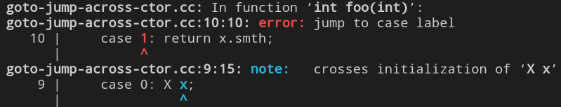
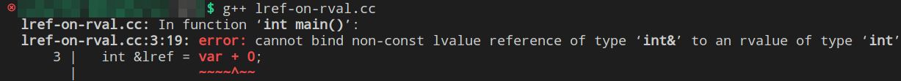
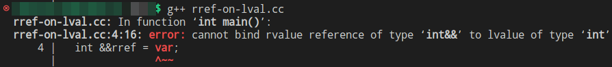
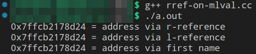

# [Лекция 5 (RAII и перемещение)](https://youtu.be/_mLDaU4wSOo)

Эта лекция посвящена классам, которые владеют своими ресурсами; так называемым *RAII-классам*. А так же мы начнём говорить о семантике перемещения.

## [Владение ресурсом и извороты в Си в попытках ](https://youtu.be/_mLDaU4wSOo?t=113)

> **Вопрос**: Что значит владеть ресурсом?

Вопрос философский. И может показаться, что ответ на него мол: "*владеть = иметь к ним доступ, подступаться к методам для работы с ним*". Однако ж чтобы ресурс был, его нужно создать, и потому

>> - **владеть** ресурсом = **уметь его выделять, освобождать и, возможно, предоставлять безопасный доступ**.

> **Вопрос**: какие существуют ценные ресурсы в контексте инструментов программирования?
>> - файловые хэндлы
>> - сетевые соединения
>> - память

Последний является наиболее важным и наиболее простым.

Владение ресурсом - это то, за чем мы должны следить, ведь если этого не делать, то этот ресурс может утечь, как например здесь

```c++
int main() { ...
  S *p = new S;
  foo(p);  // ресурс утёк в foo, и может быть там непредвиденно освобождён
  delete p;  // возможно двойное удаление
}
```
И если освобождение ресурса не локализовано в ответственности некоторого механизма этого самого ресурса (например засчёт деструктора), в языке *C* нам приходится этим освобождением заниматься непосредственно по месту событий руками. И, к сожалению, в языке *C* этим заниматься крайне неудобно.

Рассмотрим популярный пример кода на *C*, который приходится писать, если ответственность за динамическую память вешается на реализацию ф-ции. 
<div style="text-align: right">...пример ниже никак не связан с функцией <code>foo</code> в коде выше!</div> <br/>

```c
int foo(int n) {
  struct S *p = malloc (sizeof(struct S)); 
  // .... some code ....
  if (condition) {
    free(p);
    return FAILURE;
  }  
  // .... some code ....

  return SUCCESS;
}
```
Здесь две точки освобождения. Хотелось бы иметь одну.
И частично вопреки правилам структурного программирования это можно осуществить, используя оператор `goto`.

```c
int foo(int n) {
  struct S *p = malloc (sizeof(struct S));
  int result = SUCCESS; 
  // .... some code ....
  if (condition) {
    result = FAILURE;
    goto cleanup;
  }
  // .... some code ....
  cleanup:
  free(p);
  return result;
}
```
Но `goto` - это, как бы, плохо. Тем не менее, у нас есть [Linux kerner coding style](https://www.kernel.org/doc/html/v4.10/process/coding-style.html), где в пункте 7, именуемом [centralized exiting of functions](https://www.kernel.org/doc/html/v4.10/process/coding-style.html#centralized-exiting-of-functions), умные люди, которые проектировали *Linux kernel* на *C*, советуют писать именно так.

Ну и давайте раз и навсегда разберёмся, **почему `goto` - это плохо**.
> - Эдгар Дейкстра в 1968 году опубликовал статью [Go To Statement Considered Harmful](Dijkstra68.pdf). И речь шла о том, что злоупотребление `goto` плохо не для компилятора, а именно для программиста. Анализировать код, в котором использование `goto`-оператора - обычное дело, очень сложно. **Почему сложно?**
> 
>> Если структура нашей программы суть - вложенные блоки циклов и условных конструкций, то в ней нет непредсказуемых нелокальных выходных дуг. Мы точно можем быть уверены, что выходы производятся из шапок `for`, `if`, по достижению `return`; вся блочная структура программы представляет из себя вложенное дерево из блоков.
`goto` делает из дерева произвольный граф, цепочку исполнения которого анализировать намного труднее.

В своё время, означенная статья Дейкстры произвела на всех такое впечатление, что люди начали `goto` стесняться. А когда люди стесняются `goto`, люди `goto` начинают маскировать. В связи с этим появились такие ключевые слова, как `break`, `continue`, `switch-case`. Вариант реализации кода выше от стеснительного программиста выглядит, например, так:

```c
int foo(int n) {
  struct S *p = malloc (sizeof(struct S));
  int result = SUCCESS; 
  do {
    // .... some code ....
    if (condition) {
      result = FAILURE;
      break;  // что вы?!, какой goto? неее 
    }
    // .... some code ....
  } while(0);
  free(p);
  return result;
}
```
Цикл из одной итерации, из которой делается условный и вполне законный `break`. Выглядит по-ублюдски, но зато социально-приемлемо.

Другая проблема с `goto`, которая стала заметна в 90х, состоит в следующем.
Если у объектов есть состояние, и инициализация этого состояния происходит через вызов конструктора, то дуга `goto` может пересекать точки начала жизни объектов и точки их смерти по отдельности. Например вот функция со `switch-case`:

```c++
int foo(int cond) {
  switch(cond) {
    case 0: X x;
    case 1: return x.smth;
  }
}
```
> "***Дуги control flow не должны пересекать точки создания объектов и их уничтожения.***". 

Ведь если метка для `goto` находится внутри блока после начала *scope* некоторой переменной, но до его окончания, то точка исполнения, пройдя по этой метке, рискует наткнуться на диррективу в связи с объектом, который не был даже *default*-сконструирован. Обращение к объекту, который ещё не родился - это UB.
> 
И слава Богу, в *C++* это ошибка компиляции, причём формулируется она ожидаемым образом:
 
 <br/>

 Поэтому если в коде на *C* довольно легко прыгнуть из тела одного цикла-`for` внутрь тела другого цикла-`for` выше, то на *C++* это сложно, ведь в последнем появляется инициализация объектов вызовом конструктора.

 В связи с этим безопасно в коде на *C++* не забывать о явных блоках при описании `case`-ов
 ```c++
int foo(int cond) {
  switch(cond) {
    case 0: {X x}; 
    case 1: return x.smth;  // очевидная ошибка; x не виден
  }
}
```

Чтобы не заниматься всем этим контролем над освобождением ресурсов в *C++* руками, выше мы уже упомянули: надо использовать **механизмы деструкторов**.

---
## [RAII (Resource acquisition is initialisation)](https://youtu.be/_mLDaU4wSOo?t=627)

> ***RAII-классы*** - *это классы, которые владеют своими ресурсами*.

Владеют в том смысле, что и обсуждалось в разделе выше.
Вспомним самый первый пример, только перепишем его на *C++*:
```c++
template <typename S> int foo(int n) {
  S *p = new S{n}; 
  // .... some code ....
  if (condition) {
    delete p;
    return FAILURE;
  }  
  // .... some code ....
  delete p;
  return SUCCESS;
}
```
В этом примере мы хотели бы автоматизировать выделение и освобождение ресурса в `p` так, чтобы к `p` можно было относиться проще, как к статической переменной, безопасной в отношении утечки. Чтобы:

- выделение происходило по объявлению (возможно в некоторой степени конкретезированному);
- освобождение происходило по достижению `return`;

Короче, чтобы выше означенный шаблон реализации `foo` на *C++* выглядел чище и проще. Вот так, например:
```c++
template <typename S> int foo (int n) {
  ScopedPointer<S> p{new S(n)}; // ownership passed
  // .... some code ....
  if (condition) return FAILURE; // dtor called: delete
  // .... some code ....
  return SUCCESS; // dtor called: delete
}
```
Теперь реализация `foo` не в ответе за освобождение памяти по указателю `p`. Эта ответственность переложена на реализацию шаблонного класса `ScopedPointer`.

> **Вопрос**: Как может выглядеть реализация этого `ScopedPointer`?
>> - например вот так
>> ```c++
>> template <typename T> class ScopedPointer {
>>   T *ptr_;
>>    public:
>>      ScopedPointer(T *ptr = nullptr) : ptr_(ptr) {}
>>      ~ScopedPointer() { delete ptr_; }
>> };
>>```
>> Более того, ни `foo`, ни какая другая ф-ция, на стеке которой будут объявляться указатели `ScopedPointer<type>`, не смогут легально перехватить ответственность за **выделенный** на этот указатель **ресурс**, потому что указатель с этим адресом заинкапсулирован в `private` части реализации `ScopedPointer`.

> Инвариант класса `ScopedPointer`:
> <div style="text-align: center"><i><b>Никто кроме меня не имеет доступа к указателю, который я внутри себя храню.</i></b></div>
В связи с этим класс `ScopedPointer` ещё можно называть *<u>RAII-обёрткой вокруг сырых указателей</u>*

С учётом сказанного в конце предыдущей лекции можно уследить одно замечательное качество этого конструктора описанной *RAII*-обертки:

> Шаблонность конструктора `ScopedPointer(T *ptr = nullptr)` относительно параметра `T` допускает неявное преобразование любого сырого указателя на **любой тип** в объект `ScopedPointer`, параметризованный **этим самым любым типом**.

И замечательно это потому, что `ScopedPointer` гарантирует обратную совместимость с любым *legacy*-кодом, который оперировал сырыми указателями. Т.е. например в целях безопасности, мы можем тупо заменить все вхождения аргументов-указателей на аргументы-значения типа `ScopedPointer` в *legacy*-коде, убрать из него ненужные `free/delete`, и его логика сохранится.

> Вопрос: ага, сохранится, лол. 
> - А разве `ScopedPointer` поддерживает оператор `->` нужным нам образом?!
> - Разве копирование при передаче `ScopedPointer` в ф-ию по значению - это хорошая идея в текущем состоянии реализации?!
> - Разве в текущей реализации `ScopedPointer` можно вообще как-то докопаться до данных, выделенных по адресу в инкапсулированном указателе?

Нет, нет, и ещё раз нет. Но
>> - унарный `operator*` (*dereference*) можно перегрузить 
>> - `operator->` тоже можно перегрузить
>> - копирование по умолчанию в случае `ScopedPointer` скопирует указатель на фрейме вызывающей ф-ции, и вызовет деструктор по достижению её `return` $\Rightarrow$ удалит данные, а внешний указатель провиснет.

### [**Копирование `ScopedPointer`**](https://youtu.be/_mLDaU4wSOo?t=790)
&nbsp; Если бы нам хотелось копировать `ScopedPointer`-объекты без копирования всей той памяти, которая повязана на инкапсулированный в объекте указатель, то нам надо было бы придумать способ изолировать владение ресурсом от копии объекта `ScopedPointer`, чтобы деструктор копии не имел возможности удалить ресурс, на который эта копия ссылается. Это можно сделать через введение счётчика, который считает кол-во существующих копий, повязанных на данный ресурс, и через перегрузку деструктора в зависимости от значения в этом счётчике. 

Счётчик должен обладать свойствами:
- `private`, чтобы его нельзя было снаружи изменить;
- `static`, чтобы каждый объект знал, сколько объектов `ScopedPointer`, повязанных на данный ресурс на текущий момент существует и не удалено.

Проблема в том, что ресурсов, которые мы хотим защитить нашей RAII-оберткой может быть очень много, а `static`-член класса существует один для всех объектов одновременно, а значит уже для 2х ресурсов его может нехватить. Делать массив?...

Пока не будем греть голову и решим эту проблему в лоб. Забудем про единственность существования ресурса, допустим, что он является копируемым, и осуществим глубокое копирование.

```c++
class ScopedPointer {
  // ... -//-
  ScopedPointer(const ScopedPointer& rhs) :
    ptr_(new T{*rhs.ptr_}) {}
  // ... -//-
};
```
Таким образом 
- *копия действительно взаимозаменяема с оригиналом в момент копирования* => семантика копирования удовлетворена;
- *владение оригинальным ресурсом не утекает при копировании* $\leftarrow$ это тоже правда.

Да, тип нашего "скопед-указателя" понимает операцию копирования чересчур буквально, но пока оставим это.

Присваивание реализуется тривиально без неожиданностей.
1. Проверяем, не все себя ли присваиваемся
2. `delete` того, что слева
3. Переопределение на содержимое `rhs`

### [**Доступ к состоянию `ScopedPointer`**](https://youtu.be/_mLDaU4wSOo?t=878)
Надо подступиться к содержимому <kbd>T* ptr_</kbd>. 
> **Вопрос**: Какие есть варианты методов для доступа?
>
> Их несколько.
>> 1. Метод член класса `access`:
>>```c++
>> template <typename T> class ScopedPointer {
>>   T *ptr_;
>>    public:
>>     // ctor(){}, dtor(){}
>>     T& access() { return *ptr_; }
>>     const T& access() const { return *ptr_; }
>> }; 
>>```
>> И в этом случае мы пишем 2 метода.
>> - для объектов `ScopedPointer`, аннотированных `const`, возвращающих `const` ссылку на ресурс
>> - для объектов `ScopedPointer` не аннотированных ничем, возвращающих модифицируемую ссылку

Данный способ доступа ещё не так сильно нарушает инвариант нашей *RAII*-обёртки. Указатель не утёк, да, но ссылка утекла. К ссылке, конечно, `delete` применить нельзя, но т.к. она прозрачна, то <kbd>&ссылка</kbd> не защищена от `delete`.

Другая проблема метода `access`: доступ к ресурсу через метод получается весьма многословным:
```c++
ScopedPointer<S> p{new S(n)};
// Допустим x - это int поле в структуре S нашего ресурса 
int x = p.access().x;  // слишком длинно
```
Если же мы хотим, чтобы наш класс, который призван маскировать поведение указателей был не менее удобен, чем обычный указатель, то следующий вариант
>> 2. Перегрузка оператора *dereference*. Или `operator*` не принимающий аргументов:
>> ```c++
>> template <typename T> class ScopedPointer {
>>   T *ptr_;
>>    public:
>>     // ctor(){} dtor(){}
>>     T& operator*() { return *ptr_; }
>>     const T& operator*() const { return *ptr_; }
>> };
>> ```


Здесь проблема утечки ссылки всё та же, но доступ к полю уже значительно компактнее.

```c++
ScopedPointer<S> p{new S(n)};
// x - это int поле в структуре S нашего ресурса 
int x = (*p).x;  // уже лучше
```

Всё же не очень удобно. Нам очень бы хотелось стрелочку!
>> 3. Перегрузка оператора "стрелочка".
>>```c++
>> template <typename T> class ScopedPointer {
>>   T *ptr_;
>>    public:
>>     // ctor/dtor
>>     ??? operator->() { return ???; } // например p->x, для T::x
>> };
>>```
> **И вот вопрос**: Что эта стрелочка берёт, а что возвращает?

Интуитивно кажется, что поскольку она возвращает поле, какого бы типа оно не было, то возвращаемый тип метода `operator->` - не тип, а имя поля, что, увы, в *C++* невозможно.
Ответ малость неожиданный и связан со спецсемантикой <kbd>оператора-></kbd>.

>> - компилятор относится к пользовательской перегрузке `operator->` с особенностью:<br> **он ожидает, что у возвращаемого типа уже перегружен `operator->`, и при перегрузке вызывает стрелочку от возвращаемого объекта.**

В *C/C++* у типа "*указатель на тип*" `operator->` - это метод открытого интерфейса. Он существует и понятным образом работает. А потому, то что мы хотим выглядит так:
```c++
template <typename T> class ScopedPointer {
   T *ptr_;
    public:
     // ctor(){} dtor(){}
     T* operator->() { return ptr_; }
     const T* operator->() const { return ptr_; }
};
```
Означенную спецсемантику ещё называют `Drill-Down-Behaviour`. Зарывающееся вниз поведение, дословно. Стрелочка, вызывает стрелочку от возвращаемого типа, который вызывает стрелочку от своего возвращаемого типа и т.д. пока не упрёмся в указатель.
```c++
ScopedPointer<S> p{new S(n)};
// x - это int поле в структуре S нашего ресурса 
int x = p->x;
/* Можно думать, что вместо "p->" 
 * на самом деле стоит "(p.ptr_)->",
 * держа в голове, что само p.ptr_ недоступно, но вызов -> от неё доступен. */

/* Если думать об этом, как о методе класса, 
 * то то, что выше, эквивалентно */
int x = (p.operator())->x;
```
Ну и да, можно заметить, что инструкция `p.operator->()` в сухую сдаёт нам заинкапсулированный указатель, и это прокол. Но надо понимать, что программист и не захочет вызывать `operator->`, как метод класса, при использовании интерфейса `ScopedPointer`, т.к. это **пример ненормативного использования** операторов. А язык не обязан защищать от **целенаправленного некорректного использования** предоставляемых им инструментов.

Из локаничной стрелочки самой по себе же ничего не утекает, и тем она замечательна.

> **Итак**:
>```c++
>template <typename T>
>class ScopedPointer {
>  T* ptr_;
>
> public:
>   ScopedPointer(T* ptr = nullptr) : ptr_(ptr) {}
>   ScopedPointer(const ScopedPointer& rhs) :
>     ptr_(new T{*rhs.ptr_}) {}
>   ~ScopedPointer() { delete ptr_; }
>
>  public:
>   T& operator*() { return *ptr_; };
>   const T& operator*() const { return *ptr_; };
>   T* operator->() { return ptr_; };
>   const T* operator->() const { return ptr_; };
>   ScopedPointer& operator=(const ScopedPointer& rhs) {
>     if (&rhs != this) {
>       return *this;
>     }
>     delete ptr_;
>     ptr_ = new T(*(rhs.ptr_));
>     return *this;
>   }
> };
>```
> <div style="text-align: center"><b>Хороша ли получившаяся RAII-обёртка? </b></div>
---

 

## [`std::swap` и подводка к *move*-семантике]()

В инструментарии стандартной библиотеки есть шаблонная функция [`std::swap`](https://en.cppreference.com/w/cpp/algorithm/swap), которая принимает в себя 2 аргумента по ссылке и меняет местами их значения.

Можно думать, что до *C++11* её реализация выглядела примерно так:
```c++
template <typename T>
void swap (T& x, T& y) {
  T tmp = x;
  x = y;
  y = tmp;
}
```
> Проанализируем её. Что нужно от типа `T`, чтобы `swap` сделал своё дело?
>> 1-я строка - вызов *copy*-конструктора; </br>
>> 2,3 строки - вызов оператора присваивания;</br>
>> Тобишь `T` должно быть *copyable* и *assignable*.<br>
>> То есть *copy*-конструктор и присваивание у типа `T` не должны быть удалены.

Рассмотрим простую ситуацию использования функции `swap`:
```c++
Захватили владение в сырые указатели, 
и решили поменять их местами под

struct S { /*какое-то определение*/ };

int main() {
  ...
  S *a = new S(1), *b = new S(2);
  std::swap(a, b);
  ...
}

Компилим на -std=c++98
```
В ней всё произойдёт ровно так, как и ожидается. Произойдёт обмен указателями, ресурсы останутся на месте. Просто. Быстро.

А теперь сделаем всё то же самое для ресурсов, захваченных в наш `ScopedPointer`:

```c++
ScopedPointer<S> x{new S(1)}, y{new S(2)};
std::swap(x, y);

Компилим на -std=c++98
```

И внутри `swap` всё опять произойдёт ровно так, как и ожидается:
```c++
  T tmp = x;  // глубокое копирование x в tmp
  x = y;  // delete x.ptr_, x.ptr_ = new T(*(y.ptr_))
  y = tmp;  // delete y.ptr, y.ptr_ = new T(*(tmp.ptr_))
  return;  // tmp.~T()
```
Нам это не нравится по очень понятным причинам, и на вопрос в конце предыдущего раздела мы отвечаем:
>> - нет. Получившаяся *RAII*-обёртка пока что недостаточно хороша.

Очень бы хотелось, чтобы `swap` просто поменял местами значения полей-указателей внутри `x` и `y`.
> **Вопрос**: Ну и что теперь делать? Писать свой `swap`?
>> - Нет. Ведь начиная с *C++11* в интерфейсах классов появился механизм, который решает означенную проблему для *RAII*-классов и умных указателей.

И этот механизм называется ***семантика перемещения***.

И здесь я на момент отклонюсь от конспектирования Владимирова и попытаюсь разъяснить релевантную содержательную часть [доклада Крис-Ван-Рена](https://www.youtube.com/live/km3Urog_wzk?feature=share) про категории значений.

---
## Value-caterories in C++11
В 3-й лекции мы обещали вернуться к уточнениям категорий значений, когда доберёмся до *r-value*. 

<div style="text-align: center"><b>Here we go.</b></div>

В [означенном выступлении](https://www.youtube.com/live/km3Urog_wzk?feature=share) от ноября 2020-го года французским акцентом выразительно и доходчиво Kris Rens пояснил о том, что есть из себя *value-categories*, и где их можно встретить. Я опишу лишь частично первый блок выступления.

Как и было сказано ранее (в 3й лекции),
> ***value-category*** - это характеристика выражений.

Она не относится к типам, переменным или их значениям. Только к выражениям самим по себе.

> **Выражение** суть - синтаксически корректно построенная последовательность названий методов со скобочками, операторов и операндов, которая задаёт вычисление. Процесс этого вычисления может повлечь побочные эффекты (вывода в <kbd>stdout</kbd>, изменение значения переменной, форматирование жёсткого диска и др.). Финал вычисления может вернуться в виде результата конкретного типа.

При достижении выражения в коде, точка исполнения может как запустить, так и не запустить его вычисление. Произойдёт вычисление или нет зависит от наличия в нём побочных эффектов и наличия необходимости вернуть результат. 

У выражений есть:
- возвращаемый тип
- категория

Категорий бывает 5 вариантов: 3-шт основных, 2-шт обобщающих. 

Качественно отличных друг от друга вариантов категорий всего 3, и они основные:

- ***l-value*** = **l**ocation value = "значение-с-местом-в-памяти"
- ***pr-value*** = **P**ure **r**-value = "чистое-значение"
- ***x-value*** = e**X**piring value = "значение-чей-срок-жизни-истекает"


Удобно мыслить их в отношении двух свойств
1. вырашение имеет имя, или место в памяти;

Перечислим варианты выражений, варьирующихся на этом свойстве:
```c++
int a = 21;
struct S {
  int i = 84
  int foo() {return i;}
};
S obj;

следующие выражения имеют либо имя, либо место в памяти
  a
  ++a
  std::cout
  "Hi"
  S().i
  obj
  obj.i


следующие выражения не имеют ни имени, ни места в памяти
  42
  a++
  nullptr
  false
  []{return 42;}
  a + 0
  a || true
  static_cast<double>(a)
  S()
  S().foo()
```
Строковый литерал `"Hi"` имеет *static-storage-duration*, т.е. существует до конца работы программы. А потому в любой момент можно к этой строке подступиться (как то), и в этом отношении он *location-value*.


2. "*результат вычисления может быть безопасно украден*" дословно. А в терминах Владимирова это звучит куда внятнее: "ответственность за ресурс может быть безопасно перехвачена". Это возможно в двух случаях:
    *  либо время жизни объекта, который составляет это выражение, на исходе (ещё один шаг точки исполнения, и он умрёт), 
    *  либо его вычисление в текущей позиции точки исполнения порождает безымянный временный объект, чей lifetime ограничен концом полного выражения.
```c++
результат вычисления может быть безопасно украден:
  S()
  S().foo()
  S().i
  42
  nullptr
  a + 0;

передача ответственности за ресурс опасна
  a
  obj
  obj.i
```


Отличие первого "либо" от второго заключается в том, что:
- в первом случае самого вычисления может и не происходить, но объект ПОКА ЧТО имеет место в памяти (где-то в ОЗУ)
- во втором - места в памяти у вычисления не было и не будет, пока мы не вздумаем его куда-нибудь присвоить, и вычисление произойдёт, если будет куда.

Второе свойство стало главной причиной внедрения *move*-семантики в стандарт C++11.

В контексте этих двух свойств можно построить табличку 2х2 и разместить означенные варианты категорий:

|        Свойства                             | <u>имеет</u> имя или<br>место в памяти  | <u>не имеет</u> ни имени, <br> ни места в памяти  |
| --------------------------------------------| --------------------------------------- | ------------------------------------------------- |
| перехват владения<br><u>**безопасен**</u>   |                ***x-value***            |                  ***pr-value***                   |
| перехват владения<br><u>**небезопасен**</u> |                ***l-value***            |                       n/a                         |
||||

Последние два обобщающих варианта категорий:
- ***r-value*** = *errrrRrrr-value* = совокупность *x-value* и *pr_value*. 
- ***gl-value*** = *generalized-l-value* = cовокупность *x-value* и *l-value*

> **Вопрос**: почему перехват владения у *l-value*-выражений небезопасен?
>> - потому что если вдруг на один и тот же ресурс из памяти ссылаются 2 имени из разных стековых фреймов, и через второе был произведён `delete`, то в результате, или что-то провиснет, или произойдёт двойное удаление, или и то, и другое.

> **Вопрос**: почему перехват владения у *r-value*-выражений безопасен?
>> - потому что выше объявленных проблем у него нет и быть не может.
---
Отступление закончилось, возвращаемся к Владимирову.  
## *R-value*-ссылки и `std::move`

*r-value*-выражения можно вычислить и присвоить полученное значение в какую-нибудь существующую переменную:
```c++
int var = pow(11,2) + foo() / 3;
``` 
А можно сделать почти то же самое только с другим синтаксисом и описательной составляющей.

*r-value*-выражения можно связать с именем и в этот момент материализовать его в памяти, вычислив. Делается это с помощью правой ссылки (*r-value-reference*).

```c++
int &&rref = pow(11,2) + foo() / 3;
```
> **Вопрос**: чем отличаются между собой объекты `var` и `rref`?
>> - в данном случае вообще ни чем. И `var`, и `rref` продлевают жизнь значению от некоторого вычисления в *pr-value*-выражении. А после инициализации/связывания оба сами по себе являются *l-value*-выражениями.  

Да. <u>Связанная правая ссылка, как выражение только из самой себя, является *l-value*</u>. Т.е. ресурс, на который она ссылается, лежит в памяти, и, более того, через эту ссылку этот ресурс можно модифицировать. Тем не менее <u>правая ссылка - это не переменная</u>. Глубокие отличия мы увидим позже в других примерах.

Всё это звучит странно, но ок.

> **Вопрос**: чем отличается левая ссылка от правой?
>> - правая ссылка может связаться с временными объектами (*r-value*-выражениями), левая - нет. Исключение - `const`-левая ссылка.

```c++
// lref-on-rval.cc

int main () {
  int var = 5;
  int &lref = var + 0;
  int &&rref = var + 0;
}
```
 <br/>


> И напротив
>> - левая ссылка может связаться с l-value-выражениями, правая - нет.

```c++
// rref-on-lval.cc

int main () {
  int var = 5;
  int &lref = var;
  int &&rref = var;
}
```
 <br/>
И это самое важное в правых ссылках. Это отличие можно интерпретировать следующим образом: 

<div style="text-align: center"><b> - правые ссылки умеют отличать объекты, которые нам жалко, от объектов, которые нам не жалко. </b></div>

Нам не жалко тех объектов, которые имеют своё место в памяти. И нам жалко тех, что своего места в памяти не имеют, и живут, буквально, одну строку.<br/>

> Ладно. Но правая ссылка -- это же ссылка! В некотором смысле она - указатель!<br/>
> **Вопрос**: Должен же быть способ связать её с объектом, который уже лежит в памяти?
>> - Должен. И он есть. Нужно просто обмануть процесс связывания, и сказать правой ссылке, что по другую сторону от `=` стоит r-value.

Означенный обман происходит через функцию `std::move`.

```c++
// rref-on-mlval.cc

int main () {
  int var = 5;
  int &lref = var;
  int &&rref = std::move(var);

  std::cout << &rref << " = address via r-reference\n"
            << &lref << " = address via l-reference\n"
            << &var << " = address via first name" << std::endl;
}
```
 <br/>
Более того, можно видеть, что никакой материализации нового объекта в памяти при связывании `rref` не произошло. И левая, и правая, и исходное имя: все ссылаются на одно и то же место в памяти. Так что если раньше были сомнения, что правая ссылка - это не переменная, то теперь понятно; она очевидно не является переменной.

> **Вопрос**: Что происходит внутри `std::move` с переменной `var`?
>> - хрен его знает на самом деле (об этом в магистерском курсе), но полезно думать об этом так. `std::move` умеет **кастовать категорию** попавшего внутрь неё выражения из *l-value* в *x-value*.
>>> И нет, ни с выражением `var`, ни с ресурсом под ним, <u>ничего не происходит</u>. `var` не становится вдруг *x-value*-выражением после действия `std::move` ниже в коде. У неё сохраняется всё то же время жизни, какое и было до.
>> - `std::move` обманывает *name-resolution-process* конструктора правой ссылки `rref`, и *l-value* `var` попадает в *overload-set*  конструктора под видом *x-value*.

> **Вопрос**: Почему `std::move` кастует *l-value* в *x-value*, а не в *pr-value*?
>> - Потому что ресурс под `var` лежит в памяти и связан с именем. А *pr-value* выражения существуют, как рецепты вычисления, и, пока не свяжутся с именем, не вычисляются и нигде в памяти не лежат.

> **Вопрос**: Что будет, если в `std::move` попадёт *r-value* выражение?
>> - Сюрприз - ничего.

> **Вопрос**: Почему `std::move` так называется?
>> Об этом позже.

Чуть закрепим ощущения понимания простенькими примерами:

