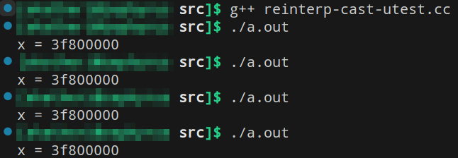

# [Лекция 6: Проектирование матриц (продолжение)](https://youtu.be/LDoCQzSd3xo)
На примере задач, которое оно ставит, очень удобно рассмотреть некоторые языковые механизмы.

Итак, проектирование.

## [***Матричные конструкторы***](https://youtu.be/LDoCQzSd3xo?t=54)

Как конструировать? Ну, первая идея - написать такой контсруктор, который ест число строк, столбцов и значениЕ, которЫМ надо матрицу заполнить.

```c++
template<typename T> class Matrix {
  // некое представление (т.е. указатель, куда будет выделяться память)
 public:
  /* конструктор для создания матрицы, 
   * заполненной конкретным значением, если конкретное указано,
   * или значением по умолчанию, иначе. */
  Matrix(int cols, int rows, T val = T{});

  /* конструктор для создания матрицы,
   * заполненой данными, расположенными
   * между итераторами start,fin (обобщенными указателями)
   * предполагая, что (fin - start) == (cols * rows) |-> true */
  template <typename It>
  Matrix(int cols, int rows, It start, It fin);
   ...
};
```
Про итераторы мы поговорим позже, а пока будем мыслить их, как к указатели, к которым можно применить `++` и они сдвигаются на следующее значение внутри некоторой коллекции. 

С матрицами, порой, хочется написать очень много конструкторов. Например
- тот, что будет создавать диагональную матрицу по заданному значению(ям)
- тот, что будет создавать верхне-треугольную матрицу
- ...

Можно, например, создать тегирующий `enum` тип внутри нашего класса, насоздавать там наименований, которые тегируют желаемый вид матрицы. Потом передавать тег в конструктор, который в свою очередь и будет создавать соответствующую матрицу. К сожалению это выглядит криво.

В таких случаях изящнее будет использовать в качестве конструкторов **статические функции класса**.

---

### [**`Static` и `friend` аннотированные методы**](https://youtu.be/LDoCQzSd3xo?t=295)
**Методы-члены класса** - это функции, которые имеют неявный аргумент `this`- указатель на объект, от которого и вызывается этот метод.
<u>Внутри реализации метода-члена класса мы имеем полный доступ к внутреннему состоянию любого объекта (достижимого внутри тела реализации метода) этого класса (т.е. в том числе к его приватным полям)</u>. Это мы знаем.

В дальнейшем будем говорить просто: "доступ к внутреннему состоянию класса", подразумевая то, что описано выше.

**Статические методы класса** - это функции, аннотированные `static`. Они вызываются БЕЗ неявного аргумента `this`, и для них `class`, в котором они находятся - это всё равно что `namespace` (причём их можно вызывать и от объектов класса, и через `MyNamespace::st_func(...)`). При этом, <u>внутри их реализации мы имеем полный доступ к внутреннему состоянию класса</u>.

И есть ещё **дружественные методы класса**. Аннотация `friend` на метод, объявленный внутри класса, говорит, что если где-то снаружи есть функция с такой же сигнатурой, то <u>внутри её реализации программист будет иметь полный доступ к внутреннему состоянию класса</u>, в котором эта ф-ция аннотирована `friend`.

И, как можно догадаться, последнее очень опасно.

```c++
class S {
  int x = 0;
 public:
  int get_x() const { return x; }  // метод-член
  static int s_get_x(const S *s) { return s->x; }  // статический метод
  friend int f_get_x(const S *s);  // дружественный метод
};

int f_get_x(const S *s) { return s->x; }
```
Удобна табличка в виде нижне-треугольной матрицы:
|   | методы-члены | статические</br> функции | друзья |
| - | - | - | - |
| получает неявный аргумент</br>`this` указатель | да | нет | нет |
| находится в</br> пространстве имен</br> класса | да | да | нет |
| имеет доступ к</br> закрытому состоянию</br> класса | да | да | да |

Класс умеет дружить не только с функциями, но и с целыми классами. Более того не исключена дружба с целыми шаблонами. Достаточно просто объявить соответствующую сущноть в теле и аннотировать её `friend`.
> **Вопрос**: Почему `friend` в *C++* - это плохо?
>> - Когда мы дойдём до шаблонов, мы об этом подробнее поговорим. Но сейчас it's safe to say: "<u>в общем случае в *C++* иметь друзей - это ошибка</u>".
>>
>> Статические методы класса определяет, или хотя бы объявляет, программист, который проектирует этот класс. Они - часть интерфейса класса, пространства имён и исходной задумки проектировщика класса, который скорее всего заботится о безопасности использования своего инструмента. В контексте этих неявных договорных отношений проектировщика с его совестью статические методы класса считаются безопасными.
>>
>> Дружественные ф-ции по определению пишет кто-то другой. А потому они вообще не обязаны сохранять инварианты класса, разве что была "нотариально-prooved-заверенная договорённость между программистами", и то не факт, что этого будет достаточно. 
>>
>> Хуже того, в классах, дружественных нашему, любой метод друга способен нарушить инвариант нашего класса. 
>>
>> Ещё хуже того, в шаблонных классах, дружественных нашему, на это способен любой метод, любой специализации этого друга.

Таким образом, если мы точно не уверены в том, что нам ПОЗАРЕЗ нужен `friend`, лучше не надо.

Эти ситуации, конечно, бывают, но они редки.

Особенно это касается *RAII*-классов. `friend` внутри *RAII*-класса <u>смертелен</u>.

---

### [**Статические функции-конструкторы**](https://youtu.be/LDoCQzSd3xo?t=587)
Имеется ввиду, что можно написать `static` аннотированную функцию внутри класса, которая будет конструировать объект. Получится этакий *C-style* конструктор, который находится в пространстве имён нашего класса.

```c++
template <typename T> class Matrix {
  // некое представление
 public:
  // конструктор для создания матрицы, заполненной значением
  Matrix(int cols, int rows, T val = T{});

  // конструктор для создания из заданной последовательности
  template <typename It>
  Matrix(int cols, int rows, It start, It fin);

  // "конструктор" для создания единичной матрицы;
  // в идентификаторе отсылочка к matlab-у
  static Matrix eye(int n, int m);
};
```
Конечно, `eye` не подчиняется синтаксису *конструктора класса в C++*. Конструирование через `eye` - это вызов `eye`-функции и вызов копирующего конструктора от *pr-value*, которое вернула `eye(n,m)`.

```c++
int main() {
  Matrix E_3 = Matrix::eye(3,3);  // возможно RVO
  ...
}
```

---

Далее. Поскольку правило нуля в данном упражнении неприменимо, то мы не можем использовать функционал `std::vector` контейнера. А потому наш класс `Matrix` - это *RAII*-класс. То есть он управляет памятью, которой никто больше не управляет. А значит нам придётся написать для него нетривиальный деструктор + остальные 4 метода согласно правилу пяти.

## [Обязательная пятёрка](https://youtu.be/LDoCQzSd3xo?t=649)

```c++
template <typename T> class Matrix {
  // некое представление
  public:
  // копирующий и перемещающий конструктор
  Matrix(const Matrix &rhs);
  Matrix(Matrix &&rhs);

  // присваивание и перемещение
  Matrix& operator=(const Matrix &rhs);
  Matrix& operator=(Matrix &&rhs);

  // деструктор
  ~Matrix();
}
```
С другой стороны, если сущностное представление объекта `Matrix` (первое `private`-поле в теле класса `Matrix`) - это не сырой указатель на `T`, а некоторая обёртка над этим сырым указателем, то именно эта обёртка будет *RAII*-классом, в котором нужно удовлетворить правилу пяти.

> **Дополнение к предыдущей лекции**:</br>
> Оказывается, если написать только 3 метода:
> - деструктор,
> - копирующий конструктор,
> - копирующее присваивание,
>
> то остальные два заблокируются компилятором. Неявного определения не будет.

...

---

## [Знакомство с `noexcept` аннотацией](https://youtu.be/LDoCQzSd3xo?t=748)

Она для функций в *C++*. Здесь мы её только коснёмся, а вплотную обсудим в 12й лекции.

Если функция делает только примитивные операции над примитивными типами, e.g.

- присваивает что-нибудь к `int` переменной,
- меняет значения указателей,
- ...

т.е. если она не совершает манипуляций над более сложными (чем примитивы) типами, то можно навесить на неё аннотацию `noexcept`.
> **Вопрос**: что делает аннотация `noexcept` на функцию?
>> - Конкретный ответ будет дан позже, а пока думаем об этом так: она "обещает" компилятору, что из этой функции не *выбросится исключение*, а компилятор в связи с этим предусматривает определённые оптимизации.

Про исключения мы начнём говорить в 11й лекции. Пока что тизерим.

> **Вопросы**: 
> - какие именно оптимизации предусмотрит компилятор?
> - в каких ещё ситуациях имеет смысл вешать `noexcept`?
> - что будет если кто-то бросит исключение внутри `noexcept`-аннотированной функции?
>> - На первые два вопроса мы ответим позже. А последний проспойлерим.
>>
>> Исключение выброшенное внутри `noexcept`-аннотированной функции спровоцирует `exit(1)`, или, что то же самое `abort`, или, что то же самое `std::terminate`, т.е. резкое завершение работы программы без очистки памяти (без вызовов деструкторов для объектов, созданных конструкторами на текущий момент *runtime*-а). Это утечка, и это плохо.
>>
>> Само собой, пока мы не умеем обрабатывать исключения (ничего не `try`-им, и ничего не ловим), выброс любого из них равносилен `std::terminate` в независимости от того, аннотированна ли функция `noexcept` или нет.

Пожалуй, если в *scope* нашей функции вызываются только `noexcept`-функции, то нашу функцию тоже можно аннотировать `noexcept`. 

В связи со всем сказанным выше, на текущий момент мы, конечно, можем вешать `noexcept`-аннотацию на всё подряд, но здравый смысл, совесть и скромность вдохновляют нас этого не делать. Чтобы не плодить плохих привычек, аннотируем функции `noexcept` лишь только в тех случаях, в которых мы уверены, что мы не врём.

Одна из реальных ситуаций, в которой `noexcept`-аннотация безопасна - это правильно реализованные перемещающий конструктор и перемещающее присваивание в *RAII*-классах, ведь эти методы лишь обменивают значения между указателями. Это примитивная операция над примитивным типом.

```c++
template <typename T> class Matrix {
  ...
  // конструктор перемещения обещает компилятору, что из него
  Matrix(Matrix &&rhs) noexcept;  // не выбросится исключение

  // перемещающее присваивание обещает компилятору, что из него
  Matrix& operator=(Matrix &&rhs) noexcept;  // не выбросится исключение
  ...
};
```

---

Перечислим безопасные методы, которые дёргают информацию о матрице, при этом саму матрицу никак не модифицируют. Ещё их называют

## [Селекторы](https://youtu.be/LDoCQzSd3xo?t=850)

```c++
template <typename T> class Matrix {
  // некое представление

 public:  // базовые
  int ncols() const;  // возвращает число столбцов
  int nrows() const;  // возвращает число строк

 public:  // агрегатные
  
  // возвращает след матрицы
  T trace() const;  

  // предикат сравнения *this c other
  bool equal(const Matrix& other) const;

  // предикат отношения "<", в терминах конкретной нормы например
  bool less(const Matrix& other) const;  

  // дамп инф-ы о матрице в поток вывода.
  void dump(std::ostream& os) const;  
};
```

> **Вопрос**: а почему бы вместо селекторов `equal` и `less` не перегрузить операторы `==` и `<` ?
>> - На это есть конкретные логические соображения, о которых мы поговорим уже в следующей лекции, а пока запомним следующее: "*бинарные операторы для объектов класса нужно писать снаружи; внутри класса им чаще всего не место*".

## [Удобные модификаторы для матриц](https://youtu.be/LDoCQzSd3xo?t=1003)
Например мы хотим, чтобы интерфейс над матрицами умел их транспонировать, умножать на -1.
```c++
template <typename T> class Matrix {
  // некое представление
 public:
  Matrix& negate() &;  // умножает *this на -1 и возвращает его
  Matrix& transpose() &;  // транспонирует *this и возвращает его
  ...
};
```
В этих методах мы возвращаем состояние объектов по ссылке, а потому, чтобы эти ссылки не провисли, объекты, от которых эти методы вызываются не должны быть временными. В прошлой лекции мы узнали, как заблокировать вызов метода для временных объектов; их надо *l-ref*-аннотировать. Вот зачем нужен амперсанд после скобок.

> **Вопрос**: Почему мы не пишем метод `Matrix transpose()`? <br/> Т.е. тот, который бы возвращал транспонированную копию `*this`.
>> - потому что `Matrix transpose()` можно написать в терминах `Matrix& transpose()`, а обратно - нет. Первый метод подразумевает копирование `*this` и транспонирование копии. Второй - только транспонирование `*this`. Потом, если нам нужно будет создать транспонированную копию `*this`, то писать `Matrix transpose()` будет намного легче c уже имеющимся методом, возвращающим ссылку.

## [Доступ к элементам. Перегрузка `operator[]`](https://youtu.be/LDoCQzSd3xo?t=1119)
Отвлечемся. Допустим мы пишем класс, который должен напоминать вектор. Но весь `std::vector<T,alloc>` нам не нужен, а нужен лишь его ограниченный интерфейс до его шаблонной специализации на `int`. Потренеруемся и перегрузим для него `operator[]`.

```c++
class MyVector {
  std::vector<int> v_;

 public:
  int& operator[](int x) { return v_[x]; }
  int operator[](int x) const { return v_[x]; }
  // .... some stuff ....
};
```
Каких-то непредсказуемых спецсемантик для оператора индексатора нет. `x` - аргумент типа индексатора, которому, вообще говоря, корректнее быть `unsigned long`-ом, или `size_t`, но да ладно. Теперь

```c++
int main() {
  MyVector arr(/*some initialisation*/);
  arr[5] = 3; // эквивалентно arr.operator[](5) = 3;
  // присваивает пятому элементу объекта
  // нашей обёртки над std::vector значение 3
}
```

Обратно к нашим матрицам. <br/>
Матрицы - это 2-мерные массивы, 
> **Вопрос**: как для них перегружать оператор индексатор?

К сожалению особенность `operator[]` состоит в том, что в него не помещается больше одного аргумента.
```c++
template <typename T> class Matrix {
  // некое представление
 public:
  ...
  ??? operator[](int id) {return ???}  
}
```
В <kbd>-std=c++23</kbd> можно перегрузить его с каким угодно кол-вом аргументов и обращаться к элементам многомерных массивов, как в Паскале: `arr[i,j,k]`. Но заниматься мы таким пока не будем, и синтаксис индексатора, который мы хотим для двумерных массивов - это двойные квадратные скобки.

По хорошему, если под "неким представлением" прячется, например, `T** owner_`, то можно было бы вернуть `owner_[id]` указатель, и дальше, стандартный интерфейс над указателями обеспечил бы нам возможность вызвать ещё одни `[]`. 

Но мы не хотим возвращать указатель `owner_[id]`, потому что наш класс *RAII*, и его инвариант:
> <div style="text-align: center"><i><b>Никто кроме меня не имеет доступа к указателям, которые я храню внутри себя.</i></b></div>

<br/> Если мы вернём `owner_[id]`, то мы нарушим инвариант нашего *RAII*-класса `Matrix`.

Один из способов разрешить эту ситуацию - описать изолированный интерфейс для доступа к внутренностям и этот интерфейс может представлять из себя следующий класс-обёртку.
В теле `Matrix` пишем структуру `ProxyLine`, с указателем и перегруженным оператором индексатором:

```c++
template<typename T> class Matrix {
  // некое представление
  struct ProxyLine {
    T *line;
    T& operator[](int row_id) { return line[row_id]; }
    T operator[](int row_id) const { return line[row_id]; }
  };

  // <- сюда можно добавить поле связанное с ProxyLine

 public:
  ...
  ProxyLine operator[](int line_id) { return lines[line_id]; }
  const ProxyLine operator[](int line_id) const { return lines[line_id]; }
  ...
};
```
В означенное поле, могут быть некоторым образом захвачены данные, заинкапсулированные в `Matrix`. Желательно, конечно, внутрь таких *proxy*-сущностей владение не отдавать, а материализовать их на месте, использовать для доступа к внутренностям и отпускать.

Таким образом, ни на каком из этапов вызова `[i][j]` не произойдёт утечки указателя при попытке доступиться до элемента матрицы в позиции $(i,j)$. Речь о нормативном использовании; само собой, если захотеть, то до заинкапсулированного указателя всегда можно добраться.

Идея:
><div style="text-align: center"><b>использования <i>proxy</i>-классов, которые изолированы контексте реализации целевого класса, что-то внутрь себя захватили, перегрузили операторы и выдали наружу результат перегрузки</b></div>

<br/> является очень плодотворной, когда нам, например, нужно описать цепочку операторов для доступа в заинкапсулированные данные. Эта идея полезна не только в этом примере, и выручит нас ещё не раз.

<div style="text-align: right">Про проектирование матриц на этом всё.</div> 

#

На настоящий момент мы попробовали перегрузить следующие операторы
- приведение (из "нас" в другой тип)
- присваивание (перемещающее и копирующее)
- разыменование (звёздочка без аргументов)
- стрелочка (с *drill-down*-поведением)
- индексатор (квадратные скобки)

Оказывается, что все эти операторы могут быть только методами класса. Вне класса эти методы переопределить нельзя. То есть вне класса нельзя <u>объявить</u> и перегрузить
- оператор приведения с одним аргументом
- `operator=` с двумя аргументами 
- `operator*` с одним аргументом (с двумя - можно)
- `operator->` с двумя аргументами 
- `operator[]`

Для матриц можно перегрузить и другие операторы. Например "*умножения строка $\times$ столбец*" или "*умножение на скаляр*". Поскольку они бинарные, то, как мы уже где-то выше сказали, внутри класса им не место. Но не сказали почему. Об этом позже.

Перед тем, как окунуться в перегрузку операторов, нам нужно будет поговорить о **приведении типов**. Но перед этим отвлечёмся и слегка познакомимся с полезным *RAII*-инструментом стандартной библиотеки.

# [`Тизер std::unique_ptr`](https://youtu.be/LDoCQzSd3xo?t=1543)
В прошлой лекции мы построили *RAII*-обёртку `ScopedPointer`. Напомним, как она выглядела:

```c++
template <typename T>
class ScopedPointer {
  T* ptr_;

 public:
  ScopedPointer(T* ptr = nullptr) : ptr_(ptr) {}
  
  ScopedPointer(const ScopedPointer& rhs) :
    ptr_(new T{*rhs.ptr_}) {}

  ScopedPointer(ScopedPointer&& rhs) : 
    ptr_(rhs.ptr_) {  rhs.ptr_ = nullptr; }

  ~ScopedPointer() { delete ptr_; }

 public:
  ScopedPointer& operator=(const ScopedPointer& rhs) {
    if (&rhs != this) return *this;
    delete ptr_;
    ptr_ = new T(*(rhs.ptr_));
    return *this;
  }

  ScopedPointer& operator=(ScopedPointer&& rhs) {
      if (&rhs != this) return *this;
      std::swap(ptr_, rhs.ptr);
      return *this;
  }

 public:
  T& operator*() { return *ptr_; };
  const T& operator*() const { return *ptr_; };
  T* operator->() { return ptr_; };
  const T* operator->() const { return ptr_; };

};
```
> **Вопрос**: А зачем нам `ScopedPointer` вообще нужен? (Это важно вспомнить)
>> - Написание  `ScopedPointer` было мотивировано необходимостью повтора интерфейса сырых указателей в контексте примера функции, выделяющей в динамической памяти объект произвольного типа, а по окончанию работы - освобождающей.
>> ```c++
>> template <typename S> int foo(int n) {
>>  S *p = new S{n}; 
>>  // .... some code ....
>>  if (condition) {
>>    delete p;
>>    return FAILURE;
>>  }  
>>  // .... some code ....
>>  delete p;
>>  return SUCCESS;
>> }
>> ```
>> Ответственность за освобождение ресурса лежала на реализации `foo`.
>>
>> Нам очень хотелось избавиться от необходимости всякий раз делать `delete`. Это можно обеспечить, локализовав эту ответственность в механизм деструктора некоторого класса, коим в последствие и являлся *RAII*-класс `ScopedPointer`.

Окей. Вспомнили.

Конструктор копирования `ScopedPointer` мы написали в предположении, что ресурс, который в него обёрнут, является копируемым. Т.е. у `T` конструктор копирования не удалён.

Вообще говоря со стороны обёртки думать, что у `T` не будет удалено копирование, очень опрометчиво. Например мьютексы и файлы не являются копируемыми сущностями.

При этом практически любой разумно описанный ресурс является перемещаемым, т.к. передать владение над ресурсом всегда должно быть возможно.

Оказывается, нам не нужно было писать свою *RAII*-обёртку (разве что для примера). В стандарте, начиная с *C++11*, уже есть нужные *RAII*-обёртки на все случаи жизни, и их ещё называют *умными указателями*. И один из таких умных называется [**`std::unique_ptr`**](https://en.cppreference.com/w/cpp/memory/unique_ptr).

На входе следует знать следующее. 
> На том месте, где у `ScopedPointer` поле `T* ptr_`,<br/> у `std::unique_ptr` стоит что-то типа `T obj_`.

И это странно, т.к. возникает
> **закономерный вопрос**: если `std::unique_ptr` - это "указатель", а внутренний handler на объект - это не указатель, то как происходит удаление?

частичный ответ даёт его объявление:
```c++
template<
  class T,
  class Deleter = std::default_delete<T>
> class unique_ptr;
```
Это объявление мы пока не до конца понимаем, но оно намекает, что помимо типа, захватываемого объекта, класс специализируется по параметру `Deleter` в котором и лежит информация о том, как надо удалять/освобождать `T`. И по умолчанию этот "делетер" - суть нечто стандартное "`std::default_delete<T>`"

Возможно означенная странность заключается в том, что таким образом в `unique_ptr` можно завернуть всё что угодно, в том числе и `void`. Зачем это надо? - пока не понятно. 

Несмотря на все странности *RAII*-обёртка `std::unique_ptr` имеет привычный нам интерфейс указателя, за одним исключением:
> `unique_ptr` = "уникальный" указатель. Т.е. не копируемый.
```c++
unique_ptr(unique_ptr& rhs) = delete;
unique_ptr& operator= (const uniqie_ptr & rhs) = delete;

unique_ptr(unique_ptr&& rhs) : ptr_(rhs.ptr_) {
  rhs.ptr_ = nullptr;
}

unique_ptr& operator= (unique_ptr &&rhs) {
  swap(*this, rhs); return *this;
}
```
Копирующие конструкторы и присваивания в нём запрещены явно.

Всё, что умеет `unique_ptr` - это перемещать то, чем он управляет.

Напишем нашу `foo` с помощью `unique_ptr` и чуть-чуть изменим его для демонстрации передачи владения.

```c++
int bar(std::unique_ptr uptr);

int foo (int x, double y) {
  std::unique_ptr<MyRes> res{new MyRes(x, y)}; // захват
  // .... some code ....

  if (condition) {
    bar(std::move(res)); // корректная передача владения
    /* <- на этой строке от res осталась лишь пустая оболочка.
     * Утёкшая в bar оболочка с ресурсом освободит его
     * по достижению return в bar. Всё хорошо. */
    return FAILURE;
  }

  // .... some code ....
  return SUCCESS; // res освобождается в деструкторе
}
```
Прежде, чем мы научимся его осознанно корректно удалять, нам, опять же, нужно будет поговорить о перегрузке операторов, и, возможно, о шаблонах.

Обратим внимание вот на что. В первой строчке реализации `foo` мы определили умный указатель `res`, просто передав в конструктор `unique_ptr` объект, выделенный через `new` от конструктора `MyRes`.
```c++
std::unique_ptr<MyRes> res{new MyRes(x, y)};
```
Есть куда более интересный способ инициализации:
```c++
auto res = std::make_unique<MyRes>(x,y);
```
Тип `auto` означает "догадайся по контексту". <br/>
`std::make_unique<T>` - это шаблонная функция, которая возвращает `unique_ptr<T>` и только его.

Значит компилятор догадается, что `res` имеет тип `unique_ptr<T>`, где данном случае `T = MyRes`.

> **Вопрос**: откуда функция `make_unique` знает, какие аргументы у конструктора класса `MyRes`?

...(минутка для осознания)

> Получается, если `make_unique` умеет захватывать любой ресурс, который мы подставим на место `T`, то аргументы `make_unique` будут зависить от сигнатуры конструктора `T`? Чего??!

Это инстанс **вариативно-шаблонной магии**, о которой мы поговорим и обучимся во второй половине курса.

>     Было сделанно так много обещаний на будущее, что, пожалуй, пришло время их резюмировать по окончанию конспектов, и отслеживать статус выполнения. 
> 
>     Непременно этим займусь.

<br/>

> **Вопрос**: что можно сказать о захвате ресурса в `const uniqie_ptr`?
> ```c++
>const unique_ptr<MyRes> cptr{new MyRes(x, y)};
>```
>> - для такого умного указателя будет запрещено копирование, потому что он *unique*.<br/>
А так же будет запрещено перемещение, потому что он `const`.

И действительно. Вспомним предыдущую лекцию. Всякое перемещение объекта синтаксически сопровождается его пробрасыванием через `std::move`. Если `cptr` - это константный `unique_ptr`, то `std::move(cptr)` - это константная правая ссылка на `unique_ptr`. Это `const &&`. А аргумент конструктора перемещения - это `&&`.

`const &&` никогда не пролезет в `&&`, но может пролезть в `const &`, однако ж конструктор копирования у класса `unique_ptr` удалён. Деваться некуда.

Таким образом, если мы хотим, чтобы для данного объекта не было возможности нормативными способами покинуть *scope* текущей функции, то `const unique_ptr` - это то, во что мы хотим этот объект захватить.

Ненормативные средста C-style кастов и интерфейса сырых указателей, с помощью которых можно сделать всё что угодно, у нас никто отобрать в *C++* никогда не сможет.

# [Литература](https://youtu.be/LDoCQzSd3xo?t=1956)


---

Невозможно говорить о перегрузке операторов без предворительного разговора о приведении типов, увы. 
# [Приведения типов](https://youtu.be/LDoCQzSd3xo?t=2145)

> <div style="text-align: center"><b>Типы в <i>С++</i> гораздо важнее, чем в <i>C</i>. </b></div>

Такое вот тривиальное утверждение. Действительно, ведь в отличии от *C*, в *C++*
- типы участвуют в разрешении имён при перегрузке функций (в *C* нет перегрузки функций, см. [лекцию 3](../../03_lect/abstract/README.md))
- типы могут иметь ассоциированное поведение (наверное речь о том, что у пользовательских типов есть виртуальные методы, реализация которого зависит от типа объекта)
- шаблонная параметризация позволяет относиться к функциям/классам, как к потенциально бесконечному множеству подобных сущностей (функций/классов), ведь их можно специализировать какими угодно типами до тех пор, пока эти типы удовлетворяют нужным условиям.

С одной стороны мы имеем огромный и клёвый строго-типизированный язык.

С другой - любой объект какого угодно типа - это кусок в памяти, в линейной парадигме целевой архитектуры. И даже в *C++*, если мы напишем что-то такое.
```c++
#include <iostream>

int main () {
  float flt = 1.0f;
  char x = *((char*)(&flt) + 2);
  std::printf("x \t = %x\n", x);  /* <- здесь выведется
   * второй байт в побитовом представлении flt = 1.0f.
   * Можно верить только первым двум цифрам. т.е. 0x******80,
   * ведь форматный спецификатор %x относится к x, как к unsigned.
   * А unsigned больше char. На месте * будет заполненение чем-то,
   * не имеющим отношения к реальности.
   * 
   * 1.0f = 0b 0011 1111 1000 0000 0000 0000 0000 0000 <- flt начинается здесь.
   * Отступаем 16 бит справа и действительно 1000 0000 = 0x80 */
}
```
Это легально и в *С*, и в *С++*. Адресная арифметика может привести нас куда угодно в памяти.

К слову, поиграть с побитовым представлением числа с плавающей точкой можно [здесь](https://www.h-schmidt.net/FloatConverter/IEEE754.html).

Ладно. В языке *C* мы привыкли к явным всемогущим приведениям типа.

> **Вопрос**: в концепции *C++*, если ли у *c-style*-кастов тёмные и мрачные стороны?
>> - *c-style*-приведения способны на слишком много нетривиальных операций через один и тот же синтаксис.

Видете ли, приведение приведению рознь. И в сложном коде их полезно друг от друга отличать. Перечислим, на какие 3 элементарных характера можно разделить приведения.

1. Приведение из одного типа в другой с сохранением семантического значения. Оно, вероятно, может повлечь изменение побитового представления. <br/><br/>Таким, например, является приведение `int` к `double`. Побитовые представления объектов этих типов очень сильно отличаются, даже если их десятичные значения совпадают.
> ```c++
> 0b 0011 1111 1000 0000 0000 0000 0000 0000 = 1.0f <- флотовая единица
> 0b 0000 0000 0000 0000 0000 0000 0000 0001 = 1  <- интовая единица
> ```

2. Приведение снятия константности и волатильности. Например приведение `const int*` к `int*`. Опасно, нарушает обещания, но порой без этого никуда. Попробуйте функции из `string.h` реализовать на *C* без возможности снять константность с аргументов. Оно не подразумевает изменения побитового представления.

3. Приведение от одного типа в другой не взирая на семантику.  Оно [почти никогда](https://youtu.be/LDoCQzSd3xo?t=2863) не подразумевает изменения побитового представления. <br/><br/> Этот вид приведения говорит: "раньше мы односились к данным битам вот таким образом, а теперь мы будем относиться к этим же самым битам совершенно другим образом". Например `int*` к `long`. Можно представить, насколько может быть непредсказуем результат такой манипуляции.

И *c-style* касты способны на все 3 варианта операций через один и тот же синтаксис:
```c++
x = (T) y;
```
Хотя, все три операции занимаются разными вещами. Это не очень читаемо и сложно *grep*-ать.

По этой причине в языке *C++* мы не используем *c-style*-касты. И достойная замена в *C++* - это функции [`static_cast<T>`](https://en.cppreference.com/w/cpp/language/static_cast), [`const_cast<T>`](https://en.cppreference.com/w/cpp/language/const_cast), [`reinterpret_cast<T>`](https://en.cppreference.com/w/cpp/language/reinterpret_cast) соответственно. 

Есть ещё `dynamic_cast`, но о нём мы поговорим, когда дойдём до тем наследования и *RTTI* (через одну лекцию).

Каждый из трёх означенных кастов ограничен в контекте трёх приведённых выше характеров. То есть
-  `static_cast` сохраняет семантику, но не способен снять cv-квалификацию или в слепую реинтерпретировать биты;
-  `const_cast` снимает cv-квалификацию, но не способен преобразовать тип с сохранением семантического значения, или в слепую реинтерпретировать биты;
-  `reinterpret_cast` реинтерпретирует биты в слепую, но не способен преобразовать тип с сохранением семантического значения или снять cv-квалификацию;

Не способен в данном случае означает: "если попытаемся, то получим ошибку компиляции".

## [reinterpret_cast\<T>; Пример UB](https://youtu.be/LDoCQzSd3xo?t=2486)
`reinterpret_cast` - это плохо, но это всё равно лучше, чем *c-style* каст как раз по причине того, что через него нельзя сделать `static_cast` и `const_cast`. Помимо этого, использование `reinterpret_cast` привычным c-style образом может повлечь *undefined behavior*. Рассмотрим следующий кейс. 

Пусть мы определили какой-то объект, например
```c++
float flt = 1.0f;  // sizeof(float) = 4 скорее всего
```
А потом захотели биты содержащиеся в `flt` рассмотреть через переменную типа `int`.

 В *C* можно сделать так:
```c
int i = *((int*)&flt);  // sizeof(int) = 4; срезки не будет
```
В *С++*, если мы сделаем так же, то всё будет хорошо, оно скомпилируется и никто ничего не заметит (кроме *cppcheck*, конечно). Но мы договорились, что *c-style*-касты в *C++* использовать низя. А потому мы делаем:
```c++
int i = *reinterpret_cast<int*>(&flt);
```
Казалось бы, всё хорошо. Срезки быть не должно, и это, конечно, скомпилируется, но оказывается здесь мы натыкаемся на *strict aliasing violation*. UB-кейс, который задокументирован в стандарте [basic.lval#11](https://eel.is/c++draft/basic.lval#11)

В нём говорится примерно следующее:
> Если мы попытаемся адресовать объект типа `A` (`float` в нашем случае) каким-то другим объектом типа `B` (`int` в нашем случае) и тип `B`
> - не является, что называется "*similar*"-типом по отношению к типу `A` (хз, что это значит)
> - не является связаным приводимой (с помощью `static_cast`) цепочкой наследования к типу `A` (или, если короче, не является вариацией динамического типа `A`)
> - не является signed/unsigned вариацией типа `A`
> - не является `char`, `unsigned char` или `std::bit`
>
> то *behavior is undefined* увы и ах.

То есть, если здесь
```c++
int i = *reinterpret_cast<_>(&flt);
```
вместо `_` стоит не `*char`, не `*unsigned char`, не `*std::bit`, не базовый класс для `flt`, не *deref-на-similar-type* к типу `flt` и не `*signed/*unsigned` вариации типа `flt`, то делать так нельзя. Поведение может быть неопределённым. Т.е. может выстрелить какой-то результат, и не обязательно *undefined behavior* в `stdout`.

В то же время в *c-style* приведении указателя *UB* не будет. "*Так уж и плохи c-style-касты,*" - спросил бы я...

Ну и чёрт его знает, на самом деле. Вот такой код, например

```c++
// reinterp-cast-utest.cc

#include <iostream>

int main () {
  float flt = 1.0f;
  int x = *(reinterpret_cast<int*>(&flt));
  std::printf("x = %x\n", x);
}
```
на моей машине имеет вполне себе *defined* поведение. Срезки нет, на многочисленных запусках ответ один и тот же.

 <br/>

Тем не менее, кейс в стандарте есть, и делать так не надо.

Если очень сильно хочется биты из `flt`, в `int` переменной, то можно сделать [`memcpy`](https://en.cppreference.com/w/cpp/string/byte/memcpy) из `flt`  на место вашей `int` переменной. Или же, начиная с *C++20*, можно воспользоваться [`std::bit_cast`](https://en.cppreference.com/w/cpp/numeric/bit_cast) - функцией. Последнее выглядит презентабельнее.


## [`static_cast` - это то самое явное преобразование](https://youtu.be/LDoCQzSd3xo?t=2951)
[Пару лекций назад](../../04_lect/abstract/README.md) мы узнали, что конструкторы могут определять явные/неявные пользовательские преобразования из типа аргумента конструктора в тот пользовательский тип, чей конструктор был вызван ("в нас"). То самое пользовательское преобразование, неявный вызов которого блокировался ключевым словом `explicit` в объявлении конструктора.

Там же мы узнали, что обратное преобразование ("из нас") можно осуществить перегрузками `operator type_t();`. И аннотация `explicit` на её объявление аналогично блокирует неявный вызов.

Оказывается, что вызов `static_cast` - это вызов того самого явного преобразования, от которого никакой `explicit` не защищает. Таким образом, если мы определяем конструктор с одним аргументом, или оператор приведения, мы должны быть готовы к тому, что он поучаствует в вызове `static_cast`.

```c++
struct T {};
struct S { explicit S(T) {}};

void foo(S s) {};
foo(T);  // fail
foo(static_cast<S>(T));  // ok
```
Копирующей инициализации это тоже касается. Напомним, что `explicit` её блокирует.

```c++
T x;
S y = x; //  fail
S y = static_cast<S>(x);  // ok 
```

---

## [Functional-style-cast в *C++*](https://youtu.be/LDoCQzSd3xo?t=3057)

Пусть y - это нечто между int и всем, что больше него. Рассмотрим следующие приведения.
```c++
int a = (int)y;  // C-style-cast из C
int b = int(y);  // functional c-style-cast из C++
```
Второго в *C* нет, и бытует мнение, что во второй строчке происходит вызов некоего мифического конструктора для `int`. Но на самом деле это не так. Это просто *c-style-cast* вывернутый наизнанку, пусть и напоминает синтаксис конструктора. Бывает ещё такое:
```c++
int c = int{y};
```
И оказывается, этот синтаксис инициализации для `int` блокирует сужающее преобразование. То есть, если `y` больше `int`, то будет ошибка. Всё на этом

Так или иначе, наш безопасный и грамотный выбор в таких ситуациях - это `static_cast`.

---

В статически типизированных языках появление необходимости в преобразовании типов - это не редко сигнал о проблемах в проектировании. Да, иногда/часто без них никак, но порой, в случае нахождения себя в ситуации нужно уметь ловить себя за руку и рефлексировать. А потому всякие инстансы вхождения преобразования типа в нашем коде должны хорошо grep-аться. *c-style*-приведения *grep*-аются в коде плохо. `reinterpret_`, `const_` и `static_` приведения *grep*-ать в коде куда легче.

---

Теперь вспомним C и поговорим о неявных арифметических преобразованиях.

## [Особенности неявного приведения примитивных типов в *C*. *Integral promotion*. ](https://youtu.be/LDoCQzSd3xo?t=3223)