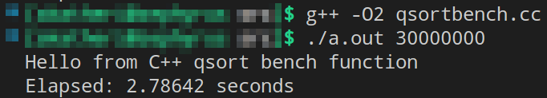
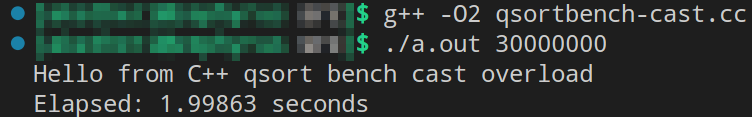

# [Лекция 7: Перегрузка операторов (продолжение)](https://youtu.be/lHxf3_uHbKg)
Смотивируем оператор "круглые скобочки" бенчмарком сортировки из стандарта.

Сортирующая функция из стандарта [`std::sort`](https://en.cppreference.com/w/cpp/algorithm/sort) лежит в `<algorithm>`. И интересующая нас сигнатура для неё выглядит, например, так:
```c++
template< class RandomIt, class Compare >
void sort( RandomIt first, RandomIt last, Compare comp );
```
- `RandomIt first` - это обобщенный указатель (в частности `int*`) на первый элемент контейнера (массива).
- `RandomIt last` - это обобщенный указатель (в частности `int*`) на последний элемент контейнера (массива). 
- `Compare comp` - это аргумент под фукнция-подобный объект (в частности указатель на функцию), от которого требуется умение принимать два однородных аргумента (в частности`(int, int)`) и возвращать в `bool` приводимое значение. Таким объектом в частности может быть компаратор для `int`.

Если под объектом `comp`, окажется предикат, определяющий линейный порядок на множестве объектов под указателями `RandomIt`, функция `std::sort` корректно произведёт сортировку (вроде бы на алгоритме *quick sort*).

В Си функция `sort` реализована на `void*`-указателях, где в качестве компаратора мы могли передать третьим аргументом только указатель на соответствующую функцию.

Проведём [бенчмарк производительности sort на Си](https://github.com/tilir/cpp-graduate/blob/master/05-opers/qsortbench.cc).

        да, код по ссылке написан на C++, 
        но в нём на самом деле нет ничего такого,
        чего нельзя было бы написать на Си.
```bash
$ g++ -O2 qsortbench.cc  # -O2 флаг предпримет оптимизации при сборке
$ ./a.out 30000000  # запустим скомпилированную программу для сортировки
# на массиве из 30 миллионов случайно сгенерированных целых чиселок.
```
в ответ увидим следуюшее:

 <br/>
Кол-во *elapsed*-секунд описывает, сколько в точности понадобилось времени на сортировку такого массива с помощью `std::sort`. Моему процессору понадобилось 2.78 секунд. В связи с произвольностью генерации чисел при повторном запуске может получиться другое, но близкое время. На другой системе - другое и, возможно, не близкое.

В [`qsortbench.cc`](https://github.com/tilir/cpp-graduate/blob/master/05-opers/qsortbench.cc) самое главное, на что надо обратить внимание - это 19 и 44 строчки.

```c++
...
int
greater(const int &lhs, const int &rhs) { return lhs > rhs; }  // <<-- сюда

int
main (int argc, char **argv) {
...
	std::sort(narr, narr + nelts, greater);  // <<-- и сюда
}
```
В `std::sort` утекает функция `greater`. И происходит это, на самом деле, по указателю на функцию.

Теперь перейдём в *C++*, где у нас есть операторы приведения, алиасы, и попробуем ещё один вариант. На этот раз будем передавать не фукнцию, а объект, который ведёт себя, как функция. Переходим [сюда](https://github.com/tilir/cpp-graduate/blob/master/05-opers/qsortbench-cast.cc).

В самом начале видим вот такую структуру:
```c++
struct myless {
  static bool less(const int &lhs, const int &rhs) { return lhs > rhs; }
  using lessptr_t = bool (*)(const int &lhs, const int &rhs);
  operator lessptr_t() const { return less; }
};
```
> **Вопрос**: Что в ней вообще происходит, и что будет, если мы передадим объект этой структуры в третий аргумент `std::sort`-функции?
>> Передав объект третьим аргументом, например, как временный объект, материализовав его на месте передачи
>> ```c++
>> std::sort(narr, narr + nelts, myless{});
>> ```
>> компилятор попытается проинтерпретировать его, как функцию. В связи с этим он будет искать возможность приведения его к функция-подобному объекту. Наткнётся на `operator lessptr_t()`, где `lessptr_t` - это алиас для типа указателя на функцию с сигнатурой `bool (*)(const int &lhs, const int &rhs)`. Такая сигнатура более чем удовлетворяет требованию "уметь принимать `(int, int)` и возвращать `bool`", а значит этот оператор приведения неявно вызовется.
>>
>> После приведения объект станет вот этим вот указателем `bool (*)(const int &lhs, const int &rhs)`, которому, согласно определению `operator lessptr_t()`, будет присвоен статический метод `myless::less`.

Жуткий для осознания способ задания функция-подобного объекта, но вполне себе рабочий для наших целей.

> **Вопрос**: Все описанные операции будут выполненны единожды перед заходом в `std::sort`, или это приведение будет дёргаться всякий раз, как реализации `std::sort`-функции понадобится сравнить два объекта?
>> Опыт показал, что если каст и статический предикат не делают ничего лишнего, то бенчмарк выдаст следующее время:
>> <br/>
>> Почти на секунду шустрее заработал. А всё потому, что "*в метод `std::sort` утёк вполне конкретный тип третьего аргумента, и в связи с этим вызов функции `myless::less` заинлайнился*".
>> 
>> Но если ...


## [Перегрузка `operator()`](https://youtu.be/lHxf3_uHbKg?t=500)

Так вот, чтобы при создании функция-подобного объекта из пользовательского типа не замарачиваться с многоходовками из неявных приведений и вспомогательных алиасов, достаточно перегрузить `operator()`. 

> <div style="text-align: center"><i>Тип, в котором определён <code>operator()</code>, в народе кличут <b>функтором</b>.</i></div>
<br/>

 И в случае передачи функтора третьим аргументом в `std::sort`, вызов компаратора, кой и является перегруженный `operator()`, аналогично заинлайнится. Код вот [здеся вот](https://github.com/tilir/cpp-graduate/blob/master/05-opers/qsortbench-op.cc).

В нём `myless` - это функтор. 

```c++
struct myless {
  bool operator()
  (const int &lhs, const int &rhs) const 
  { return lhs > rhs; }
};
```
Вызов аналогичен.

```c++
std::sort(narr, narr + nelts, myless{});
```
Результат по времени такой же хороший, как и в случае выше.

<!--

В связи с выше описанным, спецсемантика перегрузки `operator()` может звучать примерно так:
> <div style="text-align: center"><b>Если я тип, в котором перегружен <code>operator()</code>, то в нужном контексте я способен неявно приводиться к типу функции с сигнатурой той самой перегрузки.</b></div>
</br>

Причём поскольку `operator()` в структуре является её методом, то очевидно `this` в нём - неявный аргумент, равно, как и все её поля.
 
> Но тогда **Вопрос**: а как оператор() может своей сигнатурой определять каст в тип-функцию с сигнатурой без this, в то время, как тело operator() вполне себе имеет доступ к неявному аргументу-указателю this?

Такого быть не может. А потому я всё это закомментировал. Требуется проверка.

-->

Другой способ заинлайнить вызов компаратора, это написать для него анонимную функцию, или лямбда-выражение.

### [* Анонимные функции ("лямбды")](https://youtu.be/lHxf3_uHbKg?t=738)
Забегая очень сильно вперёд, отметим следующее. 
> **В *C/C++* в теле одной функции нельзя определить другую функцию**.

Где-то раньше в [лекции на деревьях (про инициализацию и копирования)](../../04_lect/abstract/README.md) мы между делом описали пример определения объекта `myclass_t` от временных объектов типа `list_t` для демонстрации очень странной особенности парсера *C++*. Напомним этот пример и его ошибку при компиляции:

```c++
// ctor-ambig.cc

#include <iostream>

struct list_t {};  // пустая структура

struct myclass_t {
  int 42;
  myclass_t(list_t, list_t) {}
};

int main () {
  myclass_t m1( list_t(), list_t() );  // здесь нас ждёт сюрприз
  myclass_t m2{ list_t(), list_t() };  // здесь всё ок, вызов конструктора

  std::cout << m1.x << std::endl;  // здесь будет ошибка компиляции
  std::cout << m2.x << std::endl;
}
```


В связи с тем, как объявлены аргументы конструктора `myclass` для объекта `m1`, парсер счёл, что `m1` - это объявление ф-ции, которая принимает 2 указателя на ф-цию, суть которых `list_t(*)()`, и возвращают временный объект типа `myclass_t`. 

Хотя, учитывая, что было сказано в самом начале;
> **Вопрос**: с какой это стати парсер может подумать, что внутри `main`-функции, или в какой угодно другой функции, может быть объявлена функция `m1`, или какая-либо другая?!

Ответ на это скорее всего:
>> парсер не настолько умён, чтобы знать, где находится имя `m1`, а правило
>>> *всё что можно засчитать за объявление ф-ции, первостепенно засчитывается за объявление ф-ции.*
>>
>> слепо соблюдается синтаксическим анализатором.

Так вот, да. Внутри одной функции мы не можем определить другую функцию. Однако же внутри тела функций у нас всегда была и есть возможность определять объекты локальных пользовательских типов.

То есть, например
```c++
// in_main_struct.cc

#include <iostream>

int main () {
  struct in_main {
    int a = 3, b = 5;
    int sum() { return a + b; }
  } var;
  printf("%d = is a var sum", var.sum());
  return 0;
}
```
Компилируем, и это работает. Результат "8" корректно выстрелит в `stdout`.

В частности, такой *in-func*-локальной структурой может быть та структура из **`static`-функции**, **оператора приведения типа к указателю на функцию** и **алиаса для этого указателя на функцию**:

```c++
// in_main_closure.cc

#include <iostream>

int main () {
  struct f_var_type {
    static int sum(const int &lhs, const int &rhs) { return lhs + rhs; }
    using sumptr_t = int (*)(const int &lhs, const int &rhs);
    operator sumptr_t() const { return sum; }
  } f_var;
  printf("%d = is a var sum", f_var(3,5));
  return 0;
}
```
Определённая таким образом структура описывает **функция-подобный тип**. Результат отработки `in_main_closure.cc` тот же самый. Но в данном случае `f_var` - это объект типа `f_var_type`. И этот объект почти что является функцией определённой внутри `main`-функции (на месте `main` содержащей функции может стоять любая другая функция). Точнее говоря, `f_var` это объект, в полях типа которого определена функция `sum`, и, пусть и опосредованно, но `sum` - это функция внутри тела другой функции, хотя выше мы думали, что такого в *C/C++* быть не может.

Другой, значительно более короткий способ написать такую реализацию суммирования двух чисел, следующий

```c++
// in_main_lambda.cc

#include <iostream>

int main () {
  auto f_var = 
    [](const int &lhs, const int &rhs) -> int { return lhs + rhs; };
  printf("%d = is a var sum", f_var(3,5));
  return 0;
}
```
```c++
[/*capture*/](/*args*/) -> type {/*def*/}  /* это синтаксис
                            определения анонимной функции. */
```
Анонимные функции ещё называют *lambda*-функциями, или просто "лямбдами".
Поскольку у них нет имени, их обычно присваивают переменной типа, указанного после стрелочки. А исполнение этой функции инициируется через написание круглых скобок с аргументами. Вызов может быть инициирован или на месте определения лямбды, или где-нибудь ниже от имени объекта, к которому эта лямбда была присвоена.

И оказывается, что следующие две инструкции
```c++
auto f_var = 
  [](const int &lhs, const int &rhs) -> int { return lhs + rhs; };
```

```c++
struct f_var_type {
  static int sum(const int &lhs, const int &rhs) { return lhs + rhs; }
  using sumptr_t = int (*)(const int &lhs, const int &rhs);
  operator sumptr_t() const { return sum; }
} f_var;
```
означают примерно **ОДНО И ТО ЖЕ** с точностью до наличия имён. Во втором случае тип именован, и в текущем *scope* может быть объявлено сколько угодно объектов типа `f_var_type`. В то время, как в первом случае, `f_var` - это единственный возможный объект "безымянного функционального типа" в текущем *scope* (единственный до тех пор, пока мы не узнаем ключевое слово `decltype`).

Этот "безымянный тип", коему принадлежит объект `f_var`, неявное (и невидимое для нас) определение которого подразумевает объявление лямбды, называется *closure* ("кложУрой"). И вид этого типа (этой кложуры) может некоторым образом разниться в зависимости от "*списка захвата*", т.е. содержимого квадратных скобок. 

Когда список захвата пуст, вид кложуры в точности совпадает с определением `f_var_type`. Когда же список захвата не пуст, то там в реализации кложуры появляется `operator()`, но я и так уже сказал слишком много, и возможно где-то наврал. Если очень сильно хочется, то [вот соответствующая лекция в магистерском курсе](https://youtu.be/j-UyAKux590?si=ZcXJq4-HGZAJRPkl), можно глянуть.

---

Как уже стало понятно, в качестве третьего аргумента в `std::sort` можно передать соответствующую лямбду, или объект в которую эта лямбда присвоена. [Здесь пример закомментирован](https://github.com/tilir/cpp-graduate/blob/master/05-opers/qsortbench-op.cc), в [лекции тизерится](https://youtu.be/lHxf3_uHbKg?t=738). Результат бенча столь же успешен, как и в случае передачи объекта именованного функция-подобного типа.

Таким образом использование функторов по сравнению с обычными указателями на функцию может обеспечить нам кучу перфоманса; тем самым перегрузка `operator()` и не только замотивирована с точки зрения производительности.

---

Теперь замотивируем перегрузку операторов с точки зрения удобства построения абстракций в устройствах наших типов.

Но для начала выучим ещё одну полезную идиому

## [PImpl - идиома](https://youtu.be/lHxf3_uHbKg?si=uWfnI9WzzjYtj1t8&t=911)
That is **P**ointer to **Impl**ementation. Указатель на реализацию.

Представим, что некоторые методы, необходимые нам для решения какой-то задачи реализованы в классе `CImpl`. А в `IFacade`-фасадном классе мы хотим использовать эти самые методы. Пока предположим, что мы не хотим использовать наследование (хотя бы по той причине, что мы до него ещё не добрались).

Мы можем сунуть объект `CImpl` целиком в поле `IFacade`, но тогда нам придётся его инициализировать вместе c объектом `IFacade` в его конструкторе, чего мы, возможно, не хотим делать.

А можем добавить в поля `IFacade` указатель на `CImpl`.
```c++
class IFacade {
  CImpl *impl_;
 public:
  IFacade(): impl(new CImpl) {}
  // методы
}
```
Такая реализация гарантирует нам стабильность *ABI* класса `IFacade`. То есть, если в класс `CImpl` мы будем добавлять какие-то новые методы, реализация и наполнение `IFacade` этого не почувстсвует. И скомпилированный сегодня бинарь с `IFacade` будет работать с любой реализацией `CImpl` в будущем до тех пор, пока первый обращается к инструментам второго в терминах указателя на второй.

Но здесь возникает знакомая проблема.
Наличие внутреннего сырого указателя на пользовательский тип в полях класса превращает его в *RAII*-класс. И теперь мы обязаны написать для `IFacade` большую пятёрку из деструктора, копирующего и перемещающего конструктора и присваивания. Но цель `IFacade` - это необязательно хранить какой-то там `CImpl`, так что описав BIG-5, *SRP* мы не удовлетворим. А что, если потом в `IFacade` надо будет поместить ещё один указатель на реализацию методов другого рода? Будем дополнять BIG-5 для каждого ресурса??

В связи с этим мы хотим обернуть реализацию в умный указатель, интерфейс которого возьмёт всю *RAII*-ответственность на себя. Мы пишем что-то в духе:

```c++
class MyClass; // предварительное объявление

struct MySafeWrapper {
  unique_ptr<MyClass> ptr_;  // не скомпилируется
  MySafeWrapper() : c(nullptr) {};
}
```

Но сходу это не сработает.

В то время, как вот это работало

```c++
class MyClass;

struct MyWrapper {
  MyClass *c;  // здесь, всё ок
  MyWrapper() : c(nullptr) {};
}
```


И дело здесь в устройстве `unique_ptr`. Поскольку он может управлять абсолютно любыми ресурсами (памятью, хэндлами на файл, сетевыми соединениями, мьютексами...), то при инициализации нам надо уточнять, как именно его надо будет удалять. И уточняем мы это через шаблонный параметр `typename Deleter`, в котором должен быть перегружен `operator()`. 

По умолчанию, в элементарных случаях специализации `unique_ptr`, например, интом, `Deleter = default_deleter<T>` - это функтор, скобки от которого делают `delete ptr_;`, где `ptr_` это объект типа `T*`. 

В случаях специализации `unique_ptr` чем-то нетривиальным, вместе с `T` в треугольные скобки при инициализации ему нужно передать тип функтора, в котором реализация `operator()` уточняет, как именно этот `T` нужно удалять.

`MyClass` неполный тип в момент определения `MySafeWrapper`-а. Пока `Deleter` внутри `unique_ptr` не знает размер `MyClass` по которому он специализируется, деструктор `unique_ptr` не сможет корректно вызваться, равно как и деструктор `MySafeWrapper`.

В случае `MyWrapper` "всё ок" потому что при его определении, его деструктор неявно объявлен, и есть надежда, что он будет определён ниже вместе с деструктором `MyClass`.

В случае `MySafeWrapper` это не работает, потому что `unique_ptr` требует, чтобы инструкции по удалению `T` были протащены внутрь объявления его поля.

Но на самом деле здесь тоже можно пообещать, не реализуя, и компилятор нам поверит, и подвесит своё недоверие куда повыше.

Можно сказать вот так:

```c++
class MyClass;

struct MyClassDeleter {
  void operator() (MyClass* );  // определён где-то ниже
}

struct MyWrapper {
  unique_ptr<MyClass, MyClassDeleter> ptr_;  // скомпилируется!
  MySafeWrapper() : c(nullptr) {};
}
```

и это будет работать.

> **Вопрос**: `unique_ptr<T, Deleter>`, как мы поняли, это класс, который в своих полях хранит указатель на `T` и функтор. И это два объекта. Один из них 8 байт, другой - не меньше чем один, а учитывая адресное выравнивание, то получается `sizeof(unique_ptr) = 16`. Такое чувство, что unique_ptr перестал быть бесплатным. Правда ли это?
>> На самом деле нет и `sizeof(unique_ptr) = 8` всё ещё, и это связано с прелестными свойствами наследования, а именно с EBO. Обо всём этом мы поговорим в следующей лекции.

---
Тем самым мы смотивировали `operator()` с точки зрения построения механизмов абстракций.

Продолжим тему перегрузки операторов
## [Пре/пост инкремент `++`](https://youtu.be/lHxf3_uHbKg?si=CQEERXqvb-zJxY7G&t=1535)

